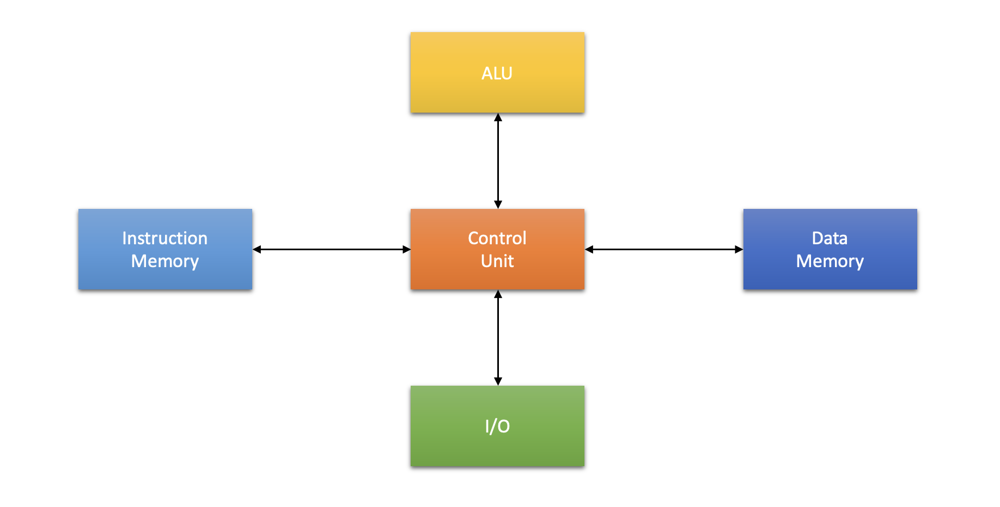

# 1장. **임베디드 시스템의 구조**

  * [1-1 임베디드 시스템의 구성](#1-1-임베디드-시스템의-구성)  
  * [1-2 프로세서](#1-2-프로세서)  
  * [1-3 시스템 버스](#1-3-시스템-버스)  
  * [1-4 메모리 장치](#1-4-메모리-장치)  
  * [1-5 주변 장치](#1-5-주변-장치)  

## 임베디드 시스템이란?  
  하드웨어와 소프트웨어의 조합으로 이루어진 특정한 목적을 수행하는 시스템.  
  마이크로 프로세서와 입출력 장치가 내장되어 있으며, 제어하기 위한 프로그램이 내장되어 있다.  

## 1-1 임베디드 시스템의 구성
  1. 하드웨어  
    프로세서(컨트롤러)
    메모리 장치(RAM/ROM)
    입출력 장치(네트워크 장치, 센서 등)
  2. 소프트웨어  
    Firmware(boot loader)  
    OS  
    Software  
     

## 1-2 프로세서  
 1. 프로세서의 구조  
     
    1. Register  
        * GPRGeneral Purpose Register(범용 레지스터)  
          프로세스 내부에서 데이터를 일시적으로 저장하는 장치  
          Flip-flop or Latch로 구현
          ALU에서 사용  
        * SPRSpecial Purpose Register(제어 레지스터)  
          프로그램이나 프로세서를 제어  
          ex) Stack Pointer, Link Register, PC(Program Counter)  
          H/W에서 사용  
        * SFRSpecial Function Register(상태 레지스터)  
          H/W(Device)에서 사용    

    2. ALUArithmetic and Logical Unit(산술 논리 연산 장치)  
        * 산술 연산 수행  
          Add, Sub ...
        * 논리 연산 수행  
          AND, OR ...
        * 연산 결과 기록  
          carry 발생, overflow qkftod emd

    3. CUControl Unit(제어 장치)  
      명령을 읽고 실행하기 위한 내부 데이터 흐름 제어하는 유닛  
      명령어 해독기, 제어 주소 레지스터, 제어 기억장치, 제어 버퍼 레지스터, 서브루틴 레지스터, 순서제어 모듈 등으로 이루어져 있음  
        
        * 명령어 해독기 (IDInstruction Decoder) : IR(명령어 레지스터)로부터 명령어를 받고, 명령어의 연산코드를 해독하여 해당 연산을 수행하기 위한 루틴의 시작 주소를 결정
        * 제어 주소 레지스터 (CARControl Address Register) : 다음에 실행할 마이크로명령어의 주소를 저장하는 레지스터
        * 제어 기억장치 (CMControl Memory) : 마이크로명령어로 이루어진 마이크로프로그램을 저장하는 내부 기억장치
        * 제어 버퍼 레지스터 (CBRControl Buffer Register 
        ) : 제어 기억장치로부터 읽혀진 마이크로명령어 비트들을 일시적으로 저장하는 레지스터
        * 서브루틴 레지스터 (SBRSubroutine Register : SBR) : 마이크로프로그램에서 서브루틴이 호출될 때, 현재의 CAR 내용을 일시적으로 저장하는 레지스터
        * 순서제어 모듈 (SMSequencing Module) : 마이크로명령어의 실행 순서를 결정하는 회로들의 집합
        * 제어신호 발생기(Decorder) : 명령어 레지스터의 명령 코드를 해독하여 필요한 실행 신호를 발생

    4. Processor Bus  
        * Internal Bus(내부 버스)  
          프로세서 내부에서 레지스터와 ALU 사이의 신호를 교환  
          결과를 다시 레지스터로 전달  
        * External Bus(외부 버스)  
          프로세서 외부의 기억장치 or I/O 장치 사이
            - Data Bus : 외부 장치에 전달하거나 읽어오는 경로  
            - Address Bus : 기억장치나 I/O 장치의 주소 정보 전송 경로  
            - Control Bus : 기억장치나 I/O 장치의 입출력 동작을 지시하는 제어 신호를 전송하는 경로  
    5. Pipeline
      프로세서 내에서 각 명령어들이 처리되는 단계  
      파이프라인을 사용하면 수행할 수 있는 명령어의 수가 증가하며 이는 퍼포먼스의 향상으로 이어진다.  
        * Fetch
        * Decode
        * Execute  
      
## 1-3 시스템 버스  
  중앙 처리 장치와 기타 장치 사이에서 데이터를 전달하는 통로  
  1. Address Bus  
    프로세서가 주기억 장치나 I/O 장치로 기억장치 주소를 전달하는 통로
  2. Control Bus  
    데이터 버스와 주소 버스를 제어하기 위해 제어 신호들을 전송하는 통로
  3. Data Bus
    프로세서와 기타 I/O 장치 사이에서 데이터를 전달하는 통로

  * 폰 노이만 아키텍쳐  
    아주 작은 시스템에서 사용함
     
  * 하버드 아키텍쳐  
    대부분의 시스템에서 사용함  
    명령용 버스와 데이터용 버스가 물리적으로 분할되어 있음'
    명령을 메모리로부터 읽는 것과 데이터를 메모리로부터 읽는 것을 동시에 할 수 있음
    폰 노이만 구조에서의 병목 현상을 해결하기 위해 고안됨
      

## 1-4 메모리 장치  
  1. RAM  
    전원이 인가되는 상태에서 데이터를 유지  
      * Static RAM  
      * Dynamic RAM  
  2. Cache  
    자주 사용하는 데이터를 미리 복사해 놓는 임시 메모리  
    Locality(지역성) 특성을 이용함  
      |Locality|설명|
      |:--:|--|
      |Temporal Locality(시간적 지역성)|방금 접근한 Data/명령어를 곧 또 접근한다.|
      |Special Locality(공간적 지역성)|방금 접근한 Data/명령어의 옆 주소를 접근한다.|
      1. 특징  
          * Hit 비율이 높을수록 성능이 좋음  
          * Miss비율이 높을수록 성능이 나쁨  
          * Context Change가 자주 일어나면 성능이 떨어짐  
          * Cache Pre Load와 같은 명령어로 성능을 높일 수 있음  
      2. 쓰기 동작
          * Write Through  
            Cache와 외부 메모리에 모두 쓰기 동작을 함
          * Write Back  
            Cache에만 쓰기 동작을 하고, 외부 메모리에는 나중에 기록함  
  4. MMUMemory Management Units  
    메모리를 관리하는 유닛  
      1. MPUMemory Protection Units  
        메모리를 보호하는 유닛  
        region을 사용하여 메모리의 침범을 막음
      2. MMUMemory Management Units  
        MPU의 기능인 보호하는 기능과 더불어 가상 주소를 mapping함  
        CPU에서 사용하는 logical한 Virtual address를 physical address로 변환하여 관리

   

## 1-5 주변 장치  
  I/O Device
  입출력을 목적으로 하는 프로세서 외부의 장치  
    
  1. I/O 장치의 어드레스 할당  
      * IO-mapped device  
        IO 장치를 위한 Address가 분리되어 있음(x86 계열)  
      * Memory mapped device  
        IO 장치는 메모리와 같은 Address 공간을 사용(x86 이외의 대부분의 계열)  
        |구분|Memory mapped I/O|IO-mapped device|
        |--|--|--|
        |대표적인 CPU|ARM. Power PC, M68K|x86계열|
        |I/O 장치의 영역|메모리읠 일부를 I/O 장치로 사용|메모리 영역과는 별도의 I/O 번지 영역이 존재|
        |명령어|메모리와 I/O 장치 모두 메모리 동작 명령으로 엑세스 각영역의 구분도 Address로 함|메모리 엑세스 명령과 I/O 엑세스 명령이 구분|
        |하드웨어|Adress를 해석하는 디코더 회로에 따라 메모리 혹은 I/O 장치가 선택|메모리 번지와 I/O 번지를 구분하는 신호가 존재|
        |기타|I/O 영역은 Non-cacheable로 설정해야 함 I/O 영역 변수는 volatile type으로 선언해야 함||
  2. I/O 장치 접근 방법  
      1. Polling  
          * 프로세서가 장치를 접근하는 방식  
          * loop를 돌며 각 장치를 순회  
      2. Intterupt  
          * 장치기 프로세서를 접근하는 방식  
          * 인터럽트 신호에 의해 프로세서의 주의를 이끌어냄  
      3. DMADirect Memory Access  
          * 프로세서의 개입을 최소화 하여 I/O 장치롸 기억장치 사이에 데이터를 전송하는 방식  
          * DAM request 신호에 의해 전송을 이끌어 냄  
  3. 인터럽트  
    인터럽트는 아래와 같은 흐름으로 이루어진다.
      
      1. 인터럽트 제어기  
        장치에서 발생되는 인터럽트의 요청을 관리  
          
      2. 인터럽트의 발생  
          * 인터럽트 요청 
            1. 장치에 의한 하드웨어적 신호 발생(irq)  
            2. 인터럽트 컨트롤러에 의한 우선 순위 처리 및 재진입 처리 여부 결정  
            3. 프로세서의 인터럽트 상태 진입  
            4. 인터럽트 벡터에 의한 서비스 루틴 처리  
          * 인터럽트 발생의 경우  
            1. 데이터 입력  
            2. 데이터 출력  
            3. 데이터 에러  
      3. 인터럽트 Vector  
        인터럽트 Vector는 인터럽트 번호, 인터럽트 서비스 루틴의 주소의 순서쌍이다.  
        인터럽트 Vectoer table은 Fixed interrupt table과 Vectored interrupt table이 있다.
        Fixed interrupt table은 어드레스 변경이 안되고, Vectored interrupt table은 어드레스가 가변하며 주변장치에 의해 처리할 주소가 제공되는 방식이다.  