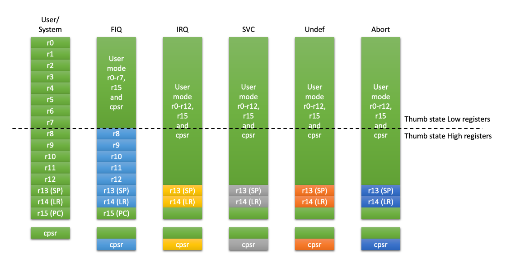
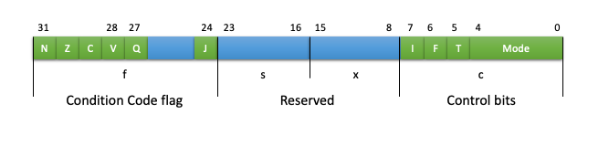

 # 2장. **ARM 아키텍쳐**

  * [2-1 ARM Architecture](#2-1-arm-architecture)  
  * [2-2 Programmer's Model](#2-2-programmers-model)  

## 2-1 ARM Architecture  
  ARM Architecture는 ARM core의 명령어, 레지스터, 버스등을 포함한 모든 구조의 개념이다.  
  1. 종류  
    ARM Architecture의 종류는 아래와 같다.  
      
  2. 특징  
      1. 32bit RISC Architecture  
          * 명령어와 내부 레지스터가 32bit로 구성  
          * RISCReduced Instruction Set Computer
      2. 다양한 명령어 지원  
          * 32 / 64bit ARM 명령어  
          * 16bit Thumb 명령어  
      3. Big / Little Endian 지원  
      4. Fast Interrupt 지원  

## 2-2 Programmer's Model  
Programmer's Model은 프로그래머가 어셈블리어 프로그램을 작성하는데 필요한 각종 정보이다.  
  1. 명령어  
      1. 32bit ARM Instruction  
        * 특징
          * 모든 ARM 명령어는 조건부로 실행이 가능  
          * 모든 ARM 32bit로 구성  
          * ARM 명령은 크게 11개의 기본적인 Type으로 이루어짐  
        * 32bit 고정된 명령어를 사용하는 이유  
          * Pipeline 구성이 용이
          * 명령 디코더의 구현이 쉬움
          * 고속으로 처리 가능
        * 명령어  
          ||Instruction Type|Instruction|
          |:--:|:--:|--|
          |1|Branch, Branch with Link|B, BL|
          |2|Data Processing 명령|ADD, ADC, SUB, RSB, RSC, AND, ORR, BIC, MOV, MVN, CMP, CMN, TST, TEQ|
          |3|Multiply 명령|MUL, MLA. SMULL, SMLAL, SMULL, UMLAL|
          |4|Load / Store 명령|LDR, LDRB, LDRBT, LDRH, LDRSB, LDRSH, LDRT, STR, STRB, STRBT, STRH, STRT|
          |5|Load / Store Multiply 명령|LDM, STM|
          |6|Swap 명령|SWP, SWPB|
          |7|Software Interrupt(SWI)명령|SWI(SVC)|
          |8|PSR Transfer 명령|MRS, MSR|
          |9|Coprocessor 명령|MRC, MCR, LDC, STC|
          |10|Branch Exchange 명령|BX|
          |11|Undefined 명령||
      * 16bit Thumb Instruction  
        * 특징  
          * 32bit ARM Instruction을 16bit로 재구성
          * 코드의 크기를 줄일수 있음
          * 8bit나 16bit와 같은 좁은 메모리 인터페이스에서 성능이 우수함
          * 조건부 실행이 안됨
          * Immediate 상수 값의 표현 범위가 작음

  2. 메모리 구조  
      * 프로그램과 데이터가 저장되는 공간
      * Big / Little Endian 지원
      * ARM 에서 사용 가능한 데이터 Type
        * byte : 8bit
        * Halfword : 16 bit, 2 byte
        * word : 32 bit, 4 byte
      * Un-aligned access
  3. 동작 모드  
    Operating mode는 현재 프로세서가 어떤 권한을 가지고 어떤 종류의 작업을 하고 있는지 나타냄  
    Exception과 System Call로 인해 모드가 변경됨
      * User Mode  
        User Task 또는 Application을 수행할 때의 동작 모드로 ARM 프로세서의 동작 모드중 유일하게 Un-privileged 모드이다.
      * FIQFast Interrupt Request Mode
        빠른 인터럽트의 처리를 위한 동작 모드
      * IRQInterrupt Request Mode  
        일반적으로 사용되는 인터럽트를 처리하기 위한 동작 모드
      * SVCSupervisor Mode
        시스템 자원을 관리할 수 있는 동작 모드  
        Reset이나 소프트웨어 인터럽트(SWI)가 발생하면 ARM은 Supervisor 모드가 됨
      * Abort Mode
        명령이나 데이터를 메모리로 부터 읽어오거나 쓸 때 오류가 발생하면 Abort Mode가 됨
        Abort는 외부의 메모리 제어기에서 발생됨
      * Undefined Mode
        ARM이 정의되지 않은 명령을 수행하려고 하면 수행되는 동작 모드
      * System Mode
        User mode와 동일한 용도로 사용되지만 Privilege 모드이다.

  4. 레지스터  
    프로세서가 작업을 하는데 사용되는 값을 지정하는 공간  
    ARM에는 32bit 길이의 37개의 레지스터가 있음
      * 종류  
        1. 범용 레지스터(30개)  
          대부분 데이터 연산 등에 사용  
          프로세서 동작 모드에 따라 사용되는 레지스터가 제한됨
        2. Program Counter(1개)  
          프로그램을 읽어올 메모리의 위치
        3. CPSR(Current Program Status Register)(1개)  
          프로세서가 수행하고 있는 현재의 동작 상태
        4. SPSR(Saved Program Status Register)(5개)  
          이전 모드의 CPSR 복사본으로 User, System 모드를 제외한 모든 privilege 모드에 하나씩 존재  
      * Operatinng mode 별 사용 가능한 레지스터  
        1. ARM state  
          * 16개의 범용 레지스터  
            r0 ~ r15의 키워드를 사용하여 관리  
            r0 ~ r12는 연산 명령과 같이 범용으로 사용  
            r13(SP), r14(LR), r15(PC) 는 특수한 목적으로 사용(연산 명령으로 사용 가능)
          * 1개의 CPSR
          * Privilege mode의 경우 각각 1개의 SPSR
        2. Thumb state
          * 8개의 범용 레지스터  
            r0 ~ r7
          * r13(SP), r14(LR), r15(PC) 레지스터  
            연산 명령에서 사용 불가
          * 1개의 CPSR
          * Privilege mode의 경우 각각 1개의 SPSR  
  
        

      * 주요 Register 특징  
        1. Staack Pointer(SP ro R13)  
            - 프로그램에서 사용하는 스택의 위치를 저장하는 레지스터  
            - 프로세서의 동작 모드마다 별도로 할당됨  
            - ARM에서는 별도의 스택 명령은 없고 LDR/STR, LDM/STM 같은 데이터 전송 명령을 사용하여 처리
        2. Link Register(LR or R14)  
            - 서브루틴에서 되돌아 갈 위치 정보를 저장하고 있는 레지스터
            - 프로세서의 동작 모드마다 별도로 할당됨  
        3. Program COunter(PC or R15)  
            - 프로그램을 수행하는 위치를 저장하고 있는 레지스터  
            - ADD, SUB와 같은 연산 명령을 사용하여 프로그램이 분기할 위치를 조정할 수 있음  
            - 프로세서의 모든 동작 모드에 대해 하나만 존재  
        4. Program Status Register(PSR)  
          1개의 CSPR과 5개의 SPSR이 있다.
            
            * Condition code flag  
              ALU 연산 결과 정보르 가지는 flag 정보  
              1. Nagative flag(N bit)  
                ALU 연산, 곱셈기 연산 결과 MSB가 켜질 경우 set
              2. Zero flag(Z bit)
                ALU 연산, 곱셈기 연산 결과 0이 발생한 경우 set
              3. Carry flag(C bit)
                ALU 연산, 덧셈시 자리 올림, 뺼셈시 내림이 발생하지 않으면 set
              4. Overflow flag(V bit)
                ALU에 의한 덧셈시 MSB가 덮어 써질 경우 set
              5. Q flag(Q bit)
                연산 명령의 수행 결과 saturation입 발생하면 set
              6. J bit
                Java 바이트 코드를 수행하는 Jazelle state임을 나타냄
            * Control bits  
              프로세서를 제어하기 위한 비트로 구성
              1. I/F bit
                IRQ나 FIQ를 set하거나 clear 함  
              2. T bit
                Thumb state임을 나타내며, BX명령에 의해서만 제어됨
              3. Mods bits
                ARM의 7개의 동작 모드를 나타냄  
                  
                  |M[4:0]|Operating Mode|
                  |:--:|:--:|
                  |10000|USER 모드|
                  |10001|FIQ 모드|
                  |10010|IRQ 모드|
                  |10011|SVC 모드|
                  |10111|Abort 모드|
                  |11011|Undefined 모드|
                  |11111|System 모드|
            * Reserved

  5. Exception 핸들링  
    
  6. 인터럽트 Latency  
  7. 프로세서 Reset  