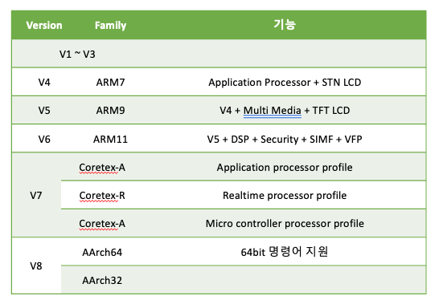

 # 2장. **ARM 아키텍쳐**

  * [2-1 ARM Architecture](#2-1-arm-architecture)  
  * [2-2 Programmer's Model](#2-2-programmers-model)  

## 2-1 ARM Architecture  
  ARM Architecture는 ARM core의 명령어, 레지스터, 버스등을 포함한 모든 구조의 개념이다.  
  1. 종류  
    ARM Architecture의 종류는 아래와 같다.  
      
  2. 특징  
      1. 32bit RISC Architecture  
          * 명령어와 내부 레지스터가 32bit로 구성  
          * RISCReduced Instruction Set Computer
      2. 다양한 명령어 지원  
          * 32 / 64bit ARM 명령어  
          * 16bit Thumb 명령어  
      3. Big / Little Endian 지원  
      4. Fast Interrupt 지원  

## 2-2 Programmer's Model  
Programmer's Model은 프로그래머가 어셈블리어 프로그램을 작성하는데 필요한 각종 정보이다.  
  1. 명령어  
      1. 32bit ARM Instruction  
        * 특징
          * 모든 ARM 명령어는 조건부로 실행이 가능  
          * 모든 ARM 32bit로 구성  
          * ARM 명령은 크게 11개의 기본적인 Type으로 이루어짐  
        * 32bit 고정된 명령어를 사용하는 이유  
          * Pipeline 구성이 용이
          * 명령 디코더의 구현이 쉬움
          * 고속으로 처리 가능
        * 명령어  
          ||Instruction Type|Instruction|
          |:--:|:--:|--|
          |1|Branch, Branch with Link|B, BL|
          |2|Data Processing 명령|ADD, ADC, SUB, RSB, RSC, AND, ORR, BIC, MOV, MVN, CMP, CMN, TST, TEQ|
          |3|Multiply 명령|MUL, MLA. SMULL, SMLAL, SMULL, UMLAL|
          |4|Load / Store 명령|LDR, LDRB, LDRBT, LDRH, LDRSB, LDRSH, LDRT, STR, STRB, STRBT, STRH, STRT|
          |5|Load / Store Multiply 명령|LDM, STM|
          |6|Swap 명령|SWP, SWPB|
          |7|Software Interrupt(SWI)명령|SWI(SVC)|
          |8|PSR Transfer 명령|MRS, MSR|
          |9|Coprocessor 명령|MRC, MCR, LDC, STC|
          |10|Branch Exchange 명령|BX|
          |11|Undefined 명령||
      * 16bit Thumb Instruction  
        * 특징  
          * 32bit ARM Instruction을 16bit로 재구성
          * 코드의 크기를 줄일수 있음
          * 8bit나 16bit와 같은 좁은 메모리 인터페이스에서 성능이 우수함
          * 조건부 실행이 안됨
          * Immediate 상수 값의 표현 범위가 작음
          
  2. 메모리 구조  
  3. 데이터 구조  
  4. 프로세스 동작 모드  
  5. 프로세서 내부 레지스터의 구성 및 사용법  
  6. Exception 처리  
  7. 인터럽트 처리  