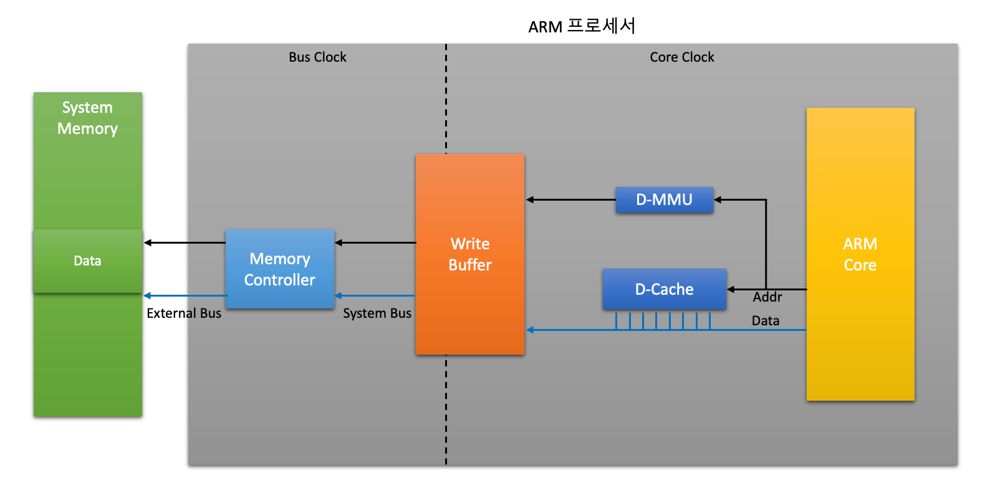

# 4장. **Cache와 Arm 프로세서**

  * [4-1 Cached Arm 프로세서](#4-1-cached-arm-프로세서)  
  * [4-2 Cache와 Write Buffer](#4-2-cache와-write-buffer)  
  * [4-3 Memory Protection Unit (MPU)](#4-3-memory-protection-unit-mpu)  
  * [4-4 Memory Management Unit (MMU)](#4-4-memory-management-unit-mmu)  
  * [4-5 Tightly Coupled Memory (TCM)](#4-5-tightly-coupled-memory-tcm)  
  
## 4-1 Cached Arm 프로세서 

  1. Cached ARM 프로세서  
      * Cached ARM 프로세서 구조
          
      * ARM 메모리 시스템  
          
      * Cached ARM 프로세서릐 제어  
        1. CP15 인터페이스를 통해 제어  
          Cached, MPU or MMU, endian 제어 등  
        2. Coprocessor Register Transfer 명령  
            * MRCMove to Register from Coprocessor : 
              Coprocessor 레지스터 내용을 ARM 레지스터로 전송
            * MCRMove to Coprocessor from Register : ARM 레지스터의 내용을 Coprocessor 레지스터로 전송
      * CP15 레지스터 (ARM926EJ-S)   
        |Register|용도|비고|
        |:--:|--|--|
        |0|ID Code register Cache type register TCM status register|Opcode_2=0 Opcode_2=1 Opcode_2=2|
        |1|Control register|Cache, MMU enable, Endian Clock, 제어 등|
        |2|Translation table base register||
        |3|Domain access control register||
        |5|Data Fault status register Instruction Fault status register|Opcode_2=0 Opcode_2=1|
        |6|Fault address register||
        |7|Cache operation register|Cached control|
        |8|TLB operation register||
        |9|Cache lockdown register TCM region register||
        |10|TLB lockdown register||
        |13|FCSE PID register Context ID|Fast Context Switching Extension Context ID|
        |15|Test configuration|Test configuration|
        |4, 11, 12, 14|Reserved||

## 4-2 Cache와 Write Buffer 
  

캐시 메모리는 프로세서가 최근 엑세스 한 메모리의 내용을 보관하고 있다가 다시 요청하면 메모리 엑세스 없이 전달하도록 프로세스 가까이에 있는 메모리이다.  
속도가 느린 메모리시스템의 성능을 개선할 수 있으며, 버스 사용향을 줄여 시스템 성능을 향상 시킨다.  
또한 전력 소모를 줄일 수 있다는 장점이 있다.

  1. Cache와 메모리 Read  
      
  2. Cache의 성능  
      * 프로세서가 읽고자 하는 명령이나 데이터가 Cache내에 있을 경우(Cache Hit)가 많을 수록 성능이 좋다.  
      * 프로세서가 읽고자 하는 명령이나 데이터가 Cache내에 없을 경우(Cache Miss) Cache 제어기는 시스템 메모리 장치에서 line 크기만큼 명령이나 데이터를 읽어 메모리에 저장(Line Fill)한다.
  3. Cache Lockdown  
      * Cache의 일정 부분을 update 되지 않도록 함  
        (중요한 명령이나 데이터를 항상 Cache에 가지고 있도록하여 성능 증가)
      * Victim counter가 지정한 위치에 가지 않도록 함
      * Cache flush 전에는 반드시 Lockdown을 해제함
  4. Cache Flush  
      * Cache의 내용과 메모리의 내용이 다른 경우 Cache를 비우고 새로 데이터를 메모리에서 읽어옴
  5. Cache와 메모리 write  
      
  6. Write Buffer 
      * Core speed로 write buffer에 데이터를 write
      * Core와 버스의 속도차를 극복하기 위함
      * write buffer는 FIFO 형태의 구조를 가짐
  7. Drain write buffer
      * Write buffer에 있는 데이터를 우선하여 빼내는 작업
      * 소프트웨어에 의해 write buffer에 있는 데이터를 빼낼 수 있음
  8. Write buffer와 Cache
      * Write Through
          * CPU가 특정 주소에 명령이나 데이터를 write하는 경우, 해당하는 명령이나 데이터가 Cache 메모리에 있을 때, Cache 메모리와 외부 메모리에 모두 쓰기 동작을 함
          * Write buffer를 거치지 않고 메모리에 저장
      * Write Back
          * CPU가 특정 주소에 명령이나 데이터를 write하는 경우, 해당하는 명령이나 데이터가 Cache 메모리에 있을 때, Cache 메모리에만 쓰기 동작을 하고, 외부 메모리에는 나중에 기록됨
          * Write buffer를 사용

## 4-3 Memory Protection Unit (MPU)  
MPU는 메모리 보호 유닛이다.  
  1. 메모리 partition  
      * 메모리를 일정 크기의 Region으로 partition 
      * Region별로 Cache attribute를 별도로 지정 가능  
      * Region별로 Access permisstion을 별도로 지정 가능  
  2. Region 설정  
      * MPU가 사용되는 프로세서는 최소 1개 이상의 instruction region과 data region이 설정되어 있고 MPU가 enable 되어있어야 함  
      * Protection unit은 Cache를 enable하기 전에 enable 되어있어야 함
  3. MPU 설정  
  <!-- TO-DO : MPU 이미지 -->

## 4-4 Memory Management Unit (MMU) 
MMU는 메모리 관리 유닛이다.
MPU의 기능인 메모리 보호 기능에 Address 변환 기능이 추가된 것이라고 볼 수 있다.
(CPU에서 사용되는 Logical한 Virtual 어드레스를 Physical 어드레스로 변환하여 관리함)
MPU는 static 하게 메모리를 관리하며 virtual address를 지원하지 않는다.  
MMU는 Dynamic 하게 메모리를 관리하며 virtual address를 지원하므로 MPU의 한계를 해소한다.  
  <!-- TO-DO : MMU 버추얼 어드레스 이미지 -->
  1. MMU의 구성
    * Translation Lookaside Buffer (TLB)  
      최근에 사용된 Virtual address와 physical address가 매핑된 정보와 access permission에 대한 정보를 저장하고 있는 일종의 cache
    * Translation Table Walking Login
      TLB를 update 하고 관리하는 기능을 가진 Logic
    * Access Control Logic
  <!-- TO-DO : MMU 메모리 구성 이미지 -->
  <!-- TO-DO : MMU 어드레스 변환 이미지 -->
  2. MMU 설정
      <!-- TO-DO : MMU 설정 이미지 -->
      1. Build Translation Table
          * Physical 메모리 설정
          * Virtual to physical translation 정보
          * Cacheable / Bufferable 정보
          * Access permission
      2. Translation Table Base 설정
          * CP15의 c2 사용
      3. Initialize Control Register
          * Enalbe Cache, MMU
          * Clocking 모드 설정
          * Endian 모드 설정
          * Vector location 설정
## 4-5 Tightly Coupled Memory (TCM)  
  1. TCM 이란?
      * TCM은 메모리의 특정 부분을 CPU 바로 옆에 두고 사용하여 성능을 최대로 올리는 기능이다.  
      * 캐시와는 다르게 메모리와 붙어있지 않다.
      <!-- TO-DO : TCM 이미지 -->
  2. TCM 초기화  
      * Program's Model
        * CP15의 control register (c9)를 사용
      * Instruction / Data TCM 의 초기화
        1. Enalbe TCM / Load mode
        2. TCM에서 사용 될 명령 또는 데이터를 TCM 메모리에 저장
