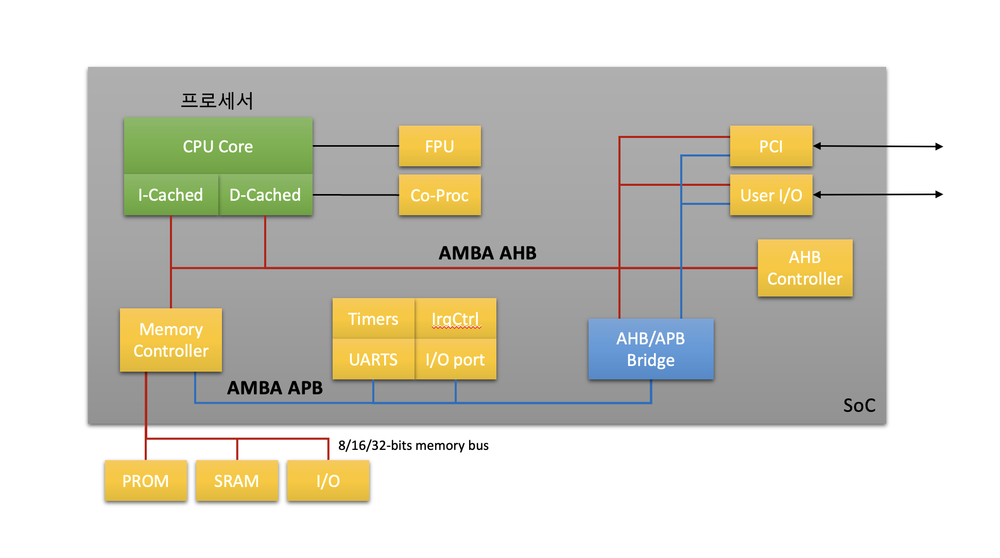
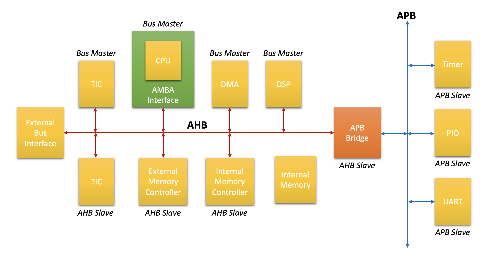

# 5장. **SoC 구조**

* [5-1 SoC란?](#5-1-soc란)  
* [5-2 AMBA 버스](#5-2-amba-버스)  

## 5-1 SoC란?
SoC(System on chip)는 하나의 직접회로에 집적된 컴퓨터나 전자시스템 부품을 말한다.  
즉, 전체 시스템을 칩 하나에 담은 기술집약적 반도체이다.  
일반적으로 임베디드 시스템에서 사용한다.

    

## 5-2 AMBA 버스  
AMBA(Advanced Microcontroller Bus Architecture)는 ARM에서 개발하여 오픈 한 표준 설계 규격으로, SoC를 구성하는 기능 블록들 간의 연결 및 관리 방법을 제공한다.  
  1. ANBA 버스의 구조 

       
  2. AMBA 버스 Type
      * AHB(Advanced High-performance Bus)  
        1. 특징
            * High performance 지원
            * Pipelined operation 지원
            * Multiple bus master 지원
            * Burst transfer 지원
            * Single clock edge 를 사용하여 동작
        2. 구성
            * AHB Master 
              * Read 또는 Write 동작을 요청하는 주체
              * 한번에 하나의 Master 만을 버스를 사용할 수 있음
            * AHB Slave 
              * 주어진 어드레스 범위 내에서 요청에 따라 Read 또는 Write 동작 수행
              * 데이터 전송 결과를 Master에 보고 (Success, Failure, Waiting 상태)
            * AHB Albiter 
              * 여러 Master의 요청을 중재하여 한번에 하나의 Master만이 버스를 사용하도록 조정
            * AHB Decoder 
              * Master의 요청에 따라 전송하고자 하는 slave의 어드레스를 Decode
              * AHB 버스에는 하나의 Decoder가 모든 slave를 Decode함
      * ASB(Advanced System Bus)  
      * APB(Advanced Peripheral Bus)  
        1. 특징
            * Low power
            * Latched address and control
            * Simple interface
        2. 구성
            * APB Bridge
              * 어드레스 hold, 어드레스 decode
              * APB Control 신호 생성
            * APB Slave
              * APB의 요청에 의한 응답
      * AXI(Advanced eXtensible Interface)  
        1. 특징
          * AMBA 버스 Soec 3.0
          * Address, Control과 data phase 분리
          * Unaligned data transfer 지원
          * Burst transfer 지원
          * Read와 write data chennel 분리
          * High frequency operator
          * Low power