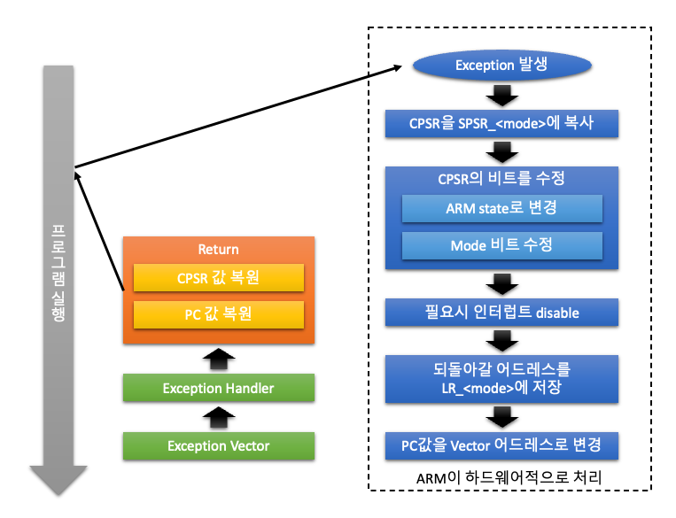
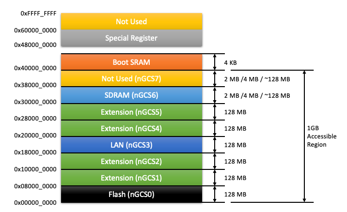
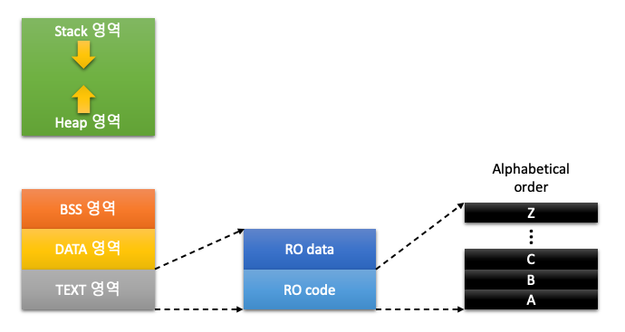
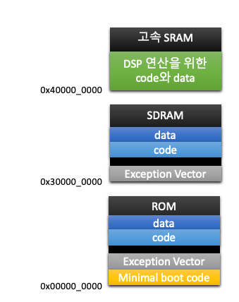

# 6장. **임베디드 소프트웨어 개발**

* [6-1 소프트웨어 개발 툴의 활용](#6-1-소프트웨어-개발-툴의-활용)  
* [6-2 Exception Handling](#6-2-exception-handling)  
* [6-3 시스템 메모리 구조 설계](#6-3-시스템-메모리-구조-설계)  
* [6-4 부트코드 작성](#6-4-부트코드-작성)  

## 6-1 소프트웨어 개발 툴의 활용  
  1. ARM Cross 컴파일러  
      
      * ARM Cross 컴파일러  
        PC의 x86 계열의 호스트에서 소스 프로그램을 32bit RISC 프로세서인 ARM용 기계어를 생성하는 프로그램
      * ARM Cross 컴파일러의 종류
        1. SDT v2.11, v2.50, v2.51
            * 통합 개발 환경 (IDE) : APM
            * 디버거 : ADW
        2. ADS(ARM Developer Suit) v1.01, v1.1, v1.2
            * 통합 개발 환경 (IDE) : CodeWarrior
            * 디버거 : AXD
        3. RVDS(RealView Developer Suit) v1.2, v2.0
            * IDE & 디버거 : RVD
        4. Code Warrior for ARM v1.2, v2.0
            * IDE & 디버거 : CodeWarrior
        5. GNU Compiler
            * 어셈블러 & 컴파일러 : gas, gcc
            * 디버거 : GDB, Insight 디버거
  2. Object 파일  
    컴파일러나 어셈블러에 의해 만들어진 바이너리 format의 파일  
      * Object 파일 구조
        1. Header
            * Section을 설명하는 내용
        2. Section
            * Text Section : 모든 code block
            * Data Section : 초기화된 전역변수 및 초기값
            * BSS Section : 초기화 되지 않은 전역 변수
        3. Symbol Table
            * 변수와 함수의 이름과 위치 정보를 가짐
      * Object 파일 format
        1. COFF(Common Object File Format)
        2. ELF(Extended Linker Format)
  3. Linker  
      * Linker
          * 불완전한 object 파일들을 합쳐 모든 코드와 데이터를 포함하는 새로운 object 파일을 생성해 내는 도구
          * 필요에 따라 라이브러리와 statup 파일을 같이 링크함
      * Startup 코드
          * 어셈블러로 구성되며 모든 프로그램에는 반드시 필요
          * 일반적으로 crt0.S(C-runtime 0의 약자), init S, startup.S 등의 이름을 많이 사용
          * Stratup 코드 동작
            1. 시스템 초기화
            2. Data 초기화
            3. Stack 영역 할당
            4. Heap 영역 할당
            5. 메인 함수(main) 호충
  4. Locate
      * Locate
        * 메모리에서 실행 가능하도록 코드와 게이터를 배치하여 최종 바이너리 이미지를 생성하는 도구
        * 대부분 링커에 포함되어 있음
      * Linker script 파일
        * 코드와 데이터의 메모리 배치를 정의한 파일
  5. ELF 이미지  
      * ELF(Executable Linkable Format)
        * Object 파일을 임의의 길이를 갖는 section들의 리스트로만 생각하고, 언제나 새로운 section의 추가가 가능하도록 되어있음
        * 프로그램 Linking  
          Object 파일의 상관 관계와 서로 link하는데 필요한 object 파일을 정보를 표시
        * 프로그램 Execution  
          프로그램을 구동시키는 방법과 프로그램 구동에 필요한 object 파일을 정보를 표시
        * DWARF2 디버깅 정보를 가지고 있음
      * DWARF(Debugging With Attribute Record Format)
  6. Binary 이미지
      * 링커에 의해 생성된 이미지에서 header, section 및 디버깅 정보를 제거한 이미지
      * 순수하게 타겟 CPU에서 하드웨어적으로 실행 가능한 machine code 만을 가지고 있음
      * ROMable 이미지
        * ELF 이미지는 실행 코드 이외에 다른 자료를 가지고 있으므로 ROM에 탑재되어 바로 구동될 수 없음
        * Binary 이미지를 탑재해야만 함
  7. 디버깅
      1. 다운로드 & 디버깅
          * 다운로드
            * 생성된 실행 가능한 바이너리 이미지를 타겟 보드의 메모리에 탑재하는 동작
            * 다운로드 및 실횅 방법
              1. ROM / Flash에 탑재하여 실행
              2. DRAM에 탑재하여 실행
              3. 전용 ICE를 사용하여 디버깅 정보와 함께 탑재하여 실행
          * 디버깅
            * 타겟 시스템을 실행하면서 프로그램의 실행 상태, 메모리, 변수 등을 프로그래머가 확인하거나 제어하면서 오류를 찾아 수정하는 동작
            * 실행 가능한 이미지가 반드시 디버깅 정보와 람께 메모리에 탑재되어 있어야 함
            * 전용 디버깅용 ICE 장비와 디버거 소프트웨어를 사용
      2. 다운로드 방법
          * ROM / Flash에 탑재하여 실행
          * DRAM에 탑재하여 실행
          * 전용 ICE를 사용하여 디버깅 정보와 함께 탑재하여 실행
      3. 임베디드 시스템 디버깅
          * 실행 제어
            * 데이터 액세스에 대하여 watchpoint 설정
            * 명령 실행에 대한 breakpoint 설정
            * 코드를 single step 실행
          * 상태 제어
            * Process 상태 제어
              * Register 값을 읽고 씀
            * 시스템 상태 제어
              * 시스템 메모리 엑세스
              * 코드 다운로드
          * 프로그램 실행 분석
            * 실시간 trace
            * Memory 액세스 history
      4. 디버그 인터페이스
        * ICE 장비
          * In-Circult Emulator(ICE)는 호스트의 디버거와 함께 Target 시스템의 레지스터나 메모리의 내용을 읽거나 변경할 수 있고, Break Point나 Watch Ponit를 설정할 수도 있고, 프로그램을 step-by-step으로 실행 할 수 있게 해주는 장치
        * 호스트 디버그 인터페이스
          * Parallel, Ethernet, USB 등
        * 타겟 디버그 인터페이스
          * BDM, JTAG 등

## 6-2 Exception Handling
  Exception은 외부의 요청이나 오류에 의해 정상적으로 진행되는 프로그램의 동작을 잠시 멈추고 프로세서의 동작 모드를 변환하여 미리 정해진 프로그램으로 외부의 요청이나 오류에 대한 처리를 하도록 하는 것
  
  * ARM의 Exception
    1. Reset : ARM으로 Reset 신호가 입력되면 Reset Exception 발생
    2. Undefined Instruction : ARM에서 정의 되지 않은 명령을 싱행하고자 하면 발생
    3. Software Interrupt : SWI 명령이 실행되면 Exception 발생
    4. Prefetch Abort : 잘못된 어드레스 공간에서 명령을 읽으려고 하면 Exception 발생
    5. Data Abort : 잘못된 어그레스 공간에서 데이터를 읽거나 쓰려고 하면 Exception 발생
    6. IRQ(Interrupt Request) : 외부 장치에서 발생된 인터럽트 신호가 ARM에 입력되면 Exception 발생
    7. FIQ(Fast Interrupt Request) : 외부 장치에서 발생된 인터럽트 신호가 ARM에 입력되면 Exception 발생
  
  * Exception Vector
    Ecrption이 발생하면 미리 정해진 어드레스(Exception Vector Table)의 프로그램을 수행  
      
    * Exception Vector Table
      |Vector Address|Exception|우선 순위|동작 모드 전환|
      |:--:|:--:|:--:|:--:|
      |0x0000 0000|Reset|1 (High)|Supervisor (SVC)|
      |0x0000 0004|Undefined Instruction|6 (Low)|Undefined|
      |0x0000 0008|Software Interrupt(SWI)|6|Supervisor (SVC)|
      |0x0000 000C|Prefetch Abort|5|Abort|
      |0x0000 0010|Data Abort|2|Abort|
      |0x0000 0014|Reserved|||
      |0x0000 0018|IRQ|4|IRQ|
      |0x0000 001C|FIQ|3|FIQ|

## 6-3 시스템 메모리 구조 설계
  * 물리적인 메모리 구조행  
      
  * Re-mapping  
    하드웨어적으로 메모리의 어드레스 MAP을 변경하는 것으로 메모리 컨트롤러에서 지원해야 함.  
    성능 향상을 위해 Re-mapping을 함
  * Re-mapping 과정  
      
  * 소프트웨어 동작을 위한 메모리 구조  
      
  * Scatter Loading  
    프로그램이 실행되는 메모리 위치를 재 배치하여 시스템의 성능을 증가 시키기 위한 방법으로  빠른 처리를 요하는 code나 data를 SoC 내부의 빠른 메모리에서 실행함
      

  ## 6-4 부트코드 작성  
  * 프로세서의 Reset과 Startup 코드  
    프로세서에 리셋 신호가 입력되면 실행중이던 명령을 멈추고 아래 순서를 따른다.  
    1. SPSR_svc에 CPSR값을 복사
    2. CPSR의 값을 변경  
        * Mode bit M[4:0]를 Supervisor 모드인 10011'b로 변경
        * I bit와 F bit를 1로 Set하여 인터럽트를 disable
        * T bit를 0으로 클리어하여 ARM state로 변경
    3. PC 값을 LR_svc 레지스터에 복사
    4. PC 값을 Reset Vector 어드레스인 0x00000000으로 변경
    5. Reset 핸들러로 분기하여 시스템의 초기화 수행

  * Reset Handler
    Reset Vector에서 분기된 어셈블리어로 작성된 처리 루틴  
    Reset Handler의 마지막에는 main() 함수와 같은 C로 구성된 함수를 호출함(Startup Code or Boot Code)
    * 주요 동작
      * 시스템 초기화 작업 수행
        1. 시스템의 클록
        2. 메모리 컨트롤러
        3. 입출력 포트의 구성
        4. MMU 등
      * 인터럽트와 스택 초기화
    
  * Startup Code
    Startup Code를 작성하기 위해서 Programmer's model, 명령어, 시스템 하드웨어 구조 및 기능에 대한 전반적인 사항등을 알아야함
    * 필수 사항
      1. Exception Vector Table의 설정
      2. Reset 핸들러의 구성
      3. 시스템 초기화

  * 시스템 초기화
    일반적으로 시스템의 초기화 동작은 다음을 포함한다.
    1. Entry point 정의
    2. Exception vector를 설정
    3. 메모리 시스템을 초기화
    4. 스택 포인처 레지스터 초기화
    5. Critical I/O 초기화
    6. 필요 시 프로세서의 모드 및 state 변환
    7. 인터럽트 제어기 초기화
    8. C 프로그램에서 사용되는 변수 영역 및 메모리 초기화
    9. C 코드로 분기