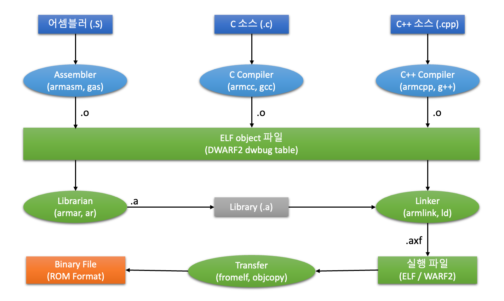

# 6장. **임베디드 소프트웨어 개발**

* [6-1 소프트웨어 개발 툴의 활용](#6-1-소프트웨어-개발-툴의-활용)  
* [6-2 Exception Handling](#6-2-exception-handling)  

## 6-1 소프트웨어 개발 툴의 활용  
  1. ARM Cross 컴파일러  
      
      * ARM Cross 컴파일러  
        PC의 x86 계열의 호스트에서 소스 프로그램을 32bit RISC 프로세서인 ARM용 기계어를 생성하는 프로그램
      * ARM Cross 컴파일러의 종류
        1. SDT v2.11, v2.50, v2.51
            * 통합 개발 환경 (IDE) : APM
            * 디버거 : ADW
        2. ADS(ARM Developer Suit) v1.01, v1.1, v1.2
            * 통합 개발 환경 (IDE) : CodeWarrior
            * 디버거 : AXD
        3. RVDS(RealView Developer Suit) v1.2, v2.0
            * IDE & 디버거 : RVD
        4. Code Warrior for ARM v1.2, v2.0
            * IDE & 디버거 : CodeWarrior
        5. GNU Compiler
            * 어셈블러 & 컴파일러 : gas, gcc
            * 디버거 : GDB, Insight 디버거
  2. Object 파일  
    컴파일러나 어셈블러에 의해 만들어진 바이너리 format의 파일  
      * Object 파일 구조
        1. Header
            * Section을 설명하는 내용
        2. Section
            * Text Section : 모든 code block
            * Data Section : 초기화된 전역변수 및 초기값
            * BSS Section : 초기화 되지 않은 전역 변수
        3. Symbol Table
            * 변수와 함수의 이름과 위치 정보를 가짐
      * Object 파일 format
        1. COFF(Common Object File Format)
        2. ELF(Extended Linker Format)
  3. Linker  
      * Linker
          * 불완전한 object 파일들을 합쳐 모든 코드와 데이터를 포함하는 새로운 object 파일을 생성해 내는 도구
          * 필요에 따라 라이브러리와 statup 파일을 같이 링크함
      * Startup 코드
          * 어셈블러로 구성되며 모든 프로그램에는 반드시 필요
          * 일반적으로 crt0.S(C-runtime 0의 약자), init S, startup.S 등의 이름을 많이 사용
          * Stratup 코드 동작
            1. 시스템 초기화
            2. Data 초기화
            3. Stack 영역 할당
            4. Heap 영역 할당
            5. 메인 함수(main) 호충
  4. Locate
      * Locate
        * 메모리에서 실행 가능하도록 코드와 게이터를 배치하여 최종 바이너리 이미지를 생성하는 도구
        * 대부분 링커에 포함되어 있음
      * Linker script 파일
        * 코드와 데이터의 메모리 배치를 정의한 파일
  5. ELF 이미지  
      * ELF(Executable Linkable Format)
        * Object 파일을 임의의 길이를 갖는 section들의 리스트로만 생각하고, 언제나 새로운 section의 추가가 가능하도록 되어있음
        * 프로그램 Linking  
          Object 파일의 상관 관계와 서로 link하는데 필요한 object 파일을 정보를 표시
        * 프로그램 Execution  
          프로그램을 구동시키는 방법과 프로그램 구동에 필요한 object 파일을 정보를 표시
        * DWARF2 디버깅 정보를 가지고 있음
      * DWARF(Debugging With Attribute Record Format)
  6. Binary 이미지
      * 링커에 의해 생성된 이미지에서 header, section 및 디버깅 정보를 제거한 이미지
      * 순수하게 타겟 CPU에서 하드웨어적으로 실행 가능한 machine code 만을 가지고 있음
      * ROMable 이미지
        * ELF 이미지는 실행 코드 이외에 다른 자료를 가지고 있으므로 ROM에 탑재되어 바로 구동될 수 없음
        * Binary 이미지를 탑재해야만 함
  7. 디버깅
      1. 다운로드 & 디버깅
          * 다운로드
            * 생성된 실행 가능한 바이너리 이미지를 타겟 보드의 메모리에 탑재하는 동작
            * 다운로드 및 실횅 방법
              1. ROM / Flash에 탑재하여 실행
              2. DRAM에 탑재하여 실행
              3. 전용 ICE를 사용하여 디버깅 정보와 함께 탑재하여 실행
          * 디버깅
            * 타겟 시스템을 실행하면서 프로그램의 실행 상태, 메모리, 변수 등을 프로그래머가 확인하거나 제어하면서 오류를 찾아 수정하는 동작
            * 실행 가능한 이미지가 반드시 디버깅 정보와 람께 메모리에 탑재되어 있어야 함
            * 전용 디버깅용 ICE 장비와 디버거 소프트웨어를 사용
      2. 다운로드 방법
          * ROM / Flash에 탑재하여 실행
          * DRAM에 탑재하여 실행
          * 전용 ICE를 사용하여 디버깅 정보와 함께 탑재하여 실행
      3. 임베디드 시스템 디버깅
          * 실행 제어
            * 데이터 액세스에 대하여 watchpoint 설정
            * 명령 실행에 대한 breakpoint 설정
            * 코드를 single step 실행
          * 상태 제어
            * Process 상태 제어
              * Register 값을 읽고 씀
            * 시스템 상태 제어
              * 시스템 메모리 엑세스
              * 코드 다운로드
          * 프로그램 실행 분석
            * 실시간 trace
            * Memory 액세스 history
      4. 디버그 인터페이스
        * ICE 장비
          * In-Circult Emulator(ICE)는 호스트의 디버거와 함께 Target 시스템의 레지스터나 메모리의 내용을 읽거나 변경할 수 있고, Break Point나 Watch Ponit를 설정할 수도 있고, 프로그램을 step-by-step으로 실행 할 수 있게 해주는 장치
        * 호스트 디버그 인터페이스
          * Parallel, Ethernet, USB 등
        * 타겟 디버그 인터페이스
          * BDM, JTAG 등

## 6-2 Exception Handling