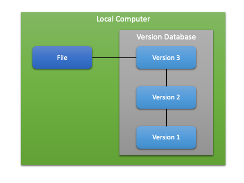
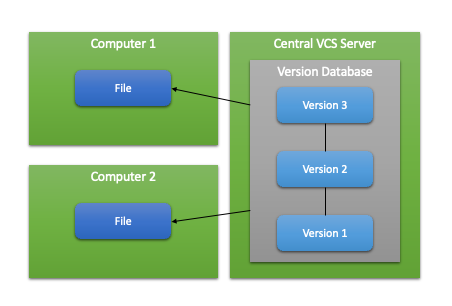
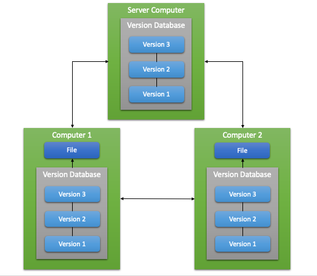
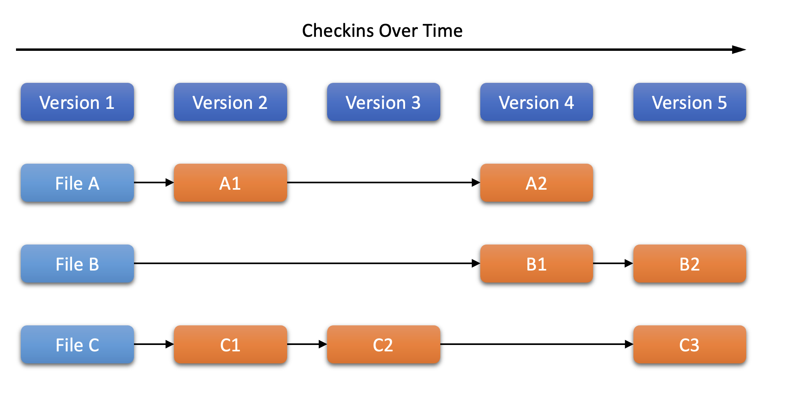
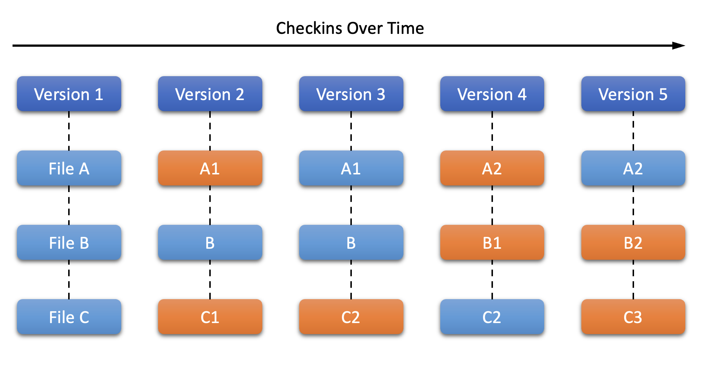
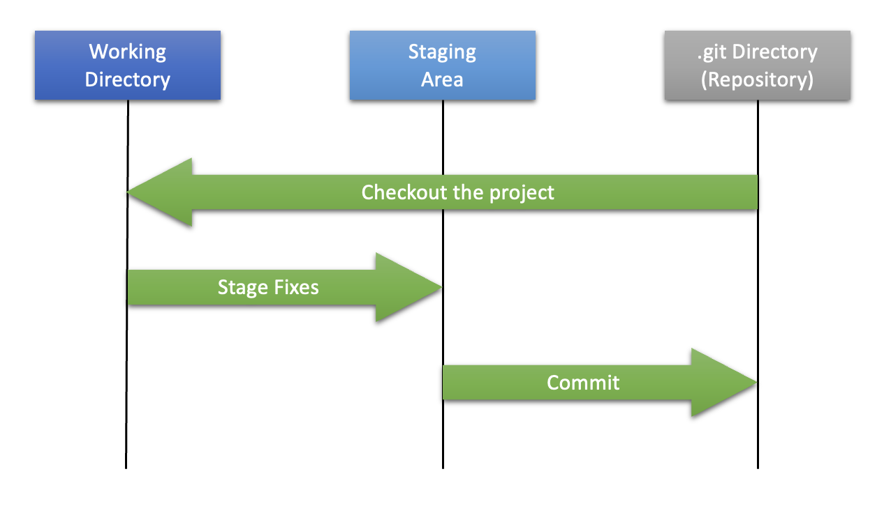

# 0장. **Git이란?**

  * [0-1 버전 관리란?](#0-1-버전-관리란)
  * [0-2 Git의 역사](#0-2-git의-역사)
  * [0-3 Git의 기초](#0-3-git의-기초)
  * [0-4 Git의 최초 설정](#0-4-git의-최초-설정)
  * [0-5 도움말 보기](#0-5-도움말-보기)

## 0-1 버전 관리란?
버전 관리 시스템(VCS<sup>Version Control System</sup>)은 파일의 변화를 시간에 따라 기록했다가 나중에 특정 시점의 버전을 다시 꺼내올수 있는 시스템이다.  
1. 로컬 버전 관리  
  로컬 버전 관리는 아주 간단한 데이터베이스를 사용해서 파일의 변경 정보를 관리했다.  
  가장 많이 사용하는 RCS가 있다.
  RCS는 기본적으로 Patch Set(파일에서 변경되는 부분)을 관리한다.
  이 Patch Set은 특별한 형식의 파일로 저장하고, Patch Set을 사용하여 모든 파일을 특정 시점으로 되돌릴 수 있다.
  <center></center>

2. 중앙집중식 버전 관리 (CVCS)  
프로젝트를 진행하다 보면 다른 개발자와 함께 작업을 해야하는 경우가 많다.  
이럴때 생기는 문제를 해결하기 위해 CVCS가 개발됐다.  
CVCS는 파일을 관리하는 서버가 별도로 있고, 클라이언트가 중앙 서버에서 파일을 받아서 사용한다.  
CVCS 환경은 누가 무엇을 하고 있는지 알 수 있고, 관리자가 누가 무엇을 할지 관리할 수 있다.  
모든 클라이언트의 로컬 데이터베이스를 관리하는 것보다 VCS 하나를 관리하기가 쉽다.
이러한 장점이 있는 반면에, 중앙 서버가 다운되면 하던일을 백업할 방법도, 협업을 할 방법도 없다는 단점이 있다.  
대표적인 CVCS로는 CVS, Subversion, Perforce가 있다.
  <center></center>

3. 분산 버전 관리 시스템(DVCS)  
DVCS<sup>Distributed Version Control Systems</sup>의 클라이언트는 단순히 파일의 마지막 스냅샷을 Checkout 하지않고 저장소 전부를 복제한다.  
이로 인해 서버에 문제가 생겨도 이 복제물로 작업을 할 수 있다.  
서버에 문제가 발생했을시 클라이언트의 복제물로 서버를 복원할 수도 있다.  
또한, 대부분의 DVCS 환경에서는 리모트 저장소가 존재한다.  
그래서 많은 사람들이 동시에 다양한 그룹과 방법으로 협업이 가능하며, 계층 모델 같은 중앙집중식 시스템으로 할 수 없는 다양한 워크플로우를 사용할 수 있다.  
대표적인 DVCS로는 Git, Mecurial, Bazaar, Darcs가 있다.  
  <center></center>

## 0-2 Git의 역사  
리눅스 커널은 규모가 굉장히 큰 오픈 소스 프로젝트이다.  
리눅스 커널은 Patch와 단순 압축 파일로만 관리했다.  
이후 리눅스 커널은 BitKeeper라고 불리는 상용 DVCS를 사용하기 시작했는데, BitKeeper를 리눅스 진영에서 무료로 사용하지 못하게 되면서 문제가 발생했다.  
이 사건은 리눅스 개발 커뮤니티가 자체 도구를 만드는 계기다 됐다.  
Git의 목표는 아래와 같다.
  * 빠른 속도  
  * 단순한 구조
  * 비선형적인 개발
  * 완벽한 분산
  * 대형 프로젝트에도 유용할 것  

Git은 2005년 탄생하고 나서 아직도 초기 목표를 유지하고 있다.

## 0-3 Git의 기초  
Git은 다른 VCS에서 사용하던 사용자 인터페이스와 비슷하지만 정보를 취급하는 방식은 다르다.  
  1. Git의 데이터 취급  
    Git은 다른 Subversion과 같은 VCS와 가장 큰 차이는 데이터를 다루는 방법에 있다.  
    CVS, Subverion등의 시스템은 각 파일의 변화를 시간순으로 관리하면서 파일의 집합을 관리한다.  
    하지만 Git은 파일을 스냅샷의 스트림처럼 관리한다.  
    또한, 파일이 변경되지 않으면 저장하지 않고, 이전 상태의 파일에 대한 링크만 저장한다.
      * 각 파일에 대한 병화를 관리하는 시스템
      <center></center>  

      * Git의 데이터 관리(시간순으로 프로젝트의 스냅샷을 저장)  
      <center></center>
  2. 거의 모든 명령어를 로컬에서 실행
    CVCS와는 다르게 Git은 프로젝트의 모든 히스토리가 로컬에 저장되어 있기때문에 서버와 통신을 하지 않고도 대부분의 명령을 실행할 수 있다.    
    이러한 특징 때문에 히스토리를 조회한다던지 하는 일들은 CVCS에 비해 굉장히 빠른 속도로 확인하고 수행할수 있다.  
  3. Git의 무결성  
    Git은 데이터를 저장하기 전에 항상 체크섬을 구하고 그 체크섬으로 데이터를 관리한다.  
    그래서 체크섬없이는 파일이나 Directory를 변경할 수 없다.  
    체크섬은 Git에서 사용하는 가장 기본적인 데이터 단위이자, Git의 기본 철학이다.  
    또한, Git은 SHA-1해시흫 사용하여 체크섭을 만든다.
  4. Git은 데이터를 추가만 한다
    Git으로 어떤 일을 하든 Git은 데이터베이스에 데이터를 추가만 한다.
    되돌리거나 삭제할수 없다.  
    다른 VCS처럼 commit 하지 않으면 데이터를 잃어버릴 수 있지만, 일단 commit을 하면 데이터를 잃어버리지 않고 이전 데이터로 되돌리거나 하는 일을 쉽게 할 수 있다.
  5. Git의 세가지 상태
    Git은 파일을 세가지 상태로 관리한다.  
      1. Committed  
        데이터가 로컬 데이터베이스에 저장된 상태
      2. Modified  
        수정된 파일들을 아직 로컬 데이터베이스에 커밋하지 않은 상태
      3. Staged
        현재 수정한 파일을 곧 커밋할 것이라고 표시한 상태
      <center></center>  
      Git Directory는 Git의 프로젝트의 메타데이터와 객체 데이터베이스를 저장하는 곳으로 Git의 핵심이다.  
      다른 컴퓨터에 있는 저장소를 Clone 할 때 이 Directory가 만들어진다.  
      Working Directory는 프로젝트의 특정 버전을 Checkout 한 것이다.  
      Git Directory는 작업하고 있는 디스크에 있고 그 Directory 안에 압축된 데이터베이스에서 파일을 가져와서 워킹 Directory를 만든다.  
      Staging Area는 Git Directory안에 있다.  
      단순한 파일이고, 곧 커밋할 파일들에 대한 정보를 저장한다.  

## 0-4 Git의 최초 설정
Git을 설치하고 나면 사용 환경을 위해 설정을 해주어야 한다.  
git configure라는 명령어로 내용을 확인하고 수정할 수 있다.  
이때 사용되는 설정 파일은 3가지이다.  
  1. /etc/gitconfig  
    시스템의 모든 사용자와 모든 저장소에 적용되는 설정  
    (git config --system 옵션으로 이 파일을 읽고 쓸수 있음)
  2. ~/.gitconfig, ~/.config/git/config  
    특정 사용자에게만 적용되는 설정  
    (git config --global 옵션으로 이 파일을 읽고 쓸수 있음)
  3. .git/config  
    Git Directory에 있고, 특정 저장소(or Repository)에만 적용되는 설정  
    (git config --system 옵션으로 이 파일을 읽고 쓸수 있음)  
  
  각 설정 파일의 우선 순위는 3 > 2 > 1 이다.  
  * 사용자 정보  
    사용자 정보를 설정하는 명령어는 아래와 같다.
    ```
    git config --global user.name "Your Name"
    git config --global user.email Your Email@example.com
    ```
  * 편집기 설정  
    편집기는 아래의 명령어로 설정한다.
    ```
    git config --global core.editor emacs
    ```
    윈도우에서 Git의 편집기로 notepad++ 로 사용하기 위해서는 아래의 명령어를 사용하면 된다.
    ```
    git config --global core.editor "'C:/Program Files (x86)/Notepad++/notepad++.exe' -multiInst -nosession"
    ```
  * 설정 확인  
    설정을 확인하기 위해서는 아래의 명령어를 사용한다.  
    Git에 설정한 모든 것을 확인할 수 있다.
    ```
    git config --list
    ```

## 0-5 도움말 보기  
명령어에 대한 도움말이 필요할 때 도움말을 보는 방법은 두 가지가 있다.
```
git help <verb>
man git-<verb>
```