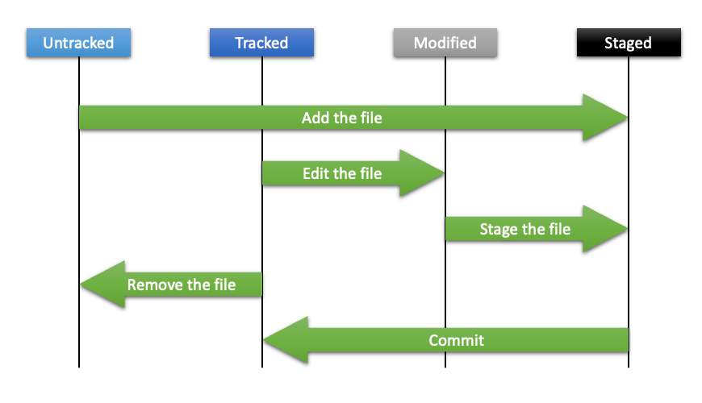

# 1장. **Git의 기초**

  * [1-1 Git 저징소 만들기](#1-1-Git-저징소-만들기)

## 1-1 Git 저징소 만들기
  1. 저장소 만들기  
    Git 저장소를 만드는 방법은 2가지가 있다.
      1. 기존 Directory를 Git 저장소로 만들기  
          기존 프로젝트를 Git으로 관리하고 싶다면 프로젝트의 Directory로 이동해서 `git init` 명령어를 실행한다.  
          `git init` 명령어는 .git이라는 하위 Directory를 만든다.  
          .git Directory에는 저장소에 필요한 Skeleton 파일이 들어있다.  
          위 명령만으로는 파일을 관리하지는 않는다.  
          파일을 관리하기 위해서는 `git add`로 파일을 추가하고 `git commit`으로 커밋을 수행해야 파일을 관리하기 시작한다.
      2. 기존 저장소를 Clone하기
          다른 프로젝트에 참여하거나 Git 저장소를 복사하고 싶을떄는 `git clone` 명령을 사용한다.  
          `git clone`은 서버에 있는 거의 모든 데이터를 복사한다.  
          명령어의 사용법은 아래와 같다.
          ```
          git clone [url] (directory)
          ```

  2. 수정하고 저장소에 저장하기  
    Working Directory의 모든 파일은 크게 Tracked와 Untracked로 나눌수 있다.  
    Tracked 파일은 이미 스냅샷에 포함돼 있던 파일이다.  
    Tracked 파일은 Unmodified와 Modified, Staged 상태중 하나이다.
    Unmodified 수정 하지 않은 상태, Modified는 수정한 상태, Staged는 커밋으로 저장소에 기록할 상태이다.  
    나머지 파일은 전부 Untracked 파일이다. 
      <center></center>

      * 파일 상태 확인하기  
        파일의 상태를 확인하는 명령어는 `git status` 이다.
        `git clone` 후에 바로 `git status`를 실행하면 아래와 같은 메세지를 보여준다.  
          ```
          On branch master
          Your branch is up to date with 'origin/master'.

          nothing to commit, working tree clean
          ```
        위 내용은 현재 브랜치가 master이고 파일을 하나도 수정하지 않았음을 말한다.  
        만약 "README" 파일을 새로 생성한다면 `git status`를 실행했을 떄, 아래와 같은 메세지를 보여준다.  

          ```
          On branch master
          Your branch is up-to-date with 'origin/master'.
          Untracked files:
          (use "git add <file>..." to include in what will be committed)

          README

          nothing added to commit but untracked files present (use "git add" to track)
          ```
        README 파일은 “Untracked files” 부분에 있다.  
        이것은 README 파일이 Untracked 상태라는 것을 의미한다.  
        즉, Git은  README 파일을 아직 스냅샷에 넣어지지 않은 파일(이력을 관리하지 않는 파일)이라고 본다.  
        그래서 파일이 Tracked 상태가 되기 전까지는 Git은 README 파일을 커밋하지 않는다.

      * 파일을 새로 추적하기  
        위에서 추가한 README 파일을 Tracked 상태로 만들기 위해서는 `git add 파일명` 명령을 사용하면 된다.  
        `git add` 명령은 파일 또는 Directory의 경로를 argument로 받는다.  Directory면 해당 Directory에 포함되어 있는 파일을 재귀적으로 추가한다.
        `git add` 명령으로 파일을 Tracked 상태로 만들고 `git status` 명령을 실행시키면 아래와 같이 결과가 출력된다.  
          ```
          $ git status
          On branch master
          Your branch is up-to-date with 'origin/master'.
          Changes to be committed:
            (use "git reset HEAD <file>..." to unstage)

              new file:   README
          ```
        “Changes to be committed” 에 들어 있는 파일은 Staged 상태라는 것을 의미한다.  
        커밋을 하면 git add 를 실행한 시점의 파일이 커밋되어 저장소 히스토리에 남는다.  
        
        * Modified 상태의 파일을 Stage 하기  
          Modified 상태인 파일을 Stage 하기 위해서 사용되는 명령어도 `git add` 이다.  
          어떤 파일을 수정하고 `git add` 명령을 통해 Staged 상태로 만든 뒤 추가 수정 사항이 있어 수정할 경우 해당 파일은 Staged 상태이면서 동시에 Unstaged 상태가 된다.  
          git add 명령을 실행하면 Git은 파일을 바로 Staged 상태로 만든다.  
          그래서 그 후에 추가 수정사항에 대해서는 아직 Stage 되지 않기 떄문이다.  
          그렇기 떄문에 커밋을 최신 버전의 파일로 하기위해서는 최종 수정이후 한번더 `git add` 를 해주어야 한다.
        
        * 파일 상태를 간략하게 확인하기  
          git status 명령으로 확인하는 내용이 많다면 -s (--short) 옵션을 주어 현재 상태를 간략하게 볼 수 있다.  
            ```
             M README
            MM Rakefile
            A  lib/git.rb
            M  lib/simplegit.rb
            ?? LICENSE.txt
            ```
          상태 정보 컬럼에는 두가지 정보를 보여준다.  
          왼쪽에는 Staging Area에서의 상태를, 오른쪽에는 Working Tree에서의 상태를 표시한다.
          파일 앞에 붙은 표시들의 상태는 각각 다음과 같다.  
          |표기|상태|
          |:--:|--|
          |M|Staged (수정된 파일)|
          |A|Staged (새로 생성된 파일)|
          |??|Untracked (새로 생성된 파일)|

          * 파일 무시하기  
            Git에서 모든 파일을 관리할 필요는 없다.  
            예를 들어, 빌드 시스템이 자동으로 생성한 파일(.o, .a 등)이나 로그 파일은 관리할 이유가 뚜렷하지 않은 이상 지속적으로 추적 및 관리할 필요가 없는 파일들이다.  
            이런 파일 때문에 변경점 등을 파악하기 힘들수 있다.  
            이때 이런 파일을 무시하려면 .gitignore 파일을 만들고 그 안에 무시할 파일 패턴을 적는다.
            * [.gitignore 예제](https://github.com/github/gitignore)
