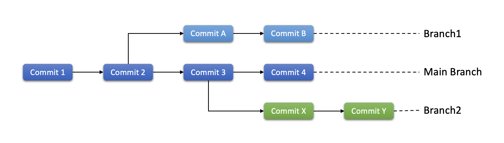
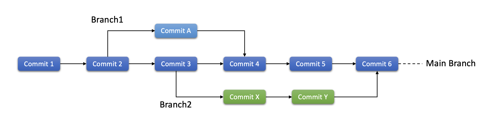
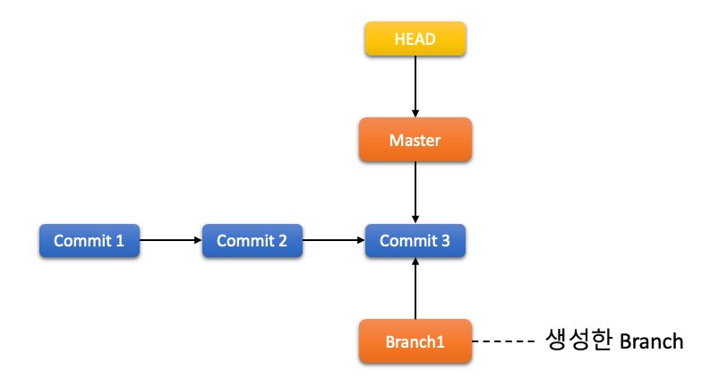
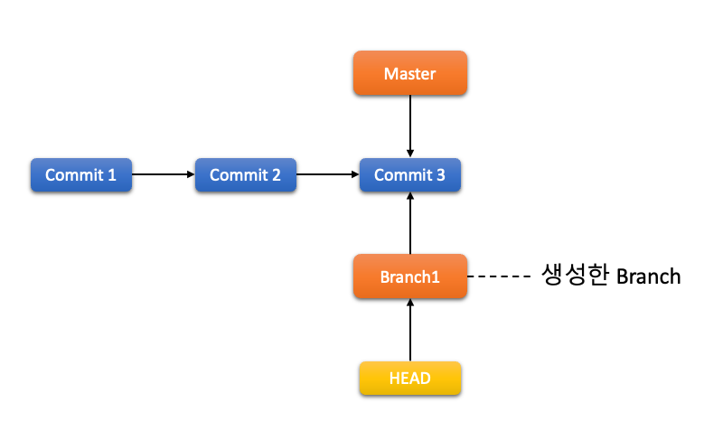
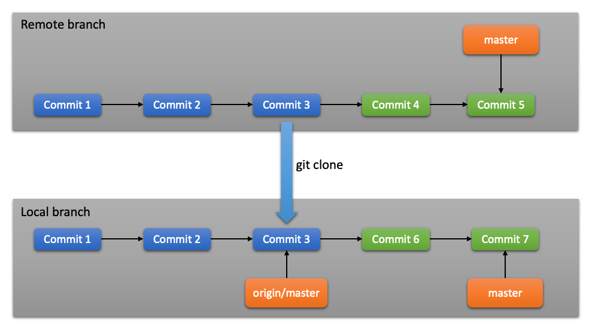

# 2장. **Git Branch**

  * [2-1 브랜치란?](#2-1-브랜치란)
  * [2-2 브랜치와 Merge](#2-2-브랜치와-merge)
  * [2-3 리모트 브랜치](#2-3-리모트-브랜치)
  * [2-4 Rebase 하기](#2-4-rebase-하기)

## 2-1 브랜치란?  
브랜치는 기존 소스 코드와는 독립적으로 어떤 작업을 진행하기 위한 개념이다.  
브랜치를 생성하면 다른 브랜치의 영향을 받지 않기 때문에, 동시에 여러개의 작업을 진행할 수 있다.  
  <center></center>
또한 이렇게 생성한 브랜치를 Merge하여 작업한 내용을 하나의 브랜치로 모을 수도 있다.  
  <center></center>

  1. Branch 생성  
      Branch는 다음 명령어로 생성할 수 있다. `git branch <브랜치명>`  
      새로 생성한 브랜치는 현재 작업하고 있는 마지막 커밋을 가리킨다.  
        <center></center>
      하지만 `git branch` 명령은 Branch를 생성하기만 하고 현재 Branch를 이동하지는 않는다.  
      Branch를 생성했을때의 HEAD는 아래와 같이 기존 작업을 하던 Branch를 가르킨다.  
        <center></center>  
  2. Branch 이동  
      생성한 브랜치로 이동하기 위해서는 `git checkout <브랜치명>` 을 사용하면 된다.  
      `git checkout <브랜치명>`로 브랜치를 이동하면 HEAD가 다음과 같이 이동한다.  
        <center></center>  
      `git log` 명령에 `--decorate` 옵션을 사용하면 브랜치가 어떤 커밋을 가리키는지 알 수 있다. 
      
## 2-2 브랜치와 Merge  
  보통 브랜치는 어떤 이슈가 발생했을 때 진행중인 개발 소스와 별개로 처리하기 위해, 현재의 소스에서 여러개의 버전이 만들어 져야할 때 생성해서 사용한다.  
  이슈를 처리했을 경우에는 해당 이슈에 대한 검증을 마치고 그 코드를 운영중인 브랜치(master or main branch)에 머지하여 다시 하나의 브랜치로 관리한다.  
  이때, 브랜치를 운영하는 순서는 아래와 같다.  
  ```
  1. 새로운 이슈를 처리위해 브랜치를 생성한다.  
  2. 생성한 브랜치로 이동해 코드를 수정한다.  
  3. 수정한 이슈에 대한 마치고 운영 브랜치로 Merge 한다.
  ```

  1. Merge의 기초  
    Merge를 수행할 때는 운영중인 브랜치(목적지 브랜치)로 이동하고 머지를 진행한다.  
    예를 들어 master 브랜치에 merge를 하려면 master 브랜치에서 작업을 진행해야 한다는 의미이다.  
    merge를 하기위한 명령어는 다음과 같다.  
    `git merge <merge할 브랜치명>`
    또한, merge를 진행하고 나면 merge된 브랜치는 이제 필요가 없어진다.  
    필요없는 브랜치를 삭제하기 위해서는 `git branch -d <브랜치명>` 명령을 사용한다.

  2. Merge conflict 기초  
    만약 같은 파일의 같은 부분을 두사람이 동시에 작업을 하고 Merge를 시도할 경우 conflict가 발생한다.  
    이때, Git은 자동으로 Merge 하지 못해서 새 커밋이 생기지 않는다.  
    충돌을 해결하지 않으면 Merge 과정을 진행할 수 없다.  
    conflict가 발생했을 떄 `git status` 명령을 사용하면 어떤 파일을 Merge 할 수 없었는지 알 수 있다.  
    충돌이 일어난 파일은 unmerged 상태로 표시되며, Git은 충돌이 난 부분을 표준 형식에 따라 아래와 같이 표시해준다.  
        ```
        <<<<<<< HEAD:index.html
        <div id="footer">contact : email.support@github.com</div>
        =======
        <div id="footer">
        please contact us at support@github.com
        </div>
        >>>>>>> iss53:index.html
        ```
      이때 개발자는 해당 부분을 확인하고 수동으로 conflict를 해결한다.  
      ======= 위쪽의 내용은 HEAD 버전(merge 명령을 실행할 때 작업하던 master 브랜치)의 내용이고 아래쪽은 iss53 브랜치의 내용이다.  
      충돌을 해결하려면 위쪽이나 아래쪽 내용 중에서 고르거나 새로 작성하여 Merge 해야한다.  
      그리고 당연히 `<<<<<<<, =======, >>>>>>>`가 포함된 행을 삭제해야 한다.   이렇게 충돌한 부분을 해결하고 `git add` 명령으로 다시 Git에 저장한다.
  
      또한 다른 Merge tool로도 충돌을 해결할 수 있다.  
      Merge tool로 conflict를 해결하기 위해서는 `git mergetool` 명령을 실행한다.  
      충돌을 해결한 후에는 어떻게 충돌을 해결했고 좀 더 확인해야 하는 부분은 무엇이고 왜 그렇게 해결했는지에 대해 commit에 자세하게 기록해두는 것이 좋다.  
      나중에 이력을 확인하다 보면 이 Merge 커밋이 어떻게 수정이 되었는지 알기 쉽기 떄문이다.  
  
  3. 브랜치 관리  
    `git branch` 명령은 단순히 브랜치를 만들고 삭제하는 명령이 아니다.
    `git branch` 명령에 옵션을 추가하는 것에 따라 여러가지 기능을 제공한다.  
    아무 옵션 없이 `git branch` 명령을 실행하면 브랜치 목록을 보여준다.  
    옵션에 대해서는 아래 표를 참고하자.  
      |명령|설명|
      |:--:|--|
      |-v|브랜치 목록과 마지막 커밋 메세지를 함께 보여줌|
      |--merged|현재 브랜치를 기준으로 merge가 된 브랜치 목록을 보여줌|
      |--no-merged|현재 브랜치를 기준으로 merge가 되지 않은 브랜치 목록을 보여줌|
      |-d <브랜치명>|<브랜치명>에 해당하는 브랜치를 삭제한다.</br>단, Merge되지 않은 브랜치는 삭제되지 않는다.|
      |-D <브랜치명>|<브랜치명>에 해당하는 브랜치를 강제로 삭제한다.</br>Merge되지 않은 브랜치도 삭제된다.|

## 2-3 리모트 브랜치
  리모트 Refs는 리모트 저장소에 있는 포인터인 레퍼런스다.  
  리모트 저장소에 있는 브랜치, 태그, 등등을 의미한다.  
  `git ls-remote <remote>` 명령으로 모든 리모트 Refs를 조회할 수 있다.  
  `git remote show <remote>` 명령은 모든 리모트 브랜치와 그 정보를 보여준다.  
  리모트 Refs가 있지만 보통은 리모트 트래킹 브랜치를 사용한다.  

  1. 리모트 트래킹 브랜치  
    리모트 트래킹 브랜치는 리모트 브랜치를 추적하는 레퍼런스이며 브랜치다.  
    리모트 트래킹 브랜치는 로컬에 있지만 임의로 움직일 수 없다.  
    리모트 서버에 연결할 때마다 리모트의 브랜치 업데이트 내용이 자동으로 갱신된다. 
    즉, 리모트 트래킹 브랜치는 리모트 저장소에 마지막으로 연결했던 순간에 브랜치가 무슨 커밋을 가리키고 있었는지를 나타낸다.  
    리모트 트래킹 브랜치의 이름은 `<remote>/<branch>` 형식으로 되어 있다.  
    참고로 `git clone -o <remote>` 명령을 사용하여 사용자가 지정한 리모트 이름으로 저장소를 clone 할 수 있다.
    
  2. Clone 이후 서버와 로컬의 master 브랜치  
      로컬 브랜치와 서버의 리모트 브랜치는 독립적이다.  
      로컬에서의 히스토리와 리모트 서버에서의 히스토리는 달라질 수 있다.  
      협업을 하는 프로젝트의 경우 하나의 깃을 여러명이 사용하기 때문에 더욱 그렇다.  
      <center></center>  
      이렇게 달라진 리모트 브랜치 정보를 업데이트하기 위해서는 `git fetch` 명령을 사용한다.  
      
  3. Push 하기  
    로컬의 브랜치를 서버로 전송하려면 리모트 저장소에 Push 해야 한다.  
    명시적으로 브랜치를 Push 해야 정보가 전송된다.  
    반대로 말하면 리모트 저장소에 전송하지 않고 로컬 브랜치에만 두는 개인 브랜치를 만들 수 있는 말이다.  
    또 다른 사람과 협업하기 위해 하나의 브랜치만 전송할 수도 있다.  
    브랜치를 push 하기 위해서는 `git push <remote> <branch>` 명령을 사용하면 된다.  
    좀 더 자세히 쓰자면 `git push <전송할 remote> <전송할 local branch>:<전송할 remote branch>`로 명령을 작성한다.  

  4. 브랜치 추적  
    리모트 트래킹 브랜치를 로컬 브랜치로 Checkout 하면 자동으로 “트래킹(Tracking) 브랜치” 가 만들어진다 (트래킹 하는 대상 브랜치를 “Upstream 브랜치” 라고 부른다).  
    트래킹 브랜치는 리모트 브랜치와 직접적인 연결고리가 있는 로컬 브랜치이다.  
    트래킹 브랜치에서 git pull 명령을 내리면 리모트 저장소로부터 데이터를 내려받아 연결된 리모트 브랜치와 자동으로 Merge 한다.
    `git checkout -b <branch> <remote>/<branch>` 명령으로 간단히 트래킹 브랜치를 만들 수 있다.  
    `--track` 옵션을 사용하여 로컬 브랜치 이름을 자동으로 생성할 수도 있다.
    또한, 이미 로컬에 존재하는 브랜치가 리모트의 특정 브랜치를 추적하게 하려면 `git branch -u <remote>/<branch>` 나 `git branch --set-upstream-to <remote>/<branch>` 명령으로 특정 리모트 브랜치를 추적하게 할 수 있다.
  
  5. Pull 하기  
    `git fetch` 명령을 실행하면 서버에는 존재하지만, 로컬에는 아직 없는 데이터를 받아와서 저장한다.  
    이 때 워킹 디렉토리의 파일 내용은 변경되지 않고 그대로 남는다.  
    서버로부터 데이터를 가져와서 저장해두고 사용자가 Merge 하도록 준비만 해둔다.  
    하지만 `git pull` 명령은 대부분 `git fetch` 명령을 실행하고 나서 자동으로 `git merge` 명령을 수행한다.
    즉, `git pull` 명령은 서버로부터 데이터를 가져와서 현재 로컬 브랜치와 서버의 추적 브랜치를 Merge 한다.
    일반적으로 fetch 와 merge 명령을 명시적으로 사용하는 것이 pull 명령으로 한번에 두 작업을 하는 것보다 좋다.
    
  6. 리모트 브랜치 삭제  
    리모트 브랜치를 삭제하기 위해서는 `git push <remote> --delete <branch>`명령을 사용한다.  
    이 명령을 실행하면 서버에서 해당 브랜치가 삭제된다.  
    서버에서 가비지 컬렉터가 동작하지 않는 한 데이터는 사라지지 않기 때문에 종종 의도치 않게 삭제한 경우에도 커밋한 데이터를 살릴 수 있다.

## 2-4 Rebase 하기  
  Git에서 한 브랜치에서 다른 브랜치로 합치는 방법으로는 두 가지가 있다. 하나는 Merge 이고 다른 하나는 Rebase 이다.

  1. Rebase의 기초  
    Merge는 두개의 commit이 하나의 parent를 사용하는 3-way-merge로 새로운 커밋을 만들어 냈다.  
    하지만 변경된 사항을 Patch로 만들고 이를 적용하는 방법이 rebase이다.  
    즉, rebase 명령으로 한 브랜치에서 변경된 사항을 다른 브랜치에 적용할 수 있다.
    원리는 다음과 같다.  
      1. 두 브랜치가 나뉘기 전인 공통 커밋으로 이동  
      2. 해당 커밋으로 부터 현재 Checkout 한 브랜치가 가리키는 커밋까지 diff를 차례로 만들어 임시로 저장
      3. Rebase할 브랜치가 합칠 브랜치가 가리키는 커밋을 가리키게 하고 임시 저장된 Patch를 차례대로 적용  
      4. 브랜치가 합쳐지면 합친 브랜치를 Fast-forward  
    
      즉 Rebase 의 경우, 브랜치의 변경사항을 순서대로 다른 브랜치에 적용하면서 합치고 Merge 의 경우, 두 브랜치의 최종결과만을 가지고 합친다.
  