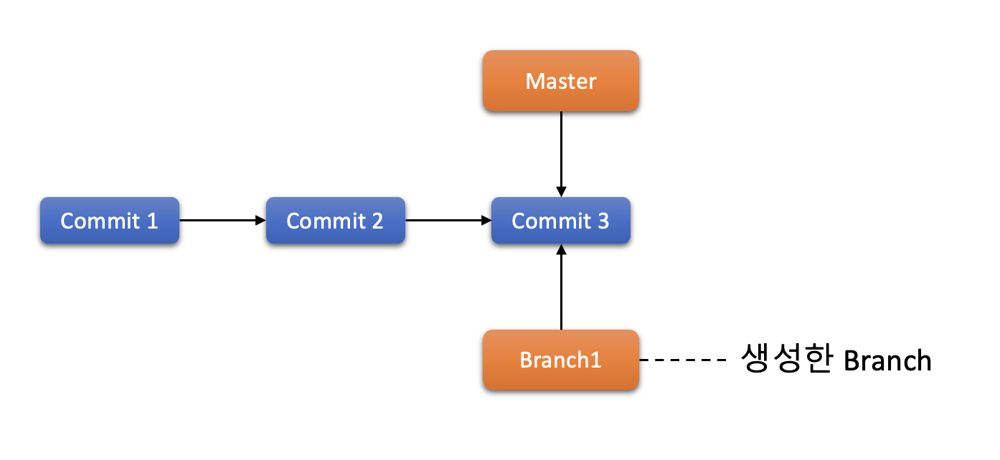

# 2장. **Git Branch**

  * [2-1 브랜치란?](#2-1-브랜치란)

## 2-1 브랜치란?  
브랜치는 기존 소스 코드와는 독립적으로 어떤 작업을 진행하기 위한 개념이다.  
브랜치를 생성하면 다른 브랜치의 영향을 받지 않기 때문에, 동시에 여러개의 작업을 진행할 수 있다.  
  

또한 이렇게 생성한 브랜치를 Merge하여 작업한 내용을 하나의 브랜치로 모을 수도 있다.  
  

  1. Branch 생성  
      Branch는 다음 명령어로 생성할 수 있다. `git branch <브랜치명>`  
      새로 생성한 브랜치는 현재 작업하고 있는 마지막 커밋을 가리킨다.  
        

      하지만 `git branch` 명령은 Branch를 생성하기만 하고 현재 Branch를 이동하지는 않는다.  
      Branch를 생성했을때의 HEAD는 아래와 같이 기존 작업을 하던 Branch를 가르킨다.  
        

  
      