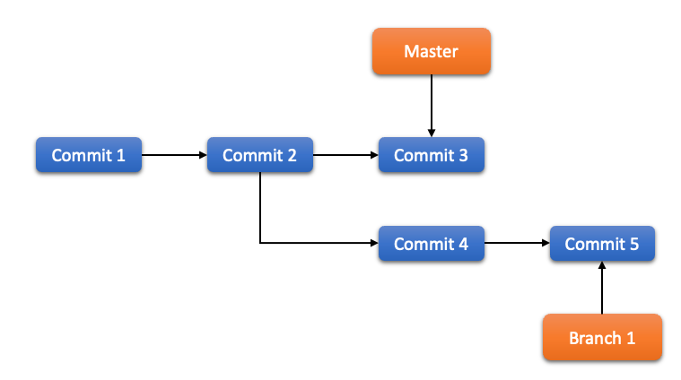

# 4장. **분산 환경에서의 Git**

  * [4-1 분산 환경에서의 워크플로](#4-1-분산-환경에서의-워크플로)
  * [4-2 프로젝트 관리하기](#4-2-프로젝트-관리하기)
  * [4-3 릴리즈 하기](#4-3-릴리즈-하기)

## 4-1 분산 환경에서의 워크플로  
  중앙집중형 버전 관리 시스템과는 달리 Git은 분산형이다.  
  
  * 중앙집중식 워크플로  
    중앙집중식 시스템에서는 보통 중앙집중식 협업 모델이라는 한 가지 방식밖에 없다.  
    중앙 저장소는 딱 하나 있고 변경 사항은 모두 이 중앙 저장소에 집중된다.  
    개발자들은 이 중앙 저장소를 중심으로 작업한다.   
      

    중앙집중식 워크플로에서는 한 개발자가 자신이 한 일을 커밋하고 서버에 Push 한다.  
    그러면 다른 개발자는 자신의 일을 커밋하고 Push 하기 전에 다른 개발자가 한 일을 먼저 Merge 해야 한다.  
    
  * Integration-Manager 워크플로  
    Git을 사용하면 리모트 저장소를 여러 개 운영할 수 있다.  
    다른 개발자는 읽기만 가능하고 자신은 쓰기도 가능한 공개 저장소를 만들수도 있다.  
    이 Workflow에는 보통 프로젝트를 대표하는 공식 저장소가 있다.  
    기여자는 우선 공식 저장소를 하나 Clone 하고 수정하고 나서 자신의 저장소에 Push 한다.  
    그 다음에 프로젝트 Integration-Manager에게 새 저장소에서 Pull 하라고 요청한다.  
    그러면 그 Integration-Manager는 기여자의 저장소를 리모트 저장소로 등록하고, 로컬에서 기여물을 테스트하고, 프로젝트 메인 브랜치에 Merge 하고, 그 내용을 다시 프로젝트 메인 저장소에 Push 한다.  
    이런 과정은 아래와 같다.
      1. 프로젝트 Integration-Manager는 프로젝트 메인 저장소에 Push를 한다.  
      2. 프로젝트 기여자는 메인 저장소를 Clone 하고 수정한다.  
      3. 기여자는 자신의 저장소에 Push 하고 Integration-Manager가 접근할 수 있도록 공개해 놓는다.  
      4. 기여자는 Integration-Manager에게 변경사항을 적용해 줄 것을 이메일로 요청한다.  
      5. Integration-Manager는 기여자의 저장소를 리모트 저장소로 등록하고 수정사항을 Merge 하여 테스트한다.  
      6. Integration-Manager는 Merge 한 사항을 메인 저장소에 Push 한다.  
          

  * Dictator and Lieutenants 워크플로  
    이 방식은 저장소를 여러개 운영하는 방식을 변형한 구조이다.  
    보통 수백 명의 개발자가 참여하는 아주 큰 프로젝트를 운영할 때 이 방식을 사용한다.  
    예를 들면 Linux 커널 프로젝트가 대표적이다.  
    여러 명의 Integration-Manager가 저장소에서 자신이 맡은 부분만을 담당하는데 이들을 Lieutenants 라고 부른다.  
    모든 Lieutenant는 최종 관리자 아래에 있으며 이 최종 관리자를 Benevolent Dictator 라고 부른다.  
    Benevolent Dictator는 Lieutenant의 저장소를 가져와 공식 저장소에 Push 하고 모든 프로젝트 참여자는 이 공식 저장소에서 반드시 Pull 해야 한다.  
    이러한 워크플로는 아래와 같다.
      1. 개발자는 코드를 수정하고 master 브랜치를 기준으로 자신의 토픽 브랜치를 Rebase 한다. 여기서 master 브랜치란 공식 저장소의 브랜치를 말한다.  
      2. Lieutenant들은 개발자들의 수정사항을 자신이 관리하는 master 브랜치에 Merge 한다.
      3. Dictator는 Lieutenant의 master 브랜치를 자신의 master 브랜치로 Merge 한다.
      4. Dictator는 자신의 master 브랜치를 Push 하며 다른 모든 개발자는 Dictator의 master 브랜치를 기준으로 Rebase 한다.
          

## 4-2 프로젝트 관리하기
  프로젝트를 운영하는 것은 크게 두 가지로 이루어진다.  
  하나는 format-patch 명령으로 생성한 Patch를 받아서 프로젝트에 Patch를 적용하는 방법이고, 다른 하나는 프로젝트의 다른 리모트 저장소로부터 변경 내용을 Merge 하는 것이다.  
  
  * 토픽 브랜치에서 일하기  
    메인 브랜치에 통합하기 전에 임시로 토픽 브랜치를 하나 만들고 거기에 통합해 보고 나서 다시 메인 브랜치에 통합하는 것이 좋다.  
    이렇게 하면 Patch를 적용할 때 이리저리 수정해 보기도 하고 좀 더 고민해 봐야 하면 Patch를 적용해둔 채로 나중으로 미룰 수도 있다.  
    무슨 Patch인지 브랜치 이름에 간단히 적어주면 다른 작업을 하다가 나중에 이 브랜치로 돌아왔을 때 기억해내기 훨씬 수월하다.  
    나중에 작업과 테스트가 전부 끝난뒤 작업한 결과물을 Long-Running 브랜치로 Merge 한다.  

  * Patch를 적용하기  
    Patch를 프로젝트에 적용하기 전에 우선 토픽 브랜치에 Patch를 적용한다.  
    Patch를 적용하는 방법은 `git apply` 명령을 사용하는 것과 `git am` 명령을 사용하는 것 두 가지가 있다.

      1. apply 명령을 사용하는 방법  
        git diff 나 Unix의 diff 명령으로 만든 Patch 파일을 적용할 때는 `git apply <Path>` 명령을 사용한다. Patch 파일이 /tmp/patch-ruby-client.patch 라고 하면 아래와 같은 명령으로 Patch를 적용할 수 있다.

        git apply 는 “모두 적용, 아니면 모두 취소” 이기 때문에 Patch를 적용하는 데 실패하면 Patch를 적용하기 이전 상태로 전부 되돌려 놓는다.  
        patch 명령은 여러 파일에 적용하다가 중간에 실패하면 거기서 그대로 중단하기 때문에 깔끔하지 못하다.  
        git apply 는 patch 명령보다 훨씬 보수적이다.  
        이 명령은 자동으로 커밋해 주지 않기 때문에 변경된 파일을 직접 Staging Area에 추가하고 커밋해야 한다.
        실제로 Patch를 적용하기 전에 Patch가 잘 적용되는지 한 번 시험해보려면 `git apply --check <Path>` 명령을 사용한다.
        화면에 아무 내용도 뜨지 않으면 Patch가 깔끔하게 적용됐다는 것이다.  
        이 명령은 Patch를 적용해 보고 에러가 발생하면 0이 아닌 값을 반환하기 때문에 쉘 스크립트에서도 사용할 수 있다.

      2. am 명령을 사용하는 방법  
        `git format-patch` 명령으로 만든 Patch 파일은 기여자의 정보와 커밋 정보가 포함되어 있다.  
        format-patch 명령으로 생성한 Patch 파일은 `git am <Path>` 명령으로 적용한다.  
        만약 Patch에 실패한다면 `git am` 명령은 Merge 나 Rebase처럼 conflict를 발생한다.  
        이때, 충돌한 파일을 열어서 충돌 부분을 수정하고 나서 Staging Area에 추가하고 git am --resolved 명령을 입력하여 해결한다.  
        또는, 충돌이 났을 때 `-3` 옵션을 사용하여 3-way Patch를 적용해 볼수있다.  
        이 옵션은 기본적으로 비활성화돼 있다.  
        이유는 Patch가 어느 시점에서 갈라져 나온 것인지 알 수 없기 때문이다.  
        하지만 같은 프로젝트의 커밋이라면 기본 옵션보다 훨씬 똑똑하게 충돌 상황을 해결한다.
        마지막으로 `-i` 옵션을 사용하면 am 명령의 대화형 방식을 사용할 수 있다.  
        이 방식은 Patch를 적용할 때마다 묻는다.

  * 리모트 브랜치로부터 통합하기  
    이 방법은 우리가 앞서 다뤘던 git remote branch를 다루는 것과 거의 유사하다.  
    다른 개발자들과 함께 지속적으로 개발할 때는 이 방식이 가장 사용하기 좋다.  
    리모트 저장소로 등록하면 커밋의 히스토리도 알 수 있고, Merge 할 때 어디서부터 커밋이 갈라졌는지 알 수 있기 때문에 -3 옵션을 주지 않아도 자동으로 3-way Merge가 적용되기 때문이다.

  * 무슨 내용인지 확인하기  
    기여물이 포함된 토픽 브랜치가 있으니 이제 그 기여물을 Merge 할지 말지 결정해야 한다.  
    즉, 토픽 브랜치에서 어떤 부분이 수정되었는지 확인하고 Merge를 결정한다.  
    어떤 브랜치에 속한 커밋은 제외하고 확인하여면 `git log <revision or path> --not <Branch>` 옵션으로 해당 브랜치에 속한 커밋은 제외하고 살펴볼수 있다.  
    또한 `git log` 명령에 `-p` 옵션을 주면 각 커밋에서 실제로 무슨 내용이 변경됐는지 살펴볼 수 있다.

  * 수정사항 통합하기  
    수정사항을 토픽 브랜치에 다 적용하고 master 브랜치로 통합하는 방법은 Merge, Rebase, Cherry-pick이 있다.  

      * Merge 하는 워크플로
        바로 master 브랜치에 Merge 하는 것이 가장 간단하다.  
        토픽 브랜치에서 작업을 하고 검증이 끝나면 master 브랜치로 Merge 한 후 토픽 브랜치를 삭제하는 과정을 반복한다.  

      * Rebase 하는 워크플로  
        히스토리를 한 줄로 관리하려면 Rebase를 하면 된다.  
        토픽 브랜치에서 작업을 마친 후 master 브랜치에 Merge 할 때 master 브랜치를 기반으로 Rebase 한다.  
        그러면 커밋이 다시 만들어지고, 문제가 없다면 master 브랜치를 Fast-forward시킨다.  
        이렇게 작업을 하면 히스토리를 한 줄로 유지할 수 있다.  

      * Cherry-pick 하는 워크플로  
        한 브랜치에서 다른 브랜치로 작업한 내용을 옮기는 또 다른 방식으로 Cherry-pick이라는 방법도 있다.  
        Git의 Cherry-pick은 커밋 하나만 Rebase 하는 것이다.  
        커밋 하나로 Patch 내용을 만들어 현재 브랜치에 적용을 하는 것이다.  
        토픽 브랜치에 있는 커밋 중에서 하나만 고르거나 토픽 브랜치에 커밋이 하나밖에 없을 때 Rebase 보다 유용하다.  
        `git cherry-pick <commit>` 명령을 실행해서 Cherry-Pick을 시도한다.  
        다음과 같은 git 저장소가 있다고 가정하자.  
          

        이때 Cherry-pick을 완료하고 나면 아래와 같아진다.  
          

          
        * Rerere  
          수시로 Merge 나 Rebase를 한다거나 오랫동안 유지되는 토픽브랜치를 쓰는 사람에게 유용한 `rerere` 기능이 있다.
          Rerere의 뜻은 “reuse recorded resolution”(충돌 해결방법 재사용)으로 수작업으로 충돌 해결하던 것을 쉽게 해준다.  
          rerere 기능이 활성화 돼 있으면 Merge가 성공할 때 마다 그 이전과 이후 상태를 저장해둔다.  
          나중에 충돌이 발생하면 비슷한 상황에서 Merge가 성공한 적이 있었는지 찾아보고 해결이 가능하다면 자동으로 해결한다.
          Rerere 기능의 동작은 두 부분으로 나누어 볼 수 있다.  
          Rerere 기능을 설정하는 부분과 Rerere 기능을 명령으로 사용하는 부분이다.  
          설정은 rerere.enabled 값을 설정하면 되는데 글로벌 설정에 저장해 두고 사용하면 편하다.  
          `git config --global rerere.enabled true`
