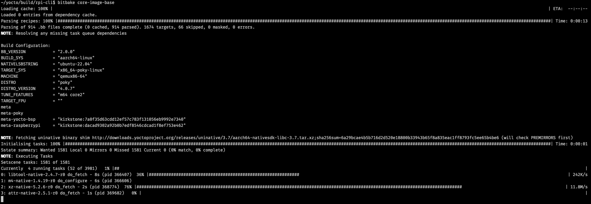

# 2장. **Yocto 프로젝트 시작하기**

  * [2-1 Yocto 프로젝트 시작하기](#2-1-yocto-프로젝트-시작하기)
  * [2-2 Yocto 프로젝트 Build process 이해](#2-2-yocto-프로젝트-build-process-이해)

## 2-1 Yocto 프로젝트 시작하기  
Yocto 프로젝트는 커스텀 Linux 이미지 빌드를 시작하기 전에 개발 환경을 설정해야 한다.  
개발 환경을 설정하기 전에 하드웨어 및 소프트웨어 요구 사항을 충족하는지 확인하자.  

  * 하드웨어 및 소프트웨어 요구 사항  
    * 50G바이트의 디스크 여유 공간  
    * [지원되는 Linux 배포판](https://docs.yoctoproject.org/ref-manual/system-requirements.html#supported-linux-distributions)  
    * Git 1.8.3.1 이상
    * tar 1.28 이상
    * Python 3.6.0 이상
    * gcc 7.5 이상
    * GNU make 4.0 이상
    
  1. 개발 환경 setup  
    아래 예제는 라즈베리 파이의 이미지를 만드는 예제이다.
      1. 필수 소프트웨어 구성 요소 설치  
        먼저 개발 시스템에 필요한 소프트웨어 구성 요소를 설치해야 한다.  
        아래 예제는 Ubuntu 22.04를 기준으로 작성되었다.  
          ```bash
          ~$ sudo apt install gawk wget git diffstat unzip texinfo gcc build-essential \
          chrpath socat cpio python3 python3-pip python3-pexpect xz-utils \
          debianutils iputils-ping python3-git python3-jinja2 libegl1-mesa \
          libsdl1.2-dev xterm python3-subunit mesa-common-dev zstd liblz4-tool
          ```

      2. Yocto 프로젝트 다운로드  
        다음으로 [공식 웹사이트](https://www.yoctoproject.org/software-overview/downloads/)에서 Yocto 프로젝트를 다운로드하자.  
        필요에 따라 최신 안정 버전 또는 개발 버전을 다운로드할 수 있다.  
        예제는 Kirkstone을 기준으로 작성되었다.  
        적절한 위치에 아래 명령어를 사용하여 다운로드하자.  
          ```bash
          ~$ mkdir yocto
          ~$ cd yocto
          ~/yocto$ git clone git://git.yoctoproject.org/poky.git -b kirkstone
          ```

      3. 필요한 Layer 다운로드  
        이 예제에서는 라즈베리 파이로 console만 확인한다.  
        만약, GUI 환경을 만들고 싶다면, meta-qt layer도 다운로드해야한다.
          ```bash
          ~/yocto$ cd poky
          ~/yocto/poky$ git clone https://git.yoctoproject.org/meta-raspberrypi -b kirkstone
          ```

      4. 빌드 환경 초기화  
        Yocto 프로젝트를 다운로드한 후에는 빌드 환경을 초기화해야 한다.  
        여기에는 빌드 시스템에 필요한 환경 변수와 스크립트 설정이 포함된다.  
        빌드 환경을 초기화하려면 다음 명령을 실행한다.  
          ```bash
          ~/yocto/poky$ cd ..
          ~/yocto$ mkdir build
          ~/yocto$ source poky/oe-init-build-env build/rpi-cli
          ```
          ```bash
          ~/yocto$ source poky/oe-init-build-env build/rpi-cli

          ### Shell environment set up for builds. ###

          You can now run 'bitbake <target>'

          Common targets are:
              core-image-minimal
              core-image-full-cmdline
              core-image-sato
              core-image-weston
              meta-toolchain
              meta-ide-support

          You can also run generated qemu images with a command like 'runqemu qemux86'

          Other commonly useful commands are:
          - 'devtool' and 'recipetool' handle common recipe tasks
          - 'bitbake-layers' handles common layer tasks
          - 'oe-pkgdata-util' handles common target package tasks
          ~/yocto/build/rpi-cli$
          ```

      5. 빌드 구성  
        대상 하드웨어 플랫폼에 맞게 빌드를 구성한다.  
        여기에는 local.conf 및 bblayers.conf 파일을 편집하여 대상 하드웨어 플랫폼과 사용하려는 추가 메타 레이어를 지정하는 작업이 포함된다.  
        라즈베리 파이용 이미지는 빌드하는 경우 local.conf 파일에서 MACHINE 변수를 "raspberrypi3-64"로 설정한다.  
        또한 meta-raspberrypi Layer를 추가하기 위해 아래 명령어를 통해 추가한다.  
          ```bash
          ~/yocto/build/rpi-cli$ bitbake-layers add-layer ../../poky/meta-raspberrypi
          ```

      6. 이미지 빌드  
        이제 Yocto를 사용하여 커스텀 리눅스 이미지를 빌드할 준비가 되었다.  
        이미지를 빌드하려면 다음 명령을 실행한다.
          ``` bash
          ~/yocto/build/rpi-cli$ bitbake core-image-base
          ```
          <center></center>

          해당 이미지에 필요한 파일은 `~/yocto/build/rpi-cli/tmp/deploy/images/raspberrypi3-64` 에 있다.  
      
      7. Image upload  
        빌드가 완료되면 라즈베리 파이에 이미지를 업로드 하여 확인한다.  
        Console 화면이 보여지면 정상적으로 빌드되어 이미지를 만든 것이다.

## 2-2 Yocto 프로젝트 Build process 이해
  Yocto 프로젝트의 Build process를 이해하기 위해서는 아래 그림을 빼놓을 수 없다.  
  <center></center>
  이제  그림의 의미를 하나씩 살펴보자.  

  1. User 설정  
    첫번째로 회색 영역은 User 설정에 대한 영역이다.  
    즉, 빌드 환경 구축이다.  
    크로스 컴파일에서 가장 귀찮은 부분이기는 하지만, 반대로 가장 중요한 부분이기도 하다.  
    Yocto에서는 이 부분에 대한 스크립트를 제공한다. 그게 바로 `oe-init-build-env`이다.  
    스크립트를 실행하면 Build Directory가 생성되고 여기서 모든 빌드 관련 작업이 이루어진다.  
    빌드에 관련된 모든 정보가 있는 파일이 `conf/bblayers.conf`와 `conf/local.conf`이다.  
    `bblayers.conf`에는 빌드에 추가할 Yocto Layer에 대한 설정을 할 수 있고, 그 외에는 `local.conf`에서 할 수 있다.