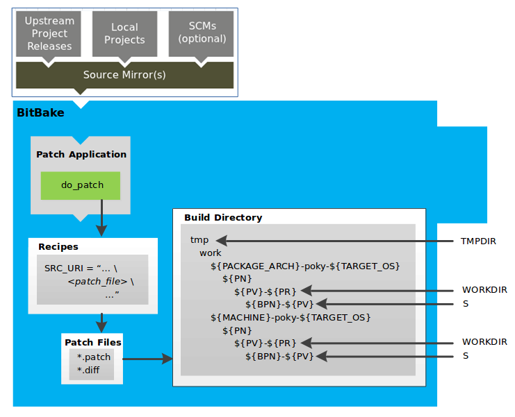
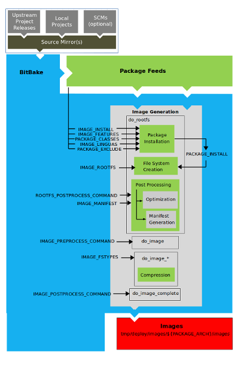
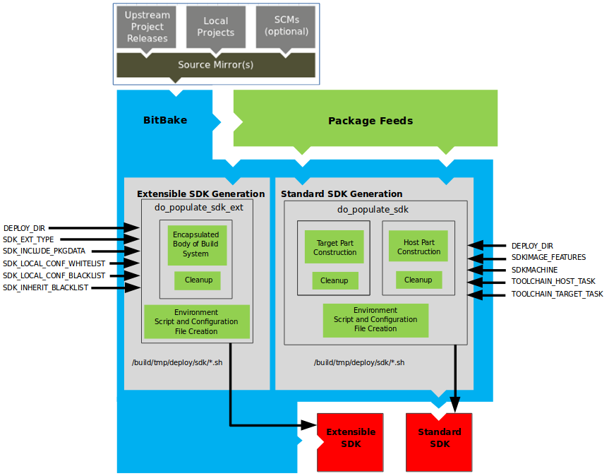

# 3장. **Bitbake 순서**

  * [3-1 User 설정](#3-1-user-설정)
  * [3-2 Source 준비](#3-2-source-준비)
  * [3-3 Patching](#3-3-patching)
  * [3-4 Configuration, Compile, Staging](#3-4-configuration-compile-staging)
  * [3-5 패키지 분류](#3-4-패키지-분류)
  * [3-6 이미지 생성](#3-5-이미지-생성) 
  * [3-7 SDK 생성](#3-6-sdk-생성)

Bitbake를 이해하려면 아래 그림을 이해하는 것이 매우 중요하다.  
단계별로 하나씩 알아보자.  
<center></center>

## 3-1 User 설정  
  <center></center>  

  비트베이크는 빌드를 완료하기 위해 몇 가지 기본 구성 파일이 필요하다.  
  이러한 파일은 *.conf 파일이다.  
  필요한 최소한의 파일은 소스 디렉터리의 `build/conf` 디렉터리에 예제 파일로 존재한다.  
  Poky 내부의 `meta-poky` layer에는 예제 구성 파일이 있는 conf 디렉터리가 포함되어 있다.  
  이러한 예제 파일은 빌드 환경 스크립트인 `oe-init-build-env`를 소싱할 때 실제 구성 파일을 만들기 위한 기초로 사용된다.  
  빌드 환경 스크립트를 소싱하면 빌드 디렉터리가 없는 경우 빌드 디렉터리가 생성된다.  
  비트베이크는 빌드 중 모든 작업에 빌드 디렉터리를 사용한다.  
  빌드 디렉터리에는 conf 디렉터리가 있으며, 이 디렉터리에는 `local.conf` 및 `bblayers.conf` 구성 파일의 기본 버전이 포함되어 있다.  
  이러한 기본 구성 파일은 빌드 환경 설정 스크립트를 소싱할 때 빌드 디렉터리에 버전이 아직 존재하지 않는 경우에만 생성된다.

  `scripts/oe-setup-builddir` 스크립트는 `$TEMPLATECONF` 변수를 사용하여 찾을 샘플 구성 파일을 결정한다.  
  `local.conf` 파일은 빌드 환경을 정의하는 많은 기본 변수를 제공합니다.  
  다음은 몇 가지 목록이다.  
  빌드 환경 스크립트에 의해 생성된 `local.conf` 파일의 기본 구성을 확인하려면 meta-poky layer에서 `local.conf.sample`을 참조하자.  
  ```
  MACHINE : 대상 머신 선택
  DL_DIR : 다운로드 디렉토리
  SSTATE_DIR : 공유 상태(Shared State) 디렉토리
  TMPDIR : 빌드 output
  DISTRO : 배포 정책
  PACKAGE_CLASSES : 패키징 포맷
  SDKMACHINE : SDK 타겟 아키텍처
  EXTRA_IMAGE_FEATURES : 추가 이미지 패키지
  ```
  `conf/local.conf` 파일에 설정된 구성은 `conf/site.conf` 및 `conf/auto.conf` 구성 파일에서도 설정할 수 있다.  
  `bblayers.conf` 파일은 빌드 중에 어떤 레이어를 고려할지 `BitBake`에 알려준다.  
  기본적으로 이 파일에 나열된 레이어에는 빌드 시스템에 필요한 최소한의 레이어가 포함된다.  
  그러나 사용자가 만든 사용자 정의 레이어는 수동으로 추가해야 한다. 

  `site.conf` 및 `auto.conf` 파일은 환경 초기화 스크립트에 의해 생성되지 않는다.  
  `site.conf` 파일을 원한다면 직접 만들어야 한다.  
  `auto.conf` 파일은 일반적으로 자동 빌더에 의해 생성된다.

  site.conf
  ```
  conf/site.conf 구성 파일을 사용하여 여러 빌드 디렉터리를 구성할 수 있다.
  예를 들어 여러 빌드 환경이 있고 몇 가지 공통 기능을 공유한다고 가정해 보자.
  여기에서 이러한 기본 빌드 속성을 설정할 수 있다.
  좋은 예로 PACKAGE_CLASSES 변수를 통해 사용할 패키징 형식을 들 수 있다.
  ```
  auto.conf
  ```
  이 파일은 보통 자동 빌더에 의해 생성되고 쓰여진다.
  이 파일에 입력되는 설정은 일반적으로 conf/local.conf 또는 conf/site.conf 파일에서 찾을 수 있는 것과 동일하다.
  ```
  모든 구성 파일을 편집하여 특정 빌드 환경을 추가로 정의할 수 있다.
  이 프로세스는 그림에서 "User Configuration Edits" 상자로 표시된다.

## 3-2 Source 준비  
  레시피를 빌드하는 첫 번째 단계는 소스 코드를 가져오고 압축을 푸는 것이다.  
  <center></center>

  `do_fetch()` 및 `do_unpack()` 작업은 소스 파일을 가져와 빌드 디렉터리에 압축을 푼다.  

  레시피의 `SRC_URI` 문에 포함된 모든 로컬 파일(예: file://)에 대해 OpenEmbedded 빌드 시스템은 해당 레시피에 대한 파일의 체크섬을 가져와 `do_fetch()` task의 서명에 체크섬을 삽입한다.  
  로컬 파일이 수정된 경우 `do_fetch()` 작업 및 해당 파일에 종속된 모든 작업이 다시 실행된다.  
  기본적으로 모든 작업은 정의된 구조를 가진 빌드 디렉토리에서 수행된다. 

  각 레시피에는 빌드 디렉토리에서 압축을 푼 소스 코드가 있는 영역이 있다.  
  `S` 변수는 레시피의 압축 해제된 소스 코드가 있는 이 영역을 가리킨다.  
  특정 레시피에 대한 해당 디렉터리의 이름은 여러 가지 변수를 통해 정의된다.  
  앞의 그림과 다음 목록은 빌드 디렉터리의 계층 구조를 설명한다.

  ```
  TMPDIR: 빌드 중에 OpenEmbedded 빌드 시스템이 모든 작업을 수행하는 기본 디렉터리(tmp 디렉터리)
  PACKAGE_ARCH: 빌드된 패키지의 아키텍처
  TARGET_OS: 대상 디바이스의 운영 체제
  PN: 패키지를 빌드하는 데 사용된 레시피의 이름(입력 파일의 컨텍스트에서 사용되는 경우 PN은 레시피의 이름)
  WORKDIR: OpenEmbedded 빌드 시스템이 레시피를 빌드하는 위치
  PV: 패키지를 빌드하는 데 사용되는 레시피의 버전
  PR: 패키지를 빌드하는 데 사용된 레시피의 개정판
  S: 특정 레시피의 압축이 풀린 소스 파일을 포함
  BPN: 패키지를 빌드하는 데 사용된 레시피의 이름(BPN 변수는 PN 변수의 버전이지만 일반적인 접두사와 접미사가 제거된 버전이다.)
  PV: 패키지를 빌드하는 데 사용된 레시피의 버전
  ```

## 3-3 Patching  
  소스 코드를 가져와 압축을 풀면 BitBake는 패치 파일을 찾아서 소스 파일에 적용한다.  
  <center></center>  

  `do_patch()` task는 레시피의 `SRC_URI` 문과 `FILESPATH` 변수를 사용하여 적용 가능한 패치 파일을 찾는다.  
  패치 파일에 대한 기본 처리는 파일의 파일 형식이 `*.patch` 또는 `*.diff`인 것으로 가정한다.  
  `SRC_URI` 매개 변수를 사용하여 빌드 시스템에서 패치 파일을 인식하는 방식을 변경할 수 있다.  

  BitBake는 패치를 찾은 순서대로 단일 레시피에 대한 여러 패치를 찾아서 적용한다.  
  `FILESPATH` 변수는 빌드 시스템에서 패치 파일을 검색하는 데 사용하는 기본 디렉터리 집합을 정의한다.  
  패치가 발견되면 `S` 디렉터리에 있는 레시피의 소스 파일에 패치가 적용된다.

## 3-4 Configuration, Compile, Staging  
  소스 코드가 패치된 후 BitBake는 소스 코드를 구성하고 Compile하는 작업을 실행한다.  
  Compile이 완료되면 패키징을 준비하기 위해 파일을 보류 영역(Staging)에 복사합니다.

  <center></center>  

  빌드 프로세스의 이 단계는 다음 작업으로 구성된다.

  * `do_populate_sysroot`: 각각의 레시피별 `sysroot`에 `DEPENDS`에 설정된 종속성에 따라 파일을 설치한다.  
  * `do_configure`: 빌드 중인 소프트웨어의 빌드 시간 및 configuration 옵션을 활성화 및 비활성화하여 소스를 구성한다.  
  configuration은 레시피 자체와 상속된 클래스에서 가져올 수 있다.  
  또한 빌드 중인 대상에 따라 소프트웨어 자체가 자체적으로 구성할 수도 있다.
  `do_configure` task가 처리하는 configuration은 레시피에 의해 빌드되는 소스 코드에 대한 구성에만 해당됩니다.
  `autotools` 클래스를 사용하는 경우 `EXTRA_OECONF` 또는 `PACKAGECONFIG_CONFARGS` 변수를 사용하여 추가 구성 옵션을 추가할 수 있다.  
  * `do_compile`: configuration이 완료되면 `BitBake`는 `do_compile` 작업을 사용하여 소스를 Compile한다.  
  Compile은 `B` 변수가 가리키는 디렉토리에서 이루어진다.  
  `B` 디렉터리는 기본적으로 `S` 디렉터리와 동일하다.  
  * `do_install`: Compile이 완료되면 BitBake는 `do_install` 작업을 실행한다.  
  `do_install`은 `B` 디렉터리에서 파일을 복사하여 `D` 변수가 가리키는 홀딩 영역에 배치한다.  
  패키징은 나중에 이 홀딩 디렉터리의 파일을 사용하여 수행된다.

## 3-5 패키지 분류  
  Staging된 후 빌드 시스템은 결과를 분석하고 출력을 패키지로 분할한다.

  <center></center>  
  
  `do_package` 및 `do_packagedata` 작업을 결합하여 `D` 디렉터리에서 찾은 파일을 분석하고 사용 가능한 패키지 및 파일에 따라 하위 집합으로 분할한다.  
  분석에는 debugging symbol 분할, 패키지 간의 공유 라이브러리 종속성 확인, 패키지 관계 확인 등의 항목이 포함된다.
  
  `do_packagedata` task는 빌드 시스템에서 최종 패키지를 생성할 수 있도록 분석 결과를 기반으로 패키지 메타데이터를 생성한다.  
  `do_populate_sysroot` task는 `do_install` task가 설치한 파일의 하위 집합을 적절한 시스템 루트에 단계적으로 복사한다.  
  분석 및 패키지 분할 프로세스의 작업, 단계별 및 중간 결과에는 여러 영역이 사용된다.  

  * `PKGD`: 패키지가 개별 패키지로 분할되기 전 패키지의 대상 디렉터리
  * `PKGDESTWORK`: `do_package` 작업에서 패키지 메타데이터를 저장하기 위해 사용하는 임시 작업 영역
  * `PKGDEST`: 패키지가 분할된 후 패키지의 상위 디렉터리(즉, 패키지가 분할된 디렉터리)
  * `PKGDATA_DIR`: 패키징 프로세스 중에 생성된 패키징 메타데이터를 보관하는 공유 글로벌 상태 디렉터리  
  (패키징 프로세스는 메타데이터를 `PKGDESTWORK`에서 `PKGDATA_DIR` 영역으로 복사하여 전역적으로 사용할 수 있게 한다.)
  * `STAGING_DIR_HOST`: 컴포넌트가 실행되도록 빌드된 시스템의 시스템 루트 경로
  * `STAGING_DIR_NATIVE`: 빌드 호스트에 대한 컴포넌트를 빌드할 때 사용되는 시스템 루트 경로
  * `STAGING_DIR_TARGET`: 시스템에서 실행되도록 빌드된 컴포넌트가 다른 시스템에 대한 코드를 생성할 때 사용되는 시스템 루트의 경로
  `FILES` 변수는 `PACKAGES`의 각 패키지에 들어가는 파일을 정의

  생성되는 패키지 유형(RPM or DEB or IPK)에 따라 `do_package_write_*` task가 실제 패키지를 생성하여 Package Feeds area(`${TMPDIR}/deploy`)에 배치한다.  

## 3-6 이미지 생성  
  패키지가 분할되어 Package Feeds area에 저장되면 빌드 시스템은 BitBake를 사용하여 루트 파일 시스템 이미지를 생성한다.

  <center></center>  
  
  이미지 생성 프로세스는 여러 단계로 구성되며 여러 작업과 변수에 따라 달라진다.  
  `do_rootfs` task는 이미지의 루트 파일 시스템(파일 및 디렉토리 구조)을 생성한다.  

  * `IMAGE_INSTALL`: Package Feeds area에서 설치할 기본 패키지 집합을 나열함
  * `PACKAGE_EXCLUDE`: 이미지에 설치하지 말아야 할 패키지를 지정
  * `IMAGE_FEATURES`: 이미지에 포함할 기능을 지정  
  (이러한 기능 대부분은 설치할 추가 패키지에 매핑)
  * `PACKAGE_CLASSES`: 사용할 패키지 백엔드(예: RPM or DEB or IPK)를 지정하여 Package Feeds area 내에서 패키지를 찾을 위치를 결정
  * `IMAGE_LINGUAS`: 추가 언어 지원 패키지가 설치되는 언어를 결정
  * `PACKAGE_INSTALL`: 이미지에 설치하기 위해 패키지 관리자에게 전달되는 패키지의 최종 목록

  `IMAGE_ROOTFS`가 구축 중인 파일 시스템의 위치를 가리키고 `PACKAGE_INSTALL` 변수가 설치할 패키지의 최종 목록을 제공하면 루트 파일 시스템이 생성된다.  
  
  패키지 설치는 대상에 대해 패키지 관리가 활성화되어 있는지 여부와 관계없이 패키지 관리자(예: dnf/rpm, opkg 또는 apt/dpkg)의 제어를 받는다.  
  프로세스가 끝나면 대상에 대해 패키지 관리가 활성화되지 않은 경우 패키지 관리자의 데이터 파일이 루트 파일 시스템에서 삭제된다.  
  패키지 설치의 마지막 단계에서 패키지의 일부인 설치 후 스크립트가 실행된다.  
  빌드 호스트에서 실행되지 않은 스크립트는 대상 시스템이 처음 부팅될 때 대상에서 실행된다.  
  읽기 전용 루트 파일 시스템을 사용하는 경우, 대상의 루트 파일 시스템은 읽기 전용이므로 패키지 설치 단계에서 빌드 호스트에서 모든 사후 설치 스크립트가 성공해야 한다.

  `do_rootfs` 작업의 마지막 단계는 사후 처리를 처리합니다. 사후 처리에는 매니페스트 파일 생성 및 최적화가 포함된다.

  매니페스트 파일은 루트 파일 시스템 이미지와 같은 디렉터리에 있다.  
  이 파일에는 설치된 패키지가 나열되어 있다.  
  매니페스트 파일은 예를 들어 테스트 이미지 클래스에서 특정 테스트를 실행할지 여부를 결정할 수 있다.  
  
  이미지 전체에서 실행되는 최적화 프로세스에는 `mklibs` 및 `ROOTFS_POSTPROCESS_COMMAND` 변수에 정의된 기타 포스트 프로세싱 명령이 포함된다.  
  `mklibs` 프로세스는 라이브러리 크기를 최적화한다.  

  루트 파일시스템이 빌드된 후 `do_image` 작업을 통해 이미지에 대한 처리가 시작된다.  
  빌드 시스템은 `IMAGE_PREPROCESS_COMMAND` 변수에 정의된 대로 모든 사전 처리 명령을 실행한다.  
  이 변수는 빌드 시스템이 최종 이미지 출력 파일을 생성하기 전에 호출할 함수 목록을 지정한다.

  빌드 시스템은 `IMAGE_FSTYPES` 변수에 지정된 이미지 유형에 따라 필요에 따라 `do_image_*` 작업을 동적으로 실행한다.  
  이 프로세스는 모든 것을 이미지 파일 또는 이미지 파일 집합으로 변환하고 루트 파일 시스템 이미지를 압축하여 이미지의 전체 크기를 줄일 수 있다.  
  루트 파일시스템에 사용되는 형식은 `IMAGE_FSTYPES` 변수에 따라 달라진다.  
  압축은 해당 파일 시스템의 형식이 압축을 지원하는지 여부에 따라 결정된다.

## 3-7 SDK 생성
  OpenEmbedded 빌드 시스템은 BitBake를 사용하여 표준 SDK와 확장 가능한 SDK(eSDK) 모두에 대한 소프트웨어 개발 키트(SDK) 설치 스크립트를 생성한다.  
  <center></center>  
  
  이미지 생성과 마찬가지로 SDK 스크립트 프로세스도 여러 단계로 구성되며 여러 변수에 따라 달라진다.  
  `do_populate_sdk` 및 `do_populate_sdk_ext` 작업은 이러한 주요 변수를 사용하여 실제로 설치할 패키지 목록을 생성할 수 있다.  
  `do_populate_sdk` 작업은 표준 SDK를 생성하는 데 도움이 되며 대상 부분과 호스트 부분의 두 부분을 처리한다.  
  대상 부분은 대상 하드웨어용으로 빌드된 부분으로 라이브러리 및 헤더를 포함한다.  
  호스트 파트는 `SDKMACHINE`에서 실행되는 SDK의 일부이다.
  `do_populate_sdk_ext` 작업은 확장 가능한 SDK를 생성하는 데 도움이 되며 호스트 및 대상 부분을 표준 SDK의 카운터 파트와 다르게 처리한다.  
  확장형 SDK의 경우 이 작업은 SDK에 필요한 모든 것을 포함하는 빌드 시스템을 캡슐화한다.  
  빌드되는 SDK 유형에 관계없이 작업은 몇 가지 정리를 수행한 후 Cross-development 환경 설정 스크립트와 필요한 구성 파일을 생성한다.  
  최종 출력은 환경 설정 스크립트가 포함된 Cross-development toolchain 설치 스크립트(.sh 파일)이다.
