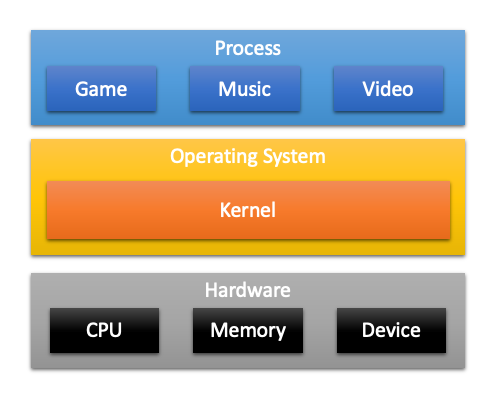
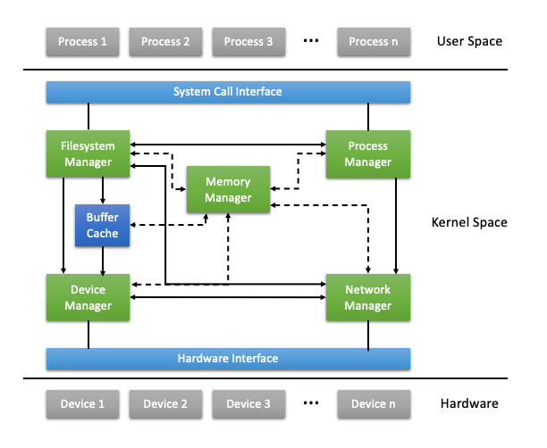

# 0장. **Linux Kernel**

  * [0-1 커널이란?](#0-1-커널이란)
  * [0-2 커널의 역힐](#0-2-커널의-역할)
  * [0-3 커널의 종류](#0-3-커널의-종류)

## 0-1 커널이란?
  커널이란 운영체제 중 항상 메모리에 올라가 있는 운영체제의 핵심 부분이다.  
  하드웨어와 응용 프로그램 사이에서 인터페이스를 제공하며 컴퓨터 자원들을 관리한다.  
  또한 커널은 항상 컴퓨터 자원들을 바라보고 있기때문에 사용자와의 상호작용은 지원하지 않는다. 따라서 사용자와의 직접전인 상호작용을 위해 프로그램을 제공하게 되는데, 대표적으로 쉘(Shell)이라는 명령어 해석기등이 있다.  
  

## 0-2 커널의 역할
커널은 하드웨어의 입/출력을 관리하고 소프트웨어의 요청(System Call)을 컴퓨터 하드웨어(CPU,Memory,Devices)가 처리할 수 있도록 요청을 변환 하는 역할을 한다.
즉, 커널은 사용자가 system call을 통해 컴퓨터 자원을 사용할 수 있게 해주는 자원관리자라고 볼 수 있다.

* 태스크(task)관리자: CPU를 task라는 추상적인 자원으로써 제공
* 메모리 관리자: 메모리를 segment나 page로 제공
파일시스템: 디스크를 파일로 제공
* 네트워크 관리자: 네트워크 장치를 소켓으로 제공
* 디바이스 드라이버 관리자: 각종 장치를 디바이스 드라이버를 통해 일관되게 접근하도록 함
커널의 구성요소, 즉 관리자들이 존재하는 공간이 Kernel Space이다. Kernel Space 위에 사용자로 여겨지는 태스크(process)들이 존재하는 User Space가 있다. (프로그램 파일이 결국 task가 된다.)

Kernel Space와 User Space 사이에 System Call Interface가 있다. User Space의 task들이 커널이 관리하는 자원에 접근해야 할 필요가 있으면 System Call Interface를 통해 Kernel Space의 자원 관리자에게 요청이 전달된다. 그리고 이 커널의 각 자원 관리자는 사용자 요청에 맞게 알맞는 하드웨어에 사용자 명령을 전달하고 작업을 수행한다.