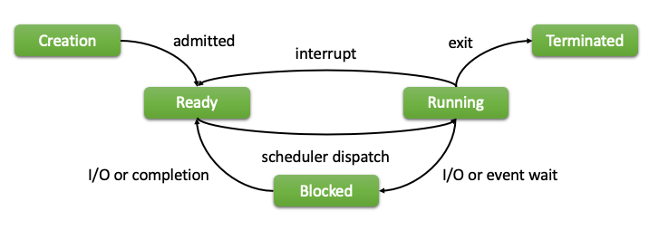

# 1장. Process

  * [1-1 프로세스 소개](#1-1-프로세스-소개)
  * [1-2 프로세스 상태 및 수명 주기](#1-2-프로세스-상태-및-수명-주기)
  * [1-3 프로세스 확인하기](#1-3-프로세스-확인하기)
  * [1-4 프로세스 생성](#1-4-프로세스-생성)
  * [1-5 커널 스레드](#1-5-커널-스레드)

## 1-1 프로세스 소개
  프로세스는 리눅스 시스템에서 실행 중인 프로그램을 말한다.  
  즉, 프로세스는 리눅스 시스템 메모리에 적재되어 실행을 대기하거나 실행하는 실행 흐름을 의미한다.  
  각 프로세스에는 고유한 메모리 공간, 실행 컨텍스트, 파일 설명자, 환경 변수 및 신호를 포함한 리소스 세트가 있다.  
  프로세스는 다른 프로세스 또는 커널 자체에 의해 생성될 수 있다.  
  프로세스가 생성되면 프로세스 ID(PID)라는 고유 식별자가 할당된다.  
  이 PID는 프로세스를 추적하는 데 사용되며 프로세스와 상호 작용하기 위한 다양한 시스템 호출에 사용된다.

## 1-2 프로세스 상태 및 수명 주기
  프로세스는 운영 체제의 중추이다.  
  프로세스는 프로그램 실행과 리소스 관리를 담당한다.  
  프로세스를 효과적으로 관리하기 위해 Linux 커널은 프로세스 스케줄링, 동기화 및 프로세스 간 통신과 같은 여러 가지 기술을 사용한다.  
  
  컴퓨터에서 프로그램을 시작하면 프로세스라는 것이 만들어진다.  
  프로세스는 시스템에서 실행 중인 프로그램의 인스턴스이다.  
  Linux 커널은 시스템의 모든 프로세스를 관리하며, 이를 위해서는 각 프로세스의 현재 상태를 추적해야 한다.  
  
  1. 프로세스 상태  
    Linux 커널에서 프로세스는 다섯 가지 상태 중 하나에 있을 수 있다.

      |State|설명|
      |:--:|--|
      |Running|프로세스가 현재 CPU에서 실행 중|
      |Interruptible|프로세스가 사용자의 입력이나 네트워크 연결과 같은 리소스나 이벤트를 기다리는 중<br>커널 또는 다른 프로세스의 신호에 의해 프로세스가 중단될 수 있다.|
      |Uninterruptible|중단 가능 상태와 비슷하지만 프로세스가 신호에 의해 중단될 수 없다<br>일반적으로 하드웨어 리소스 또는 파일 시스템 작업이 완료되기를 기다리는 프로세스에 사용|
      |Stopped|사용자 또는 커널에 의해 프로세스가 중지됨<br>프로세스는 나중에 다시 시작할 수 있다|
      |Zombie|프로세스가 실행을 완료했지만 프로세스 테이블에 여전히 나열되어 있음<br>프로세스의 부모가 종료 상태를 검색하기 위해 wait() 시스템 호출을 아직 호출하지 않은 경우에 발생|

  2. 프로세스 수명 주기  
      Linux 커널의 모든 프로세스는 수명 주기 동안 일련의 단계를 거친다.  
      <center></center>
      이러한 단계는 다음과 같다.  
      
      1. Creation  
        새 프로세스가 시작되면 커널에 의해 생성됩니다. 프로세스에 프로세스 ID(PID)가 할당되고 프로세스 테이블에 추가된다.
      2. Ready  
        프로세스가 생성되면 준비 상태가 됩니다. 이 상태에서는 프로세스가 CPU를 사용할 수 있게 되기를 기다린다.
      3. Running  
        CPU를 사용할 수 있게 되면 프로세스가 실행 중 상태가 되어 실행을 시작한다.
      4. Blocked  
        프로세스가 리소스나 이벤트를 기다려야 하는 경우 프로세스는 차단됨 상태가 된다.  
        이 상태에서는 프로세스가 CPU 시간을 사용하지 않는다.
      5. Terminated  
        프로세스가 실행을 완료하면 종료 상태가 된다.  
        이 시점에서 프로세스는 프로세스 테이블에서 제거되고 해당 리소스가 해제된다.

  Linux 커널이 시스템에서 프로세스를 관리하는 방법을 이해하려면 프로세스 상태와 수명 주기를 이해하는 것이 중요하다.  
  프로세스 상태를 모니터링하면 시스템의 성능이나 안정성에 영향을 미칠 수 있는 문제를 식별할 수 있다.

## 1-3 프로세스 확인하기  
  Linux에서 프로세스를 확인하는 데 사용되는 몇 가지 일반적인 도구와 명령어를 알아보자.  
  
  1. ps 명령어  
    ps 명령은 시스템에서 실행 중인 프로세스에 대한 정보를 표시하는 데 사용된다.  
    기본적으로 현재 터미널 세션과 연결된 프로세스에 대한 정보를 표시한다.  
    또한 다양한 옵션과 함께 사용하여 실행 중인 프로세스에 대한 보다 자세한 정보를 표시할 수 있다.

      * 옵션  
        |옵션|설명|
        |--|--|
        |aux|시스템 및 사용자 프로세스를 포함하여 시스템에서 실행 중인 모든 프로세스를 자세한 형식으로 표시<br>(PID, CPU 및 메모리 사용량, 명령 이름, 사용자 및 그룹 ID)|
        |-ef|시스템 및 사용자 프로세스를 포함하여 시스템에서 실행 중인 모든 프로세스를 표시|
        |-e|시스템에서 실행 중인 모든 프로세스를 표시하지만 프로세스 계층 구조나 프로세스에 대한 추가 정보는 표시하지 않음|
        |-l|프로세스 상태, 사용된 CPU 시간 및 프로세스를 시작하는 데 사용된 명령줄 인수와 같은 추가 정보를 포함하여 프로세스의 긴 목록을 표시|
        |-f|사용자 및 그룹 ID, 프로세스 상태 및 상위 프로세스 ID와 같은 추가 정보를 포함하여 프로세스의 전체 목록을 표시|
        |-o|ps 명령의 출력 형식을 사용자 지정할 수 있다.<br>표시할 열과 열의 순서를 지정할 수 있다.|
        |-C|명령 이름으로 프로세스를 필터링|
        |-u|사용자 ID로 프로세스를 필터링|
        |-p|특정 프로세스 ID에 대한 정보를 표시|

  2. top 명령  
    top 명령은 시스템에서 실행 중인 프로세스와 해당 프로세스의 리소스 사용률에 대한 실시간 정보를 표시하는 데 사용된다.  
    CPU 사용량, 메모리 사용량 등과 같은 다양한 기준으로 정렬할 수 있는 시스템의 동적 보기를 표시한다.  
  
  3. htop 명령  
    htop 명령은 상위 명령의 고급 버전으로, 보다 사용자 친화적인 인터페이스와 추가 기능을 제공한다.  
    사용자가 다양한 기준으로 프로세스를 정렬하고 터미널에서 직접 프로세스를 종료할 수 있는 대화형 프로세스 뷰어 및 프로세스 관리자이다. 
  
## 1-4 프로세스 생성  
  리눅스에서 프로세스는 실행 중인 프로그램이다.  
  프로세스는 Linux에서 작업의 기본 단위이며 운영 체제 또는 다른 프로세스에 의해 생성될 수 있다.

  `fork()` 시스템 호출은 호출 프로세스를 복제하여 새 프로세스를 만든다.  
  자식 프로세스라고 하는 새 프로세스는 부모 프로세스라고 하는 호출 프로세스의 정확한 복사본이다.  
  `fork()` 시스템 호출은 부모 프로세스와 자식 프로세스에 한 번씩 두 번 반환한다.  
  부모 프로세스의 반환 값은 자식 프로세스의 프로세스 ID(PID)이며, 자식 프로세스의 반환 값은 0이다.

  ``` c
  #include <stdio.h>
  #include <unistd.h>

  int main() {
      pid_t pid;

      pid = fork();

      if (pid < 0) {
          fprintf(stderr, "Failed to fork process\n");
          return 1;
      } else if (pid == 0) {
          // This is the child process
          printf("Child process: PID=%d\n", getpid());
          execl("/bin/ls", "ls", "-l", NULL);
      } else {
          // This is the parent process
          printf("Parent process: PID=%d, Child PID=%d\n", getpid(), pid);
      }

      return 0;
  }
  ```
  이 코드에서는 `fork()`를 호출하여 새 프로세스를 생성한다.  
  `fork()`가 음수 값을 반환하면 프로세스 생성에 실패한 것이다.  
  `fork()`가 0을 반환하면 자식 프로세스에 있는 것이고, `execl()`을 사용하여 `ls` 명령을 실행한다.  
  `fork()`가 양수 값을 반환하면 부모 프로세스에 있는 것이고, 자식 프로세스의 PID를 출력한다.

## 1-5 커널 스레드
  운영 체제에서 스레드는 CPU가 독립적으로 실행할 수 있는 명령어 시퀀스이다.  
  스레드는 경량 프로세스로 간주할 수 있으며 단일 프로세스 내에서 여러 스레드가 실행될 수 있다.  
  운영 체제는 상태, 우선순위, 실행 컨텍스트 등 각 스레드에 대한 정보를 유지 관리한다.

  운영 체제는 사용자 수준 스레드 외에도 커널 스레드라고도 하는 커널 수준 스레드도 지원한다.  
  커널 스레드는 운영 체제 자체에서 생성 및 관리되며 커널 공간에서 작동한다.  
  즉, 커널 스레드는 하드웨어 장치 및 시스템 데이터 구조와 같은 시스템 리소스에 직접 액세스할 수 있다.

  커널 스레드는 운영 체제에서 시스템 리소스에 직접 액세스해야 하거나 하드웨어 인터럽트 처리 또는 파일 시스템 작업 수행과 같이 커널 공간에서 수행해야 하는 작업을 수행하는 데 사용된다.  
  커널 스레드는 커널 공간에서 실행되므로 시스템 리소스에 액세스할 때 사용자 공간과 커널 공간 사이를 전환해야 하는 사용자 수준 스레드보다 더 효율적으로 실행할 수 있다.

  1. 커널 스레드의 장단점  
      * 장점
        1. 높은 효율성  
          커널 스레드는 사용자 모드와 커널 모드 간에 컨텍스트 전환이 필요하지 않으므로 사용자 수준 스레드보다 더 효율적이다.
        2. 동시성  
          커널 스레드는 병렬로 실행할 수 있으므로 시스템의 전반적인 성능을 향상시킬 수 있다.
        3. 리소스 공유  
          커널 스레드는 추가적인 동기화 메커니즘 없이도 메모리, 파일, 네트워크 연결과 같은 리소스를 공유할 수 있다.
        4. 유연성 향상  
          커널 스레드는 커널에 의해 관리되므로 사용자 수준 스레드에서 사용할 수 없는 낮은 수준의 시스템 리소스에 액세스할 수 있다.

      * 단점  
        1. 복잡성 증가  
          커널 스레드는 사용자 수준 스레드보다 더 복잡하며 생성 및 관리에 더 많은 리소스가 필요하다.
        2. 제어력 저하  
          커널 스레드는 커널에 의해 관리되므로 프로그래머가 그 동작을 제어할 수 있는 권한이 적다.
        3. 위험 증가  
          커널 스레드를 제대로 관리하지 않으면 시스템이 불안정해질 수 있다.
        4. 디버깅 복잡성  
          커널 스레드를 디버깅하는 것은 실행의 하위 수준 특성으로 인해 사용자 수준 스레드를 디버깅하는 것보다 더 어려울 수 있다.

      전반적으로 커널 스레드는 고성능 동시 시스템을 구축하기 위한 강력한 도구이지만, 장단점을 신중하게 관리하고 고려해야 한다.

2. 커널 스레드 생성 및 관리
  커널 스레드는 Linux 커널에서 중요한 역할을 한다.  
  커널 스레드는 전적으로 커널 공간에서 작동하는 경량 프로세스이며 커널 자체에서 생성 및 관리한다.  
  애플리케이션에 의해 관리되는 사용자 공간 스레드와 달리 커널 스레드는 사용자 공간 애플리케이션에 보이지 않으며 특정 사용자 프로세스에 바인딩되지 않는다. 
  
    1. 커널 스레드 생성  
        커널 스레드는 두 개의 인수를 받는 kthread_create() 함수를 사용하여 생성된다.
        ``` c
        struct task_struct *kthread_create(int (*threadfn)(void *data),
                                          void *data,
                                          const char *namefmt, ...);
        ```
        int (*threadfn)(void *data) : 새 커널 스레드가 실행할 함수에 대한 포인터이다. 이 함수는 정수 값을 반환하고 공백 포인터를 인자로 받아야 한다. 
        void *data : 스레드 함수에 전달해야 하는 데이터에 대한 포인터이다.
        const char *namefmt : 스레드 이름을 생성하는 데 사용되는 형식 문자열이다. 형식 문자열 뒤에는 이름을 생성하는 데 필요한 추가 인수가 이어진다.

        커널 스레드가 생성되면 `wake_up_process()` 함수를 사용하여 시작할 수 있다.  
        이 함수는 커널 스레드의 `task_struct` 구조체에 대한 포인터를 인수로 받는다.  
        ``` c
        int wake_up_process(struct task_struct *tsk);
        ```
        이 함수는 커널 스레드를 "실행 가능" 상태로 만들어 커널의 스케줄러가 스케줄링할 수 있도록 한다.

    2. 커널 스레드 관리  
        커널 스레드는 `task_struct` 구조를 사용하여 관리된다.  
        이 구조체에는 스레드의 우선순위, 현재 CPU, 스케줄링 정책 등 스레드의 상태에 대한 정보가 포함되어 있다.

        커널 스레드를 종료하려면 `kthread_stop()` 함수를 사용할 수 있다.  
        이 함수는 커널 스레드의 `task_struct` 구조체에 대한 포인터를 인수로 받는다.  
        ``` c
        int kthread_stop(struct task_struct *tsk);
        ```
        이 함수는 스레드를 종료해야 함을 나타내는 플래그를 `task_struct` 구조체에 설정한다.  
        커널 스레드의 함수는 주기적으로 이 플래그를 확인하고 플래그가 설정되면 종료해야 한다.

  3. 커널 스레드와 사용자 수준 스레드의 차이점  
      커널 스레드와 사용자 수준 스레드는 운영 체제에서 스레드를 관리하고 실행하는 두 가지 다른 방식이다.  
      
      사용자 수준 스레드는 사용자 공간에서 스레드 라이브러리에 의해 관리되는 스레드이다.  
      애플리케이션에 의해 생성 및 관리되며 사용자 공간에서 실행된다.  
      사용자 수준 스레드는 스레드 라이브러리에서 제공하는 라이브러리 호출을 사용하여 생성된다.  
      스레드 라이브러리는 사용자 수준 스레드의 스케줄링과 실행 관리를 담당한다.  
      사용자 수준 스레드는 사용자 수준 리소스에 액세스할 수 있으며 권한 있는 작업을 수행할 수 없다.

      1. 커널 스레드와 사용자 수준 스레드의 차이점  
          * 스케줄링  
            커널 스레드는 CPU 사용량 및 I/O 작업과 같은 시스템 전반의 정보에 액세스할 수 있는 커널에 의해 스케줄링된다.  
            커널은 이러한 정보에 액세스할 수 있기 때문에 사용자 수준 스레드보다 커널 스레드를 더 효율적으로 스케줄링할 수 있다.  
            사용자 수준 스레드는 시스템에 대한 정보가 제한적인 스레드 라이브러리에 의해 스케줄링된다.

          * 컨텍스트 전환  
            컨텍스트 전환은 CPU에서 스레드 간에 전환하는 프로세스이다.  
            커널 스레드는 전체 프로세스 상태를 저장하고 복원하는 전체 컨텍스트 전환이 필요하다.  
            이는 커널 스레드가 사용자 공간과 다른 주소 공간을 가진 커널 공간에서 실행되기 때문이다.  
            사용자 수준 스레드에는 스레드의 실행 상태를 저장하고 복원하는 부분 컨텍스트 전환이 필요하다.  
            이는 사용자 수준 스레드가 스레드 라이브러리와 동일한 주소 공간을 가진 사용자 공간에서 실행되기 때문이다.

          * 리소스 관리  
            커널 스레드는 I/O 장치 및 메모리 관리와 같은 커널 리소스에 액세스할 수 있다.  
            이를 통해 메모리 할당 및 해제와 같은 권한 있는 작업을 수행할 수 있다.  
            사용자 수준 스레드는 시스템 리소스에 대한 액세스 권한이 제한되어 있으며 권한 있는 작업을 수행할 수 없다.

          * 성능
            커널 스레드는 커널에 의해 스케줄링되고 시스템 리소스에 액세스할 수 있기 때문에 일반적으로 사용자 수준 스레드보다 더 빠르고 효율적이다.  
            그러나 커널 스레드를 생성하고 관리하려면 커널 수준의 권한이 필요하므로 보안 위험이 발생할 수 있다.  
            사용자 수준 스레드는 생성 및 관리가 더 쉽지만 커널 스레드에 비해 속도가 느리고 효율성이 떨어진다.
