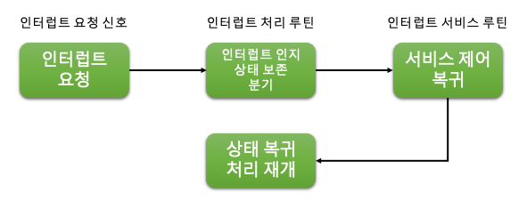

# 2장. Interrupt

  * [2-1 Interrupt 란?](#2-1-interrupt-란)

## 2-1 Interrupt 란?
  1. Interrupt 란?  
      컴퓨팅에서 인터럽트는 장치나 프로그램에서 프로세서의 주의를 끌기 위해 프로세서에 보내는 신호를 말한다.  
      인터럽트가 트리거되면 프로세서는 현재 실행 중인 명령어 실행을 중단하고 인터럽트 서비스 루틴(ISR)이라고도 하는 인터럽트 처리 루틴으로 전환하여 들어오는 신호를 처리한다.

      인터럽트는 키보드, 마우스, 디스크와 같은 입력/출력 장치나 시스템 호출, 트랩, 예외와 같은 소프트웨어 이벤트 등 다양한 소스에서 발생할 수 있다.  
      인터럽트는 프로세서가 입력 또는 출력 작업이 완료될 때까지 기다리는 시간을 줄여 리소스를 보다 효율적으로 사용할 수 있게 해주므로 최신 컴퓨팅 시스템에서 필수적인 부분이다.

      인터럽트는 하드웨어 인터럽트와 소프트웨어 인터럽트의 두 가지 주요 유형으로 분류된다.  
      하드웨어 인터럽트는 외부 장치 또는 주변 장치에 의해 트리거되며 비동기식으로 간주되므로 예측할 수 없는 시간에 발생한다.  
      반면에 소프트웨어 인터럽트는 프로그램이나 시스템 호출에 의해 생성되며 동기식이기 때문에 특정 시간에 발생한다.

      인터럽트가 발생하면 프로세서는 먼저 프로그램 카운터와 레지스터를 포함한 현재 상태를 메모리에 저장한다.  
      그런 다음 인터럽트 처리를 담당하는 인터럽트 서비스 루틴을 메모리에 로드하고 프로그램 카운터를 ISR의 시작 주소로 설정한다.  
      그런 다음 ISR이 실행되고 완료되면 프로세서는 이전 상태로 복원하고 인터럽트된 프로그램을 계속 실행힌다.

      인터럽트는 시스템 성능과 안정성에 중요한 역할을 한다.  
      인터럽트는 효율적인 멀티태스킹을 가능하게 하여 프로세서가 리소스 낭비 없이 여러 작업을 동시에 처리할 수 있게 해준다.  
      또한 인터럽트는 프로세서가 예기치 않은 이벤트나 오류가 발생할 때 이를 처리할 수 있도록 하여 시스템 충돌 및 중단을 방지하는 데 도움이 된다.  

  2. 인터럽트 처리 과정  
    인터럽트 처리 프로세스에는 여러 단계가 포함된다.  

      

      1. 인터럽트 발생  
        인터럽트 처리 프로세스의 첫 번째 단계는 인터럽트 발생이다.  
        인터럽트는 키보드, 마우스 또는 디스크 드라이브와 같은 하드웨어 장치 또는 장치 드라이버 또는 운영 체제 서비스와 같은 소프트웨어 프로그램에 의해 발생할 수 있다.
      2. 인터럽트 알림  
        인터럽트가 발생하면 하드웨어 장치 또는 프로그램이 프로세서에 신호를 보내 인터럽트를 알린다.  
        이 신호는 일반적으로 장치 또는 프로그램을 프로세서에 연결하는 전용 회선인 하드웨어 인터럽트 라인을 통해 전송된다.
      3. 인터럽트 승인  
        프로세서는 인터럽트 신호를 승인하여 장치 또는 프로그램에 요청을 수신했음을 알려야한다.  
        이는 인터럽트 라인을 통해 승인 신호를 다시 전송하여 수행된다.
      4. 인터럽트 처리  
        인터럽트가 승인되면 프로세서는 인터럽트의 원인을 파악하고 적절한 인터럽트 핸들러 루틴을 실행해야 한다.  
        이 루틴은 인터럽트 요청을 처리하도록 특별히 설계된 코드 조각이다.
      5. 인터럽트 서비스  
        인터럽트 핸들러 루틴은 인터럽트 요청을 처리하는 데 필요한 작업을 수행한다.  
        여기에는 장치에서 데이터 읽기, 장치에 데이터 쓰기 또는 인터럽트 처리에 필요한 기타 작업 수행이 포함될 수 있다.
      6. 인터럽트 완료  
        인터럽트가 처리되면 프로세서는 인터럽트 요청이 완료되었음을 나타내는 신호를 장치 또는 프로그램에 보낸다.  
        그러면 장치 또는 프로그램이 정상 작동을 재개할 수 있다.

      요약하면 인터럽트 처리 프로세스에는 인터럽트 발생, 알림, 승인, 처리, 서비스 및 완료를 포함한 여러 단계가 포함된다.  
      각 단계는 컴퓨터 시스템의 효율적인 작동에 매우 중요하며 시스템 충돌이나 성능 문제를 방지하기 위해 신중하게 관리해야 한다.

