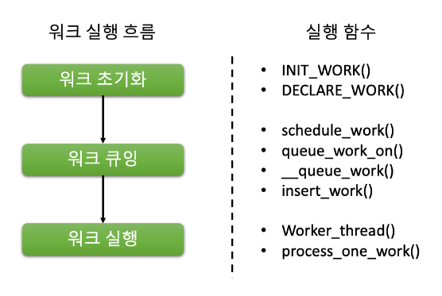

# 3장. Work Queue

  * [3-1 Work Queue 란?](#3-1-work-queue-란)
  * [3-2 Work Queue 종류](#3-2-work-queue-종류)
  * [3-3 work_struct 구조체](#3-3-work_struct-구조체)
  * [3-4 워크큐에 워크를 큐잉하는 방법](#3-4-워크큐에-워크를-큐잉하는-방법)

## 3-1 Work Queue 란?
  리눅스 커널에서 워크 큐(Work Queue)는 백그라운드에서 비동기적으로 수행해야 하는 작업을 예약하는 메커니즘이다.  
  워크 큐는 일반적으로 시간이 오래 걸리거나 커널을 차단할 수 있는 작업을 즉시 수행할 수 없을 때 사용된다.

  리눅스 커널에서 워크 큐는 인터럽트 핸들러, 디바이스 드라이버 및 다른 커널 하위 시스템 등 다양한 컨텍스트에서 사용된다.

  워크 큐의 기본 아이디어는 커널 코드가 나중에 별도의 커널 스레드에서 수행될 작업을 예약할 수 있도록 하는 것이다.  
  이 스레드는 워커 스레드(Worker Thread) 또는 워커 프로세스(Worker Process)라고도 한다.  
  수행할 작업은 워크 구조체(Work Structure)에 캡슐화되어 워크 큐에 추가된다.

  워커 스레드가 작업을 수행할 준비가 되면, 작업 구조체를 큐에서 제거하고 해당 구조체와 연결된 작업 함수를 실행한다.  
  작업이 완료되면 작업 구조체가 해제되고, 워커 스레드는 대기 상태로 돌아가 추가로 예약된 작업을 기다린다.

  워크 큐는 시스템 워크 큐와 CPU별 워크 큐 두 가지 종류가 있다.  
  시스템 워크 큐는 시스템 내 모든 CPU에서 공유되며, 장치 드라이버 등 전역적으로 수행되어야 하는 작업에 사용된다.  
  CPU별 워크 큐는 시스템 내 각 CPU에 구체적으로 할당되며, 프로세스 계정 정보 업데이트 등 로컬하게 수행 가능한 작업에 사용된다.

## 3-2 Work Queue 종류
  Linux 커널에서는 여러 가지 유형의 work queue가 있으며, 각각 특정한 특성과 사용 사례를 갖고 있다.  
  다음은 가장 일반적으로 사용되는 유형이다.

  1. System Work Queues  
    시스템 워크 큐는 어떤 특정 디바이스나 서브시스템과 직접적으로 관련이 없는 시스템 관련 작업을 수행하는 데 사용된다.  
    시스템 워크 큐 작업의 예로는 메모리 관리, 프로세스 스케줄링, 기타 일반적인 커널 작업 등이 있다.

  2. Device Work Queues  
    디바이스 워크 큐는 특정 디바이스나 서브시스템과 관련된 작업을 처리하기 위해 사용된다.  
    예를 들어, 디바이스 드라이버는 네트워크 인터페이스에서 들어오는 데이터 처리와 관련된 작업을 수행하기 위해 디바이스 워크 큐를 사용할 수 있다.

  3. CPU Work Queues  
    CPU Work Queues는 특정 CPU에만 해당되는 작업을 수행하는 데 사용됩니다.  
    이것은 특정 하드웨어 구성 요소에서 저수준 작업을 수행할 때와 같이 특정 CPU에서 작업을 더 효율적으로 수행할 수 있는 경우에 유용하다.

  4. High Priority Work Queues  
    High Priority Work Queues는 일반적인 시스템 작업보다 높은 우선순위를 갖는 작업을 수행하는 데 사용된다.  
    이러한 작업은 실시간 오디오 또는 비디오 처리와 같은 시간에 민감한 작업에 대해 일반적으로 사용된다.

  5. Low Priority Work Queues  
    Low Priority Work Queues는 일반적인 시스템 작업보다 낮은 우선순위를 갖는 작업을 수행하는 데 사용된다.  
    이러한 작업은 시스템 성능에 영향을 미치지 않고 백그라운드에서 수행될 수 있는 작업에 대해 일반적으로 사용된다.

  각각의 작업 대기열 유형마다 특징과 사용 사례가 있다.  
  개발자는 특정 작업에 적합한 작업 대기열 유형을 선택함으로써, 시스템 성능이나 안정성에 부정적인 영향을 미치지 않고 코드가 시간적으로 효율적으로 실행되도록 보장할 수 있다.

## 3-3 work_struct 구조체
  워크큐를 구성하는 주요 개념 중 핵심은 워크이다.  
  워크큐를 실행하는 기본 단위가 워크이기 때문이다.  
  보통 "워크큐에 워크를 큐잉한다" 라고 말한다면, "후반부 처리를 워크가 실행하도록 워크를 워크큐에 실행 요청한다"로 해석할 수 있다.

  아래그림을 보면서 워크가 어떤 과정으로 실행되는지 확인해보자.  

  <center></center>

  * work_struct 구조체  
      `work_struct` 구조체는 커널에서 work queue를 정의하고 초기화하는 데 사용된다.
      `work_struct` 구조체는 `linux/workqueue.h` 헤더 파일에서 정의된다.  
      이 구조체는 `struct list_head`, `work_func_t`, `struct delayed_work` 세 가지 필드를 포함한다.
      ``` c
      struct work_struct {
          atomic_long_t data;
          struct list_head entry;
          work_func_t func;
      #ifdef CONFIG_LOCKDEP
          struct lockdep_map lockdep_map;
      #endif
      };
      ```
      data : 워크 실행 상태  
      list_head : entry는 work 항목을 work queue 내의 다른 항목들에 연결하는 데 사용  
      func : func은 work가 실행될 때 호출될 함수의 포인터  
      delayed_work : 은 work 항목의 지연 실행을 처리하는 데 사용

  * 워크의 초기화  
      `work_struct`를 초기화하려면 `INIT_WORK()` 매크로를 사용할 수 있다.  
      이 매크로는 `work_struct`에 대한 포인터와 work가 실행될 때 호출될 함수에 대한 함수 포인터 두 가지 인수를 취한다.

      ``` c
      void my_work_handler(struct work_struct *work) {
          // do some work
      }

      DECLARE_WORK(my_work, my_work_handler);

      int init_module(void) {
          // schedule the work to run later
          schedule_work(&my_work);
          return 0;
      }
      ```
      이 예시에서는 `DECLARE_WORK()` 매크로를 사용하여 `my_work`라는 `work_struct`를 선언하고 `my_work_handler()` 핸들러 함수로 초기화한다.  
      그런 다음 `schedule_work()` 함수를 사용하여 작업 항목을 미래에 실행할 수 있도록 예약한다.

      `INIT_WORK()` 매크로는 새 변수를 선언하는 대신 `work_struct`를 현장에서 초기화하는 데에도 사용할 수 있다.

      ``` c
      struct work_struct my_work;
      INIT_WORK(&my_work, my_work_handler);
      ```
      이 경우, `my_work` 항목이 실행될 때 `my_work_handler()` 함수가 호출된다.

## 3-4 워크큐에 워크를 큐잉하는 방법
  Linux 커널에서는 여러 가지 워크큐가 있으며, 사용되는 워크큐의 유형에 따라 워크를 워크큐에 인큐하는 방법이 다를 수 있다. 
  
  시스템 워크큐는 워크 아이템을 실행하기 위한 간단하고 효율적인 방법을 제공하는 커널 메커니즘이다.  
  워크 아이템을 실행하는 것은 워크큐에 추가된 순서대로 전용 커널 스레드가 담당한다.

  시스템 워크큐를 사용하여 워크를 워크큐에 인큐하는 프로세스는 다음 단계를 따른다.  

  1. 먼저 `work_struct`를 초기화하여 실행시 워크큐에서 실행될 함수를 가리키도록 한다.  
      다음은 `work_struct`를 초기화하는 방법의 예이다.  
      ``` c
      static struct work_struct my_work;
      INIT_WORK(&my_work, my_work_handler);
      ```
      이 예제에서 `my_work`는 `work_struct`이며, `my_work_handler`는 워크가 대기열에서 빠져나올 때 실행될 함수이다.

  2. 다음으로, 작업이 대기열에 추가될 대기열을 초기화한다.  
      작업 대기열은 `create_workqueue()` 함수를 사용하여 생성할 수 있다.

      다음은 작업 대기열을 초기화하는 방법의 예시이다.
      ``` c
      static struct workqueue_struct *my_workqueue;
      my_workqueue = create_workqueue("my_workqueue");
      ```
      이 예제에서, `my_workqueue`는 `workqueue_struct`에 대한 포인터이며, `my_workqueue`는 workqueue의 이름이다.

  3. 마지막으로, `queue_work()` 함수를 사용하여 워크를 workqueue에 큐잉한다.
      워크를 큐잉하는 방법은 다음과 같다.
      ``` c
      queue_work(my_workqueue, &my_work);
      ```
      이 예제에서 `my_workqueue`는 `workqueue_struct`의 포인터이며 `my_workqueue`는 workqueue의 이름이다.  
      `&my_work`는 `work_struct`의 포인터이다.

      `queue_work()` 함수는 `work_struct`를 workqueue의 끝에 추가한다.  
      workqueue가 이미 실행 중이 아니면 자동으로 시작된다.

      작업이 큐잉되면 시스템 워크큐 스레드에서 나중에 실행된다.

  4. 다음은 시스템 워크큐를 사용하여 작업을 워크 큐에 큐잉하는 완전한 예시이다.
      ``` c
      #include <linux/module.h>
      #include <linux/kernel.h>
      #include <linux/workqueue.h>

      static void my_work_handler(struct work_struct *work)
      {
          printk(KERN_INFO "Hello, world!\n");
      }

      static struct workqueue_struct *my_workqueue;
      static struct work_struct my_work;

      static int __init my_module_init(void)
      {
          printk(KERN_INFO "Initializing my module...\n");

          INIT_WORK(&my_work, my_work_handler);

          my_workqueue = create_workqueue("my_workqueue");

          queue_work(my_workqueue, &my_work);

          return 0;
      }

      static void __exit my_module_exit(void)
      {
          printk(KERN_INFO "Exiting my module...\n");

          flush_workqueue(my_workqueue);
          destroy_workqueue(my_workqueue);
      }

      module_init(my_module_init);
      module_exit(my_module_exit);

      MODULE_LICENSE("GPL");
      ```
      이 예시에서, `my_work_handler()` 함수는 실행될 때 커널 로그에 메시지를 출력한다.  
      `my_module_init()` 함수는 `work_struct`와 workqueue를 초기화하고, work를 workqueue에 enqueue한다.  
      `my_module_exit()` 함수는 workqueue를 flush한다.