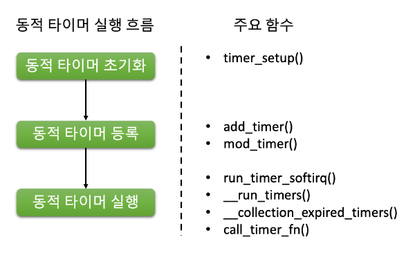

# 4장. 커널 타이머 관리

  * [4-1 커널 타이머](#4-1-커널-타이머)
  * [4-2 jiffies란?](#4-2-jiffies란)
  * [4-3 커널에서 시간의 흐름을 제어하는 방법](#4-3-커널에서-시간의-흐름을-제어하는-방법)
  * [4-4 동적 타이머](#4-4-동적-타이머)

## 4-1 커널 타이머
  Kernel Timer는 스케줄링, 동기화, 이벤트 처리 등 다양한 시스템 레벨 작업을 담당하는 Linux Kernel의 필수적인 부분이다. 

  1. HZ란?  
      HZ는 타이머 인터럽트가 틱을 생성하는 속도를 정의하는 커널 구성 매개변수이다.  
      초당 타이머 인터럽트가 발생하는 회수를 지정한다.  
      예를 들어, HZ가 1000으로 설정된 경우 타이머 인터럽트는 초당 1000개의 틱을 생성한다.  
      HZ의 값은 커널 컴파일 시간에 설정되며 동적으로 변경할 수 없다.

  2. Soft IRQ의 타이머 서비스란?  
      Timer Service in SOFT IRQ는 커널이 이후에 실행할 작업을 예약할 수 있는 메커니즘이다.  
      SOFT IRQ 컨텍스트에서 실행되며, 다른 작업에 의해 중단될 수 있지만, 다음 사용자 수준 작업이 실행되기 전에 반드시 실행된다는 것을 보장한다.

  3. Soft IRQ 타이머 서비스와 동적 타이머란?  
      SOFT IRQ Timer Services는 SOFT IRQ 컨텍스트에서 실행되는 커널 서비스이다.  
      시스템 시계 업데이트 또는 네트워크 인터럽트 처리와 같이 이후에 실행할 작업을 예약하는 데 사용된다.

      Dynamic Timers는 런타임에서 작업을 동적으로 예약하고 취소할 수 있는 SOFT IRQ Timer Services의 일종이다.  
      `timer_setup` 함수를 사용하여 생성하고 `mod_timer`와 `del_timer` 함수를 사용하여 관리한다.

  4. 커널 타이머 용어 정리
      * 타이머 인터럽트 : 하드웨어 타이머 장치에 의해 생성되는 인터럽트
      * HZ : 타이머 인터럽트가 틱을 생성하는 빈도를 정의하는 커널 구성 매개변수
      * SOFT IRQ : 지연된 컨텍스트에서 커널 서비스를 실행할 수 있는 메커니즘
      * SOFT IRQ 타이머 서비스 : SOFT IRQ 컨텍스트에서 실행되는 커널 서비스
      * 다이나믹 타이머 : 런타임 중에 작업을 동적으로 예약하고 취소할 수 있는 SOFT IRQ 타이머 서비스 유형

## 4-2 jiffies란? 
  Jiffies는 Linux 커널에서 시간을 tick의 단위로 추적하는 시간 유지 메커니즘이다.  
  tick은 커널이 추적하는 가장 작은 시간 단위이며, 고정된 시간을 나타냔다.  
  대부분의 시스템에서 tick 비율은 1000 Hz로 설정되어 있으며, 이는 커널이 초당 1000번 jiffies 값을 업데이트한다는 것을 의미한다.

  1. jiffies와 jiffies_64 변수  
      jiffies 변수는 현재 tick 수를 보유하는 32비트 부호 없는 정수이다.  
      이 값은 최댓값에 도달하면 다시 0부터 세기 시작하므로 시간 간격을 계산할 때 문제가 될 수 있다.  
      이를 해결하기 위해 `jiffies_64` 변수가 도입되었으며, 이는 현재 tick 수를 보유하는 64비트 정수이다.

  2. jiffies 값은 누가 언제 증가시킬까?  
      jiffies 값은 커널의 타이머 인터럽트 핸들러에 의해 증가된다.  
      이 핸들러는 소프트 IRQ 시스템의 일부이다.  
      타이머 인터럽트는 시스템 상수 HZ에 의해 결정된 고정된 속도로 발생한다.

      HZ 값은 초당 타이머 인터럽트의 수를 나타낸다.  
      예를 들어, HZ가 1000으로 설정된 경우 타이머 인터럽트는 1밀리초마다 한 번 발생한다.

  3. msecs_to_jiffies() 함수  
      커널은 `msecs_to_jiffies()`라는 헬퍼 함수를 제공한다.  
      이 함수는 밀리초 단위의 시간 값을 해당하는 jiffies 수로 변환한다.  
      이 함수는 커널 타이머 및 기타 시간 관련 작업에 대한 시간 간격을 지정하는 데 유용하다.

      예를 들어, 500 밀리초 동안 타이머를 설정하려면 다음과 같이 사용할 수 있다.
      ``` c
      unsigned long timeout = msecs_to_jiffies(500);
      ```
      이렇게 하면 500 밀리초의 시간 값을 해당하는 jiffies 수로 변환하며, 이는 타이머 이벤트를 설정하는 데 사용할 수 있다.

## 4-3 커널에서 시간의 흐름을 제어하는 방법
  컴퓨터 시스템에서 시간은 프로세스와 스레드가 적시에 실행되도록 운영 체제에 의해 관리되는 중요한 자원이다.  
  운영 체제의 커널은 시간을 관리하여 시간의 흐름을 제어하기 위한 기능과 도구를 제공한다.  
  
  * time_after()와 time_before() 함수  
      `time_after()`와 `time_before()` 함수는 두 개의 시간 값을 비교하는 데 사용되는 두 개의 커널 함수이다.  
      이러한 함수는 `linux/jiffies.h` 헤더 파일에 정의되어 있으며 두 개의 jiffies 변수 값을 비교하는 데 사용할 수 있다.

  * time_after() 함수  
      `time_after()` 함수는 첫 번째 시간 값이 두 번째 시간 값보다 큰지 여부를 판단하는 데 사용된다.  
      ``` c
      #define time_after(a, b)    ((long)(b) - (long)(a) < 0)
      ```
      a : 비교할 첫 번째 타임스탬프  
      b : 비교할 두 번째 타임스탬프
      return value : a가 b보다 크면 함수는 true를 반환, 그렇지 않으면 false  

      다음 코드는 `time_after()` 함수를 사용하는 방법을 보여줍니다:
      ``` c
      #include <linux/jiffies.h>

      unsigned long time1, time2;

      // set time1 and time2 to some values

      if (time_after(time1, time2)) {
          // time1 is greater than time2
      }

      ```

  * time_before() 함수  
      `time_before()` 함수는 첫 번째 시간 값이 두 번째 시간 값보다 작은지 여부를 확인하는 데 사용된다.  
      ``` c
      #define time_before(a, b)    ((long)(a) - (long)(b) < 0)

      ```
      a : 비교할 첫 번째 타임스탬프  
      b : 비교할 두 번째 타임스탬프
      return value : b가 a보다 크면 함수는 true를 반환, 그렇지 않으면 false  

      다음 코드 스니펫은 `time_before()` 함수의 사용 방법을 보여줍니다:
      ``` c
      unsigned long time1, time2;
      if (time_before(time1, time2)) {
          // time1 is less than time2
      } else {
          // time1 is greater than or equal to time2
      }
      ```

## 4-4 동적 타이머
  동적 타이머(Dynamic Timer)는 일반 타이머와 비교하여 더 큰 유연성과 기능을 제공하는 고급 타이머 메커니즘으로서, 운영 체제에서 예약된 이벤트 및 시간 기반 작업을 수행하는 데 중요한 역할을 한다. 

  1. 동적 타이머 흐름  
      동적 타이머는 Linux 커널 내에서 특정한 흐름을 따른다.  
      동적 타이머 흐름에서 중요한 단계는 다음과 같다.  

      <center></center>

  2. 동적 타이머 데이터 구조  
      동적 타이머는 `timer_list` 데이터 구조를 사용하여 커널에서 표현된다.  
      이 데이터 구조에는 타이머의 만료 시간 및 타이머가 작동될 때 호출되는 함수와 관련된 정보가 포함된다.  
      `timer_list` 데이터 구조는 `<linux/timer.h>` 헤더 파일에 정의되어 있다.
      ``` c
      struct timer_list {
        struct list_head entry;
        unsigned long expires;
        void (*function)(struct timer_list *);
        unsigned long data;
        u32 flags;
        int slack;
        struct lock_class_key lock_key;
      };
      ```
      entry : 커널이 활성화된 타이머 목록을 유지하기 위한 list_head (타이머를 다른 타이머와 연결)  
      expires : 타이머의 만료 시간(단위는 jiffies)  
      function : 타이머가 만료될 때 실행되는 콜백 함수  
      data : 타이머와 관련된 임의의 데이터를 저장  
      flags : 타이머와 관련된 다양한 플래그와 구성 옵션  
      slack : 타이머의 만료 시간이 요청된 만료 시간과 얼마나 최대로 벗어날 수 있는지를 나타내는 정수  
      lock_key : 디버깅 목적으로 사용되는 구조로서 타이머와 관련된 락킹 클래스를 추적하는 데 사용

  3. 동적 타이머 초기화  
      동적 타이머를 효과적으로 사용하기 위해서는 적절한 초기화가 필수적이다.  
      초기화 과정에는 타이머 데이터 구조를 설정하고 타이머 핸들러 함수를 지정하며 필요한 속성을 구성하는 작업이 포함된다.  
      동적 타이머를 초기화하는 주요 단계는 아래와 같다.

      1. 타이머 초기화 : `timer_setup()` 함수를 사용하여 타이머 데이터 구조를 초기화
      2. 만료 시간 설정 : `mod_timer()` 함수를 사용하여 타이머의 만료 시간을 설정
      3. 타이머 활성화 : 타이머가 설정되면 활성화되어 타이머 큐에 추가됨

      동적 타이머를 초기화하려면 `timer_list` 데이터 구조를 생성하고 필드를 적절히 설정해야 한다.  
      다음은 동적 타이머를 초기화하는 예시이다.
      ``` c
      #include <linux/timer.h>

      static struct timer_list my_timer;

      void my_timer_function(unsigned long data)
      {
          /* Do something when the timer fires */
      }

      int init_module(void)
      {
          /* Initialize the timer */
          init_timer(&my_timer);
          my_timer.function = my_timer_function;
          my_timer.expires = jiffies + HZ;
          my_timer.data = 0;

          /* Add the timer to the timer queue */
          add_timer(&my_timer);

          return 0;
      }
      ```