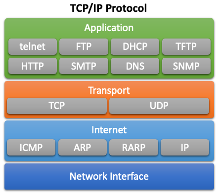

# 4장. **TCP/IP 스택 및 해당 프로토콜(TCP, UDP, IP 등)**

  * [TCP/IP 스택 및 해당 프로토콜(TCP, UDP, IP 등)](#4-1-tcpip-스택-및-해당-프로토콜tcp-udp-ip-등)
  * [가상 네트워크 장치를 사용한 네트워크 가상화(TUN/TAP)](#4-2-가상-네트워크-장치를-사용한-네트워크-가상화tuntap)
  * [네트워크 네임스페이스와 네트워크 격리에서의 역할](#4-3-네트워크-네임스페이스와-네트워크-격리에서의-역할)

## 4-1 TCP/IP 스택 및 해당 프로토콜(TCP, UDP, IP 등)
  TCP/IP 스택은 최신 네트워킹과 인터넷의 기반이다.  
  이는 장치들이 네트워크를 통해 서로 통신할 수 있도록 하는 통신 프로토콜 모음이다. 

  1. TCP/IP 스택이란?  
    TCP/IP 스택은 네트워크를 통해 디바이스 간의 통신을 설정하고 유지하는 데 사용되는 통신 프로토콜 모음이다.  
    가장 중요한 두 가지 프로토콜인 TCP(전송 제어 프로토콜)와 IP(인터넷 프로토콜)의 이름을 따서 명명되었다.

  2. TCP/IP 스택의 계층  
    TCP/IP 스택은 아래와 같이 네 개의 계층으로 나뉜다.  
      

      1. Application Layer(애플리케이션 계층)  
        Application Layer는 TCP/IP 스택의 최상위 레이어이다.  
        이 계층에는 네트워크 애플리케이션에 네트워크에 대한 액세스를 제공하는 프로토콜과 서비스가 포함되어 있다.  
        이 계층에 속하는 프로토콜의 예로는 HTTP, FTP, SMTP, telenet 등이 있다.  

      2. Transport Layer(전송 계층)  
        Transport Layer는 애플리케이션 간에 안정적인 엔드투엔드 데이터 전송을 제공하는 역할을 담당한다.  
        이 계층은 두 가지 프로토콜로 나뉜다.  
          * TCP  
            TCP는 애플리케이션 간에 안정적인 데이터 전송을 제공하는 데 사용되는 연결 지향 프로토콜이다.  
            흐름 제어, 혼잡 제어, 오류 감지 및 수정과 같은 기능을 제공한다.  
            TCP는 이메일, 파일 전송, 웹 브라우징과 같이 안정적이고 오류 없는 데이터 전송이 필요한 애플리케이션에서 사용된다.
          * UDP  
            UDP는 애플리케이션 간에 안정적이고 최선의 데이터 전송을 제공하는 데 사용되는 비연결 프로토콜이다.  
            TCP와 달리 UDP는 오류 감지 및 수정 또는 흐름 제어 기능을 제공하지 않는다.  
            UDP는 온라인 게임, 스트리밍 미디어, 화상 회의 등 빠르고 효율적인 데이터 전송이 필요한 애플리케이션에서 사용된다.

      3. Internet Layer(인터넷 계층)  
        인터넷 계층은 패킷이 서로 다른 네트워크를 통해 전송될 수 있도록 주소 지정 및 라우팅 기능을 제공한다.  
        이 계층에서 가장 일반적으로 사용되는 프로토콜은 인터넷 프로토콜(IP)이다.  
          * IP  
            인터넷 프로토콜(IP)은 서로 다른 네트워크에서 패킷 주소 지정 및 라우팅을 담당하는 네트워크 계층 프로토콜이다.  
            이는 장치가 인터넷을 통해 서로 통신할 수 있도록 하는 논리적 주소 체계를 제공한다. IP는 이메일, 웹 브라우징, 파일 전송을 포함한 모든 인터넷 기반 통신에 사용된다.

      4. Network Interface Layer(네트워크 인터페이스 계층)  
        네트워크 인터페이스 계층은 네트워크와 컴퓨터 하드웨어 사이의 물리적 인터페이스를 제공한다.  
        이 계층에는 사용 중인 네트워크 인터페이스 유형에 맞는 프로토콜이 포함되어 있다.

## 4-2 가상 네트워크 장치를 사용한 네트워크 가상화(TUN/TAP)
  네트워크 가상화는 물리적 네트워크 인프라를 추상화하여 논리적 네트워크를 만드는 프로세스이다.  
  이 접근 방식은 유연성 향상, 보안 강화, 비용 절감 등 여러 가지 이점을 제공한다.  
  네트워크 가상화를 구현하는 일반적인 방법 중 하나는 TUN/TAP과 같은 가상 네트워크 장치를 사용하는 것이다.  
  
  TUN 및 TAP은 호스트 시스템에서 가상 네트워크 인터페이스 역할을 하는 가상 네트워크 장치이다.  
  이를 통해 가상화된 환경에서 실행되는 게스트 운영 체제와 호스트 운영 체제 간에 가상 네트워크 연결을 생성할 수 있다.  
  
  TUN은 IP 터널링에 사용되며, TAP은 이더넷 터널링에 사용된다.
  TUN 및 TAP 장치는 암호화된 네트워크 트래픽을 인터넷을 통해 안전하게 전송할 수 있는 가상 사설망(VPN)에서 일반적으로 사용된다.  
  또한 컨테이너화된 환경에서 동일한 호스트 시스템에서 실행되는 여러 컨테이너 간에 네트워크 격리를 제공하기 위해 사용할 수도 있다.

  TUN/TAP 가상 네트워크 장치는 OSI 모델의 데이터 링크 계층에서 작동하므로 TCP/IP, UDP, ICMP와 같은 다양한 네트워크 프로토콜을 지원할 수 있다.  
  즉, 물리적 네트워크 인터페이스를 사용할 수 있는 모든 소프트웨어는 TUN/TAP 장치도 사용할 수 있다.

  TUN의 경우 가상 네트워크 장치는 장치를 사용 중인 사용자 공간 애플리케이션과 직접 IP 패킷을 읽고 쓰는 방식으로 작동한다.  
  이를 통해 애플리케이션이 네트워크 트래픽을 제어하고 필요한 암호화 또는 암호 해독 알고리즘을 적용할 수 있다.

  반면, TAP 장치는 이더넷 장치를 에뮬레이션하는 데 사용되며, 장치를 사용하는 사용자 공간 애플리케이션과 직접 이더넷 프레임을 읽고 쓰는 방식으로 작동한다.  
  따라서 패킷 캡처 및 네트워크 분석 도구와 같이 네트워크 인터페이스에 대한 낮은 수준의 액세스가 필요한 애플리케이션에 TAP 장치가 더 적합하다.

  전반적으로 TUN/TAP 가상 네트워크 장치는 다양한 환경에서 네트워크 가상화를 구현할 수 있는 유연하고 강력한 방법을 제공한다.  
  안전하고 격리된 가상 네트워크를 생성할 수 있으며 다양한 네트워크 프로토콜을 지원하므로 네트워크 관리자와 개발자 모두에게 유용한 도구이다.

## 4-3 네트워크 네임스페이스와 네트워크 격리에서의 역할