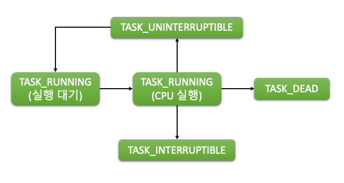

# 6장. Process 스케쥴링

  * [6-1 스케줄링의 주요 개념](#6-1-스케줄링의-주요-개념)
  * [6-2 프로세스 상태 관리](#6-2-프로세스-상태-관리)
  * [6-3 스케줄러 클래스](#6-3-스케줄러-클래스)

## 6-1 스케줄링의 주요 개념

  1. 스케줄링이란?  
      운영 체제에서의 스케줄링은 프로세서의 시간을 여러 작업이나 프로세스 사이에 분배하는 방법을 말한다.  
      이는 준비 큐에 있는 작업 풀에서 선택하여 CPU 자원을 할당하는 것을 포함한다.  
      스케줄링은 다중 프로그래밍 환경에서 여러 작업이 동시에 실행되는 것을 지원하며, 이는 CPU 리소스를 효과적으로 여러 작업이나 프로세스 사이에 공유하고 전체 시스템의 성능을 향상시키는데 기여한다.

      스케줄링은 또한 운영 체제의 다른 중요한 개념, 예를 들면 다중 작업, 병렬 처리, 동시성 등을 지원한다.  
      이는 CPU의 사용을 최적화하고 모든 작업이 그들의 요구사항에 따라 완료되도록 보장하는 데 도움이 된다.

      스케줄링은 CPU 스케줄러, 즉 단기 스케줄러에 의해 수행되는 의사 결정 과정으로 볼 수 있다.  
      이는 큐 내의 프로세스의 실행 순서를 결정한다.  
      이 의사 결정 과정은 대기 시간 최소화, 부하 균형, 공정성 보장과 같은 특정 파라미터를 최적화하도록 설계된 다양한 스케줄링 알고리즘에 근거한다.

  2. 선점 스케줄링과 비선점 스케줄링  
      운영 체제의 스케줄링 전략은 크게 선점 스케줄링과 비선점 스케줄링 두 가지 유형으로 나뉜다.  
      선점 스케줄링과 비선점 스케줄링 핵심 차이는 프로세스와 CPU 리소스를 다루는 방식에 있다.

      * 비선점 스케줄링  
          비선점 스케줄링에서는 CPU가 프로세스를 시작하면 완료되거나 이벤트(예: 입력/출력 작업)에 의해 차단될 때까지 실행된다.  
          프로세스가 자발적으로 CPU를 놓을 때까지 CPU를 프로세스로부터 가져올 수 없다.  
          이 스케줄링 방법은 간단하고 이해하기 쉽지만, 한 큰 프로세스가 CPU를 내놓을 때까지 모든 다른 프로세스가 기다리는 컨보이 효과와 같은 문제를 야기할 수 있다.

          일반적으로 사용되는 비선점 스케줄링 알고리즘에는 선입선출(FCFS)과 최단 작업 우선(SJN)이 있다.

      * 선점 스케줄링  
          선점 스케줄링은 운영 체제가 현재 CPU에서 실행 중인 프로세스를 중단하고 준비 상태로 되돌릴 수 있게 해주어, 다른 프로세스가 실행될 수 있게 한다.  
          이 방법은 각 사용자가 CPU의 공정한 점유를 얻어야 하는 시분할 시스템에서 유용한다.

          선점 스케줄링은 프로세스 우선 순위와 같은 문제를 처리하고, 높은 우선 순위의 작업이 낮은 우선 순위의 작업이 완료될 때까지 기다리지 않도록 할 수도 있다.  
          그러나 이것은 여러 프로세스가 공유 데이터에 접근할 때 발생하는 경쟁 조건과 같은 복잡한 문제를 야기할 수도 있다.

          일반적으로 사용되는 선점 스케줄링 알고리즘에는 라운드 로빈(RR), 우선 순위 스케줄링, 최단 남은 시간 우선(SRTF) 등이 있다.

          선점 스케줄링과 비선점 스케줄링 모두 장점과 단점이 있다.  
          둘 중 어느 것을 선택할지는 일반적으로 시스템의 특정 요구 사항과 제약 조건에 따라 달라진다.  
          일부 시스템은 두 가지를 모두 사용하여 각각의 이점과 단점을 균형잡을 수 있다.

  3. 컨텍스트 스위칭  
      컨텍스트 스위칭은 선점 스케줄링과 밀접하게 관련된 중요한 개념이다.  
      컨텍스트 스위칭은 현재 실행 중인 프로세스에서 다른 프로세스로 CPU 제어를 전환하는 프로세스이다.  
      이는 운영 체제의 핵심 부분으로, CPU를 효과적으로 여러 프로세스 사이에 공유하는 데 도움이 된다.

      컨텍스트 스위칭 중에 운영 체제는 현재 실행 중인 프로세스의 상태(컨텍스트)를 저장하고, 다음에 실행할 프로세스의 상태를 복구한다.  
      컨텍스트에는 프로세스의 PC(Program Counter), 레지스터 값, 스택 정보 등이 포함될 수 있다.

      컨텍스트 스위칭은 리소스를 효과적으로 활용하고 시스템의 응답 시간을 최적화하는 데 중요한 역할을 하지만, 과도한 컨텍스트 스위칭은 시스템의 전체 성능에 영향을 줄 수 있다.  
      이는 각 컨텍스트 스위칭이 오버헤드를 발생시키기 때문이다.  
      따라서, 컨텍스트 스위칭은 필요할 때만 수행되어야 하며, 이를 관리하는 것은 스케줄링 알고리즘의 중요한 부분이다.

      결론적으로, 프로세스 스케줄링은 운영 체제 설계의 필수적인 부분이다.  
      이를 통해 시스템은 CPU 리소스를 효과적으로 관리하고, 공정성과 최적화 사이의 균형을 찾을 수 있다.  
      선점 스케줄링과 비선점 스케줄링 사이의 선택은 특정 사용 사례와 시스템 제약 조건에 크게 의존한다.  
      이러한 개념을 이해함으로써, 사람들은 컴퓨터 시스템이 어떻게 주어진 시간에 여러 작업과 프로세스를 처리하는지 더 잘 이해할 수 있다.

  4. 스케줄링 정책  
      스케줄링 정책은 프로세스가 어떻게 선택되고 CPU 시간이 할당되는지를 규정하는 규칙과 알고리즘이다.  
      일반적으로 사용되는 몇 가지 스케줄링 정책을 살펴보자.

      1. 선입선출 (FCFS)  
          선입선출 스케줄링 정책은 프로세스가 도착한 순서대로 실행되는 가장 간단한 정책 중 하나이다.  
          CPU는 큐의 첫 번째 프로세스에 할당되고, 해당 프로세스는 완료되거나 I/O 작업에 의해 차단될 때까지 계속 실행된다.  
          FCFS는 프로세스가 도착한 순서대로 실행되므로 공정성을 보장하지만, 실행 시간이 긴 작업 뒤에 대기하는 짧은 작업의 응답 시간이 느려질 수 있다.

      2. 최단 작업 우선 (SJN)  
          최단 작업 우선 스케줄링 정책은 실행할 다음 프로세스를 가장 짧은 실행 시간을 갖는 프로세스로 선택한다.  
          이 정책은 평균 대기 시간을 최소화하고 알려진 작업 길이 집합에 대해 최적의 스케줄링을 제공하기 위해 사용된다.  
          그러나 이 정책은 미리 실행 시간을 알아야 하므로 많은 실시간 시나리오에서는 실현 가능하지 않을 수 있다.

      3. 라운드 로빈 (RR)  
          라운드 로빈 스케줄링은 각 프로세스에 고정된 시간 양자 또는 타임 슬라이스를 할당하는 선점 정책이다.  
          CPU는 순환적으로 각 프로세스에 할당되며, 프로세스가 타임 슬라이스 내에서 완료되지 않으면 큐의 뒤로 이동한다.  
          RR은 모든 프로세스가 공평하게 실행할 수 있는 공정성을 제공하지만, 컨텍스트 전환 오버헤드가 높아지고 CPU 활용이 비효율적일 수 있다.

      4. 우선순위 스케줄링  
          우선순위 스케줄링은 각 프로세스에 우선순위를 할당하고 CPU를 가장 높은 우선순위를 갖는 프로세스에 할당한다.  
          실시간 작업과 같은 높은 우선순위 프로세스가 낮은 우선순위 프로세스보다 먼저 실행되도록 한다.  
          우선순위 스케줄링은 실행 중에 우선순위를 변경할 수 있는 선점형 또는 비선점형일 수 있다.

      5. 다중 대기열 스케줄링  
          다중 대기열 스케줄링은 우선순위에 따라 프로세스를 여러 대기열로 구성합니다. 각 대기열은 RR 또는 FCFS와 같은 자체적인 스케줄링 정책을 가질 수 있습니다. 프로세스는 우선순위에 따라 특정 대기열에 처음에 배치되고, 그 후 해당 대기열 내에서 스케줄링됩니다. 이 정책은 다양한 우선순위와 특성을 가진 다양한 유형의 프로세스를 처리하는 유연성을 제공합니다.

      6. 다중 피드백 대기열 스케줄링  
          다중 피드백 대기열 스케줄링은 프로세스가 동작에 따라 대기열 간 이동할 수 있는 다중 대기열 스케줄링의 확장입니다. CPU 시간이 더 필요하거나 더 높은 우선순위를 요구하는 프로세스는 더 높은 우선순위 대기열로 이동하고, 자주 차단되거나 낮은 우선순위를 갖는 프로세스는 낮은 우선순위 대기열로 이동할 수 있습니다. 이 정책은 프로세스의 동적 특성에 적응하여 응답 시간과 자원 활용을 최적화합니다.

  5. 프로세스 스케줄링  
      리눅스 커널은 5개의 스케줄러를 지원하며, 프로세스가 이를 유연하게 사용하도록 스케줄러의 세부 동작을 샛체화 했다.  
      이를 스케줄러 클래스라고 부르며 종류는 아래와 같다.  

      1. Stop Scheduler  
          Stop Scheduler는 모든 프로세스를 일시 중지시켜 활성 작업의 실행을 중단하는 기본적인 스케줄러 클래스이다.  
          에너지 절약 모드나 시스템이 유휴 상태로 들어가야 하는 경우에 자주 사용된다.

      2. Deadline Scheduler  
          Deadline Scheduler는 시간에 민감한 작업을 위해 설계된 실시간 스케줄러 클래스이다.  
          작업의 긴급성에 따라 우선순위를 할당하여 작업이 지정된 Deadline을 준수하도록 보장한다.  
          Deadline이 더 이른 작업이 먼저 실행되어 시간에 민감한 작업이 제때 완료될 수 있도록 한다.

      3. RT Scheduler  
          RT Scheduler는 실시간 작업의 결정적이고 예측 가능한 실행을 보장하는 또 다른 실시간 스케줄링 클래스이다.  
          작업에 고정된 우선순위를 할당하고 우선순위 기반 선점을 사용하여 제때 처리를 보장한다.  
          RT Scheduler는 엄격한 타이밍 요구 사항을 충족해야 하는 시스템에서 일반적으로 사용된다.

      4. CFS Scheduler  
          CFS Scheduler는 많은 현대적인 운영 체제에서 사용되는 인기 있는 스케줄러 클래스이다.  
          CFS Scheduler는 공정성과 최적의 자원 할당을 목표로 한다.  
          CFS Scheduler는 "가상 실행 시간"이라는 개념을 활용하여 우선순위를 동적으로 할당한다.  
          실행 시간 기록을 기반으로 작업을 효율적으로 추적하고 스케줄링하기 위해 레드-블랙 트리를 유지한다.

      5. Idle Scheduler  
          Idle Scheduler는 CPU가 유휴 상태인 경우에 작업을 실행하는 특수한 스케줄러 클래스이다.  
          시스템이 중요한 작업에 참여하지 않는 경우에 배경 작업, 유지 관리 활동 또는 다른 낮은 우선순위 작업을 수행하기 위해 유휴 CPU 사이클을 효율적으로 활용하는 데 사용된다.

  6. 런 큐(Run Queue)란?  
      런 큐는 스케줄러가 실행 가능한 프로세스 목록을 유지하기 위해 사용되는 중요한 데이터 구조이다.  
      런 큐는 CPU에서 실행되기 ready(준비된) 상태인 프로세스들의 집합을 나타낸다.  
      런 큐는 CPU 시간을 기다리는 작업을 보유하는 중앙 집중식 개체 역할을 한다.

      런 큐는 사용되는 스케줄링 알고리즘에 따라 다양한 방식으로 구현될 수 있다.  
      간단한 큐, 우선순위 큐, 다중 레벨 큐 등의 형태일 수 있다.  
      스케줄러는 주기적으로 런 큐에서 프로세스를 선택하고 선택한 스케줄링 정책에 따라 CPU 시간을 할당한다.

  7. 나이스(Nice)란?  
      프로세스 스케줄링의 문맥에서 "나이스(Nice)"는 사용자가 자신의 프로세스의 스케줄링 우선순위에 영향을 미칠 수 있는 개념을 의미한다.  
      각 프로세스에는 나이스 값이 할당되는데, 이는 우선순위를 나타내는 숫자적 표현이다.  
      나이스 값이 낮을수록(우선순위가 높을수록), 높은 우선순위를 의미하며, 나이스 값이 높을수록(우선순위가 낮을수록) 낮은 우선순위를 의미한다.

      나이스 값은 일반적으로 -20부터 +19까지의 범위를 가지며, 기본값은 일반적으로 0으로 설정된다.  
      나이스 값이 낮은 프로세스(높은 우선순위)는 나이스 값이 높은 프로세스(낮은 우선순위)에 비해 더 많은 CPU 시간을 받게 된다.  
      나이스 값은 일반적으로 nice나 renice와 같은 시스템 유틸리티를 사용하여 프로세스 소유자에 의해 조정될 수 있다.

      나이스 값을 조정함으로써 사용자는 스케줄링 알고리즘에서 자신의 프로세스의 상대적 중요성에 영향을 미칠 수 있다.  
      중요한 작업이나 실시간 요구 사항이 있는 프로세스는 나이스 값을 낮게 설정하여 충분한 CPU 시간을 할당받고 타이밍 제약을 충족시킬 수 있다.

## 6-2 프로세스 상태 관리
  운영 체제에서 프로세스는 생성, 실행 및 종료되는 과정에서 다양한 상태로 전환될 수 있다.  
  프로세스 상태 관리는 시스템 내에서 효율적인 자원 할당과 조정을 위해 중요하다.  

  1. 프로세스 상태  
      프로세스 상태는 다음과 같은 프로세스 상태 다이어그램으로 표현할 수 있다.  

      <center></center>
      
      |프로세스 상태|내용|
      |:--:|--|
      |실행 대기<br>(TASK_RUNNING)| - 프로세스가 런큐에 삽입이 된 후 실행을 기다리는 상태<br> - 스케줄러는 TASK_RUNNING(실행 대기) 상태에 있는 프로세스 중에서 CPU에서 실행할 프로세스를 선택|
      |CPU 실행<br>(TASK_RUNNING)| - 프로세스가 CPU에서 실행되고 있는 상태<br> - CPU 레지스터 세트에는 현재 실행 중인 프로세스의 상태 정보로 채워짐|
      |TASK_INTERRUPTIBLE| - 프로세스가 휴면 상태에 진입한 상태<br> - 프로세스를 깨우면 다시 TASK_RUNNING(실행 대기) 상태로 변경됨|
      |TASK_UNINTERRUPTIBLE| - 프로세스가 특정 조건으로 깨어나고 싶을 때 설정하는 상태<br> - 보통 스스로 깨어날 조건을 설정한 다음에 TASK_UNINTERRUPTBLE 상태로 변경<br> - 뮤텍스를 얻지 못하거나 입출력(I/O) 동작 중에 TASK_UNINTERRUPTBLE 상태로 변경|

      * [(참고) TASK_INTERRUPTIBLE와 TASK_UNINTERRUPTIBLE의 차이점](#참고-task_interruptible와-task_uninterruptible의-차이점)

  2. 프로세스 상태 변화  
      앞서 Linux에서의 주요 프로세스 상태에 대해 소개했다.  
      이번에는 프로세스 상태가 변화할 때 어떤 동작들이 일어나는지에 대해 더 자세히 살펴보자.

      1. 실행 대기(TASK_RUNNING) &#8594; CPU 실행(TASK_RUNNING)  
          실행 대기 상태의 프로세스는 CPU를 할당받기 위해 기다리고 있는 상태이다.  
          여기서 스케줄러가 동작하게 되며, 스케줄러는 실행 대기 상태의 프로세스 중에서 어느 하나를 선택하여 CPU에 할당한다.  
          이 프로세스는 이제 CPU 실행 상태로 전환되며 실제 연산 작업을 수행합니다. 

      2. CPU 실행(TASK_RUNNING)&#8594; TASK_INTERRUPTIBLE  
          프로세스가 다시 깨어나길 기다리거나 지정된 시간 동안 기다리는 상태이다.  
          프로세스사 다시 깨어날 조건이 되면 프로세스는 다시 TASK_RUNNING 상태로 바꾸면서 런큐에 삽입한다.  
          TASK_RUNNING 상태인 프로세스를 스케줄러가 선택하면 CPU에서 실행할 수 있다.

      3. CPU 실행 (TASK_RUNNINGTASK_RUNNING) &#8594; TASK_UNINTERRUPTIBLE  
          프로세스가 특정 족선에서 깨어나 실행하려면 TASK_UNINTERRUPTIBLE 상태로 바꾼다.  
          대부분의 프로세스는 다음과 순서로 동작한다.  

            1. 자신이 깨어날 조건 설정
            2. TASK_UNINTERRUPTIBLE 상태로 변경
            3. schedule() 함수를 호출해 휴면 상태에 진입  

          또한, TASK_UNINTERRUPTIBLE 상태로 변경 되는 경우는 다음과 같다.  

            1. I/O를 실행할 때
            2. 뮤텍스를 획득하지 못했을 때

      4. TASK_INTERRUPTIBLE &#8594; 실행 대기(TASK_RUNNING)  
          TASK_INTERRUPTIBLE 상태의 프로세스는 대기하고 있던 조건이 충족되면 다시 실행 대기 상태로 전환된다.  
          예를 들어, 프로세스가 기다리던 I/O 작업이 완료되었다면, 커널은 프로세스를 깨우고 실행 대기 상태로 전환시킨다.  
          이후 스케줄러는 프로세스를 CPU 실행 상태로 전환시킬 수 있다.

      5. TASK_UNINTERRUPTIBLE &#8594; 실행 대기(TASK_RUNNING)  
          특정 조건에서 프로세스가 깨어난 후 바꾸는 상태이다.  
          깨어난 프로세스는 다시 실행 대기(TASK_RUNNING) 상태로 변경된다.  
          이 과정은 다음과 같은 경우에 해당한다.  
            
            1. I/O 실행 완료
            2. 뮤텍스를 해제한 프로세스가 뮤텍스 획득을 위해 휴면 상태에 진입한 프로세스를 깨울 때

## 6-3 스케줄러 클래스
  시스템이 스케줄링, 즉, 프로세스와 스레드들을 어떻게, 언제 실행할지 결정하는 것은 매우 중요한 과제이다.  
  이를 처리하기 위한 매커니즘 중 하나가 바로 리눅스 스케줄러 클래스이다. 

  1. 스케줄러 클래스란 무엇인가?  
      리눅스 스케줄러 클래스는 리눅스 커널의 일부로, 프로세스가 어떻게 실행되고, 언제 실행될지 결정하는 역할을 한다.  
      이것은 운영 체제가 컴퓨터의 CPU를 효율적으로 사용하도록 돕는 중요한 역할을 수행한다. 

      각 클래스는 다른 종류의 작업에 적합한 다른 알고리즘을 사용한다.  
      예를 들어, 일부 클래스는 고성능 계산을 위해 설계되어 있을 수 있고, 다른 클래스는 사용자 응답성에 중점을 둘 수 있다.

  2. 스케줄러 클래스를 도입 이유  
    리눅스 시스템이 다양한 유형의 작업을 처리할 수 있도록 하는 데에는 높은 유연성이 필요하다.  
    서버는 가장 중요한 작업을 먼저 실행하도록 스케줄링해야 하며, 컴퓨터는 사용자의 명령에 신속하게 반응해야 한다.  
    스마트폰은 배터리 수명을 최대화하면서도 사용자 인터페이스를 유지해야 한다. 

    이러한 다양한 요구 사항을 충족시키기 위해, 리눅스는 스케줄러 클래스라는 개념을 도입하했다.  
    스케줄러 클래스는 각각의 작업 유형에 맞게 알고리즘을 사용하여, 작업을 스케줄링할 수 있다. 

  3. 스케줄러 클래스 자료구조  
      ```c
      struct sched_class {
        const struct sched_class *next;

        void (*enqueue_task) (struct rq *rq, struct task_struct *p, int flags);
        void (*dequeue_task) (struct rq *rq, struct task_struct *p, int flags);
        void (*yield_task) (struct rq *rq);
        bool (*yield_to_task) (struct rq *rq, struct task_struct *p, bool preempt);

        void (*check_preempt_curr) (struct rq *rq, struct task_struct *p, int flags);

        /* it is the current task - we are holding rq->lock */
        struct task_struct * (*pick_next_task) (struct rq *rq, struct task_struct *prev, struct rq_flags *rf);
        void (*put_prev_task) (struct rq *rq, struct task_struct *p);

        int  (*select_task_rq)(struct task_struct *p, int task_cpu, int sd_flag, int flags);
        void (*migrate_task_rq) (struct task_struct *p, int next_cpu);
        void (*task_woken) (struct rq *rq, struct task_struct *task);
        void (*set_cpus_allowed)(struct task_struct *p, const struct cpumask *newmask);
      };
      ```

      위의 `sched_class` 구조체는 각각의 스케줄러 클래스가 어떻게 동작할지를 정의한다.  
      각 멤버 함수는 특정 작업을 수행하기 위해 사용된다.  
      아래는 자료구조의 주요 함수에 대한 설명이다.

      enqueue_task : 스케줄러 클래스의 큐에 작업을 추가  
      dequeue_task : 큐에서 작업을 제거  
      yield_task : 현재 실행 중인 작업이 CPU를 다른 작업에게 양보  
      check_preempt_curr : 현재 실행 중인 작업이 다른 작업에게 선점당할지 여부  
      pick_next_task : 다음에 실행될 작업을 선택  
      put_prev_task : 이전 작업을 처리  

  4. 5가지 스케줄러 클래스  
      1. Stop Scheduler  
          Stop 스케줄러 클래스는 특정 프로세스나 스레드의 스케줄링을 중단시키는 역할을 한다.  
          이 클래스는 주로 디버깅이나 프로세스 관리를 위해 사용된다.

          - Stop 스케줄러는 프로세스나 스레드를 일시적으로 정지시킬 수 있다.
          - 해당 프로세스나 스레드는 CPU 자원을 반환하고 다른 작업에 할당될 수 있다.

      2. Deadline Scheduler  
          Deadline 스케줄러 클래스는 실시간 시스템에서 작업의 마감 시간(deadline)을 고려하여 스케줄링을 수행한다.  
          이 클래스는 실시간 응용 프로그램에서 중요한 역할을 한다.

          - Deadline 스케줄러는 작업의 마감 시간을 최대한 준수하도록 스케줄링한다.
          - 이 스케줄러는 작업의 우선순위를 기반으로 스케줄링을 수행하며, 마감 시간을 고려하여 작업을 배정한다.

      3. RT Scheduler  
          RT(Real-Time) 스케줄러 클래스는 실시간 응용 프로그램을 위해 설계된 스케줄러이다.  
          이 클래스는 작업의 우선순위를 기반으로 스케줄링을 수행하며, 실시간 요구에 따라 응답 시간을 보장한다.

          - RT 스케줄러는 실시간 작업이 정확한 시간에 실행될 수 있도록 스케줄링한다.
          - 우선순위를 기반으로 작업을 배정하며, 우선순위가 높은 작업이 우선적으로 처리된다.
          - RT 스케줄러는 실시간 응용 프로그램의 응답 시간을 최소화하여 실시간 요구를 충족시킨다.

      4. CFS Scheduler  
          CFS(Completely Fair Scheduler) 스케줄러 클래스는 리눅스 커널에서 가장 일반적으로 사용되는 스케줄러이다.  
          이 클래스는 공정성을 기반으로 프로세스를 스케줄링한다.

          - CFS 스케줄러는 CPU 시간을 공정하게 분배하여 프로세스 간 공정한 경쟁을 제공한다.
          - 프로세스의 가중치를 기반으로 CPU 시간을 할당하며, 프로세스의 우선순위를 고려한다.
          - CFS 스케줄러는 가변적인 타임 슬라이스를 사용하여 공정성을 보장한다.

      5. Idle Scheduler  
          Idle 스케줄러 클래스는 CPU가 유휴 상태일 때 실행되는 스케줄러이다.  
          이 클래스는 시스템의 에너지 효율성을 향상시키는 데 도움을 준다.

          - Idle 스케줄러는 CPU가 아무 작업도 수행하지 않을 때 실행되는 작업을 처리한다.
          - 유휴 상태에서 실행되는 작업이므로 시스템의 에너지 소비를 줄이는 데 기여한다.

### (참고) TASK_INTERRUPTIBLE와 TASK_UNINTERRUPTIBLE의 차이점
1. TASK_INTERRUPTIBLE  
    `TASK_INTERRUPTIBLE` 상태는 "슬립(sleeping)" 상태로 알려져 있으며, 프로세스가 특정 이벤트나 조건을 기다리고 있는 상태를 나타낸다.  
    프로세스가 `TASK_INTERRUPTIBLE` 상태에 있을 때, 커널로부터의 신호나 외부 이벤트에 의해 깨워질 수 있다.  
    신호를 받으면 프로세스가 깨어나 실행을 계속할 수 있다.

    `TASK_INTERRUPTIBLE` 상태의 주요 특징은 프로세스가 신호에 의해 중단될 수 있다는 것이다.  
    이는 프로세스가 대기하는 동안 신호가 도착하면 즉시 깨어나 신호에 응답할 수 있다는 것을 의미한다.  
    `TASK_INTERRUPTIBLE` 상태에 있는 프로세스의 일반적인 예로는 I/O 완료를 기다리거나 락이 해제되기를 기다리는 프로세스가 있다.

2. TASK_UNINTERRUPTIBLE  
    `TASK_UNINTERRUPTIBLE` 상태는 "중단되지 않는 슬립(uninterruptible sleep)" 상태로 알려져 있으며, 프로세스가 특정 이벤트나 조건을 기다리고 있는 점에서 `TASK_INTERRUPTIBLE` 상태와 유사하다.  
    그러나 주요한 차이점은 `TASK_UNINTERRUPTIBLE` 상태의 프로세스는 신호에 의해 중단될 수 없다는 것이다.  
    프로세스가 대기하는 동안 신호가 도착해도 신호에 대응하기 위해 즉시 깨어나지 않는다.

    `TASK_UNINTERRUPTIBLE` 상태에 있는 프로세스는 일반적으로 가까운 시일 내에 사용 가능해지지 않을 것으로 예상되는 리소스를 기다린다.  
    예를 들어, 상당한 시간이 걸릴 수 있는 디스크 I/O 작업을 기다리는 프로세스는 `TASK_UNINTERRUPTIBLE` 상태에 있을 수 있다.  
    이 경우, 리소스가 사용 가능해질 때까지 프로세스를 신호로 중단하는 것은 바람직하지 않다.
