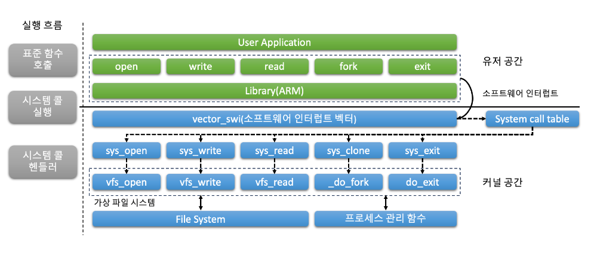

# 7장. System call

  * [7-1 시스템 콜(System Call)이란?](#7-1-시스템-호출system-call이란)

## 7-1 시스템 콜(System Call)이란?
  운영 체제의 세계에서 시스템 콜은 사용자 수준의 프로세스가 기반이 되는 운영 체제 커널과 상호 작용할 수 있는 기본 메커니즘이다.  
  시스템 콜은 권한이 있는 작업을 실행하고 시스템 리소스에 액세스하기 위한 제어된 인터페이스를 제공한다.

  1. 시스템 콜 이해하기  
      높은 수준에서 시스템 콜은 사용자 수준 애플리케이션과 운영 체제 사이의 경계로 작동한다.  
      이를 통해 사용자 프로그램은 파일 입출력, 프로세스 생성, 네트워크 통신, 하드웨어 장치 액세스와 같이 일반적으로 커널에 제한된 기능과 서비스를 요청할 수 있다.  
      시스템 콜은 잘 정의된 인터페이스를 제공함으로써 사용자 프로그램이 특권을 가진 커널 모드에 직접 액세스하지 않고도 운영 체제의 기능을 활용할 수 있게 한다.

  2. 시스템 콜의 목적  
      시스템 콜의 주요 목적은 사용자 수준 프로세스가 특권 있는 작업을 실행할 수 있는 안전하고 제어된 메커니즘을 제공하는 것이다.  
      이러한 작업은 종종 하드웨어, 특권 명령어 또는 운영 체제에서 보호되고 관리되는 중요한 시스템 리소스에 액세스해야 하는 경우가 많다.  
      시스템 콜을 사용함으로써 사용자 프로그램은 이러한 서비스를 제어된 방식으로 요청할 수 있으며, 인가된 작업만 수행되고 시스템 리소스에 대한 무단 액세스나 남용을 방지할 수 있다.

  3. 시스템 콜의 전체 흐름과 계층
      아래는 시스템 콜의 전체 흐름이다.  
      

      시스템 콜의 세부 실행 단계는 다음과 같다.  

      1. Linux 저수준 표준 함수 호출  
          - 사용자 프로그램이 직접 Linux 저수준 표준 함수를 호출한다.
          - 함수 호출은 링커/로더에 의해 해결되고 해당 라이브러리 함수에 링크된다.
          - 함수는 호출하는 프로세스의 사용자 공간에서 실행된다.
          - 함수는 사용자 프로그램을 대신하여 일부 작업을 수행하거나 추가적인 시스템 콜을 수행할 수 있다.

      2. User 공간에서 시스템 콜 실행  
          - 사용자 프로그램은 래퍼 함수나 시스템 콜 라이브러리와 같은 고수준 인터페이스를 사용하여 시스템 콜을 수행한다.
          - 고수준 인터페이스는 시스템 콜을 특정 함수 호출로 변환힌다.
          - 함수 호출은 호출하는 프로세스의 사용자 공간에서 실행된다.
          - 함수는 커널 공간으로 전환하기 전에 일부 초기 유효성 검사나 준비 작업을 수행할 수 있다.

      3. 커널 공간에서 시스템 콜 실행  
          - 사용자 공간에서의 함수 호출은 모드 전환을 트리거하여 사용자 모드에서 커널 모드로 전환한다.
          - CPU는 운영 체제의 커널에게 제어를 전달힌다.
          - 커널은 제공된 식별자나 번호를 기반으로 요청된 시스템 콜을 식별한다.
          - 커널은 시스템 콜과 관련된 매개변수와 권한을 유효성 검사한다.
          - 커널은 요청된 작업을 수행하기 위해 해당하는 시스템 콜 핸들러를 실행한다.
          - 시스템 콜의 실행은 커널 공간에서 발생한다.

      4. 시스템 콜 핸들러 실행  
          - 시스템 콜 핸들러는 특정 시스템 콜을 실행하는 커널 수준 루틴이다.
          - 핸들러는 사용자 프로그램으로부터 매개변수를 받아 필요한 작업을 수행한다.
          - 핸들러는 하드웨어에 액세스하거나 시스템 상태를 수정하거나 다른 커널 하위 시스템과 상호 작용할 수 있다.
          - 핸들러는 오류 처리를 수행하고 결과나 상태를 호출 컨텍스트에 반환한다.
          - 시스템 콜 핸들러가 완료되면 제어가 커널로 반환되고, 특정 컨텍스트에 따라 추가 처리가 진행될 수 있다.

  4. 시스템 콜의 특징  
      시스템 콜은 사용자 프로그램이 기반이 되는 운영 체제와 상호 작용할 수 있도록 중요한 역할을 한다.  
      시스템 콜은 사용자 프로세스가 커널로부터 서비스와 리소스를 요청할 수 있도록 제어된 인터페이스를 제공한다.

      1. 사용자 프로그램과 커널 사이의 인터페이스  
          시스템 콜은 사용자 프로그램과 운영 체제 커널 간의 인터페이스 역할을 한다.  
          사용자 프로그램은 운영 체제에서 제공하는 특정 기능이나 서비스를 요청하기 위해 호출할 수 있는 일련의 정의된 함수 또는 서비스를 제공한다.

      2. 제어된 진입점  
          시스템 콜은 커널로의 제어된 진입점을 제공한다.  
          사용자 프로그램이 사용자 모드에서 커널 모드로 전환하여 권한이 필요한 작업을 수행하거나 특정 리소스에 액세스할 수 있도록 한다.  
          시스템 콜을 통해 인가된 작업만 실행되며 시스템의 보안과 무결성을 유지하는 데 도움이 된다.

      3. 하드웨어와 리소스의 추상화  
          시스템 콜은 하드웨어와 저수준 작업의 복잡성을 추상화한다.  
          사용자 프로그램이 하드웨어별 세부 사항을 직접 다루지 않아도 되도록 고수준 인터페이스를 제공한다.  
          대신 사용자 프로그램은 시스템 콜을 사용하여 하드웨어 장치, 파일 시스템, 네트워크 프로토콜, 프로세스 관리 및 기타 운영 체제 서비스와 일관되고 통일된 방식으로 상호 작용할 수 있다.

      4. 시스템 전반적인 서비스  
          시스템 콜은 사용자 프로그램이 시스템 전반적인 서비스와 리소스를 요청할 수 있도록 한다.  
          시스템 콜은 일반적으로 커널 수준에서만 사용 가능한 기능에 액세스할 수 있도록 한다.  
          예를 들어, 프로세스 관리, 파일 작업, 프로세스간 통신, 메모리 관리, 시간 관리, 장치 입출력 등의 기능에 액세스할 수 있다.  
          시스템 콜을 호출함으로써 사용자 프로그램은 운영 체제가 제공하는 다양한 기능을 활용할 수 있다.

      5. 동기화와 보호  
          시스템 콜은 공유 리소스의 적절한 동기화와 보호를 보장한다.  
          시스템 콜은 종종 상호 배제 메커니즘인 락 또는 세마포어와 같은 동기화 메커니즘을 포함하며, 이를 통해 데이터 경쟁을 방지하고 데이터 무결성을 유지한다.  
          또한 시스템 콜은 접근 제어 정책을 강제하며, 사용 권한과 사용자 권한을 확인하여 무단 액세스나 시스템 리소스의 남용을 방지한다.

      6. 오류 처리와 반환 값  
          시스템 콜은 오류 처리와 관련된 메커니즘을 제공하고 사용자 프로그램에 관련 정보를 반환한다.  
          시스템 콜 실행 후에는 작업의 결과를 나타내는 상태 코드나 오류 값이 반환될 수 있다.  
          사용자 프로그램은 이러한 반환 값들을 확인하여 오류를 처리하고 적절하게 대응하며 필요한 수정 작업을 수행할 수 있다.

      7. 성능 고려 사항  
          시스템 콜은 사용자 모드와 커널 모드 간 전환에 따른 오버헤드로 인해 성능에 영향을 줄 수 있다.  
          컨텍스트 스위치와 관련된 오버헤드는 시스템 콜이 자주 호출되거나 시간에 민감한 시나리오에서 전체 시스템 성능에 영향을 미칠 수 있다.  
          따라서 효율적인 시스템 콜 구현과 최적화는 오버헤드를 최소화하고 전체 시스템 성능을 향상시키기 위해 중요한다.

  5. ARM 프로세스 관점에서의 시스템 콜 처리  
      현대의 컴퓨팅 시스템에서 시스템 콜은 사용자 프로세스가 기반이 되는 운영 체제와 상호 작용할 수 있도록하는 중요한 역할을 한다.  
      ARM 기반 아키텍처에서 실행 중인 프로세스가 권한이 필요한 작업을 수행하거나 시스템 서비스에 액세스해야 할 때 시스템 콜을 사용한다.  
      
      1. ARM 프로세서 모드  
          ARM 프로세서는 각각의 권한 수준과 시스템 리소스에 대한 액세스 권한을 가지는 다양한 운영 모드를 지원한다.  
          시스템 콜 처리와 관련된 주요한 모드는 다음과 같다.

          - 사용자 모드  
              사용자 프로세스가 실행되는 모드이다.  
              제한된 권한을 가지며 특정한 권한을 가진 리소스에 직접적으로 액세스할 수 없다.

          - 슈퍼바이저 모드 (SVC)  
              프로세스가 시스템 콜을 요청할 때 진입하는 모드이다.  
              더 높은 권한을 가지며 시스템 리소스와 서비스에 액세스할 수 있다.
          
          - 시스템 모드  
              주로 운영 체제 커널이 커널 레벨 코드를 실행하는 데 사용되는 권한 모드이다.

      2. 시스템 콜 호출  
          사용자 모드에서 실행 중인 프로세스가 권한이 필요한 작업을 수행하거나 시스템 서비스에 액세스하려는 경우, 다음 단계를 따라 시스템 콜을 시작한다.

          1. 프로세스는 시스템 콜을 위해 필요한 인수를 준비한다.  
          이는 입력 매개변수와 함수 코드와 같은 것들이다.

          2. 프로세스는 소프트웨어 인터럽트를 트리거하여 사용자 모드에서 슈퍼바이저 모드로 전환한다.  
          이를 위해 일반적으로 `svc` 명령을 사용한다.  
          이 명령은 예외를 발생시켜 컨텍스트 스위치를 트리거하며, 슈퍼바이저 모드로의 전환을 일으킨다.

          3. 소프트웨어 인터럽트를 수신한 ARM 프로세서는 프로세스의 현재 컨텍스트(레지스터 및 프로그램 카운터 등)를 저장하고 SVC 모드로 전환한다.

          4. 프로세서는 시스템 콜 처리를 위한 사전에 정의된 벡터 테이블 항목으로 점프한다.  
          이 항목은 일반적으로 운영 체제가 초기화 과정에서 설정한다.

          5. SVC 모드에서 실행되는 운영 체제 커널은 프로세스가 제공한 함수 코드를 검사하여 요청된 특정 시스템 콜을 결정한다.

          6. 커널은 시스템 콜을 해당하는 핸들러 루틴에 전달하여 프로세스를 대신하여 요청된 작업을 수행한다.

          7. 핸들러 루틴은 필요한 작업을 수행하며, 특권 리소스에 액세스하거나 데이터 구조를 조작하거나 다른 커널 레벨 작업을 실행할 수 있다.

          8. 시스템 콜이 완료되면 커널은 결과를 프로세스에 반환한다.  
          일반적으로 이 값을 미리 정의된 레지스터나 메모리 위치에 저장한다.

          9. 프로세서는 저장된 프로세스 컨텍스트를 복원하고 사용자 모드로 전환하여 프로세스의 실행을 이전한 지점부터 계속한다.

      3. 시스템 콜 인터페이스  
          시스템 콜 처리를 위해 ARM 프로세서는 사용자 공간과 커널 사이에 잘 정의된 인터페이스를 제공한다.  
          이 인터페이스에는 다음이 포함된다.

          - 시스템 콜 번호  
              각 시스템 콜은 고유한 번호가 할당되며, 사용자 프로세스에 의해 인수로 전달된다.  
              운영 체제는 이 번호를 사용하여 요청된 시스템 콜을 식별한다.
          - 인수  
              사용자 프로세스는 시스템 콜 호출의 일부로서 추가적인 인수를 커널에 전달한다.  
              이러한 인수는 커널이 요청된 작업을 수행하는 데 필요한 정보를 제공한다. 
          - 반환 값  
              시스템 콜을 실행한 후 커널은 결과 값을 사용자 프로세스에 반환한다.  
              이 값은 일반적으로 작업의 성공 또는 실패를 나타내거나 필요에 따라 추가 정보를 제공한다.

      4. 예외 처리와 컨텍스트 스위칭  
          시스템 콜은 예외의 생성과 다른 프로세서 모드 간의 컨텍스트 스위칭을 수반한다.  
          프로세스가 소프트웨어 인터럽트를 트리거하여 시스템 콜을 시작하면 예외가 발생하며, 프로세서는 SVC 모드로 전환하여 운영 체제 커널로 제어를 전달한다.  
          그런 다음 커널은 예외를 처리하고 시스템 콜을 실행한 후 완료 시 사용자 프로세스에 제어를 반환한다.

          이 프로세스 중에는 프로세스의 상태를 저장하고 복원하기 위해 컨텍스트 스위칭이 수행된다.  
          프로세스의 레지스터 및 프로그램 카운터는 SVC 모드로의 전환시 저장되며, 사용자 모드로 복귀할 때 복원되어 프로세스가 이전 상태에서 실행을 계속할 수 있도록 한다.

  6. 시스템 콜 테이블이란?  
      운영 체제에서 시스템 콜은 사용자 프로세스가 커널로부터 서비스를 요청하는 수단을 제공한다.  
      이러한 시스템 콜은 프로세스가 특정 작업을 요청할 때 호출되는 함수로 구현된다.  
      시스템 콜 테이블은 운영 체제 내에서 시스템 콜의 조직과 관리에 중요한 구성 요소이다.  
      
      1. 시스템 콜 테이블의 역할  
          시스템 콜 테이블은 운영 체제가 시스템 콜을 관리하고 디스패치하는 데 사용하는 데이터 구조이다.  
          이는 시스템 콜 번호를 해당하는 핸들러 함수와 매핑하는 룩업 테이블로 동작한다.  
          각 시스템 콜은 고유한 번호가 할당되며, 이 번호는 시스템 콜 테이블의 인덱스로 사용되어 적절한 핸들러 함수를 찾는다.

      2. 시스템 콜 테이블의 구조  
          시스템 콜 테이블은 일반적으로 배열 또는 유사한 데이터 구조로 구현된다.  
          테이블의 크기는 운영 체제에서 지원하는 시스템 콜의 수에 의해 결정된다.  
          테이블의 각 항목은 시스템 콜을 나타내며, 해당하는 핸들러 함수에 대한 정보를 포함한다.

      3. 시스템 콜 테이블의 채워넣기  
          운영 체제 초기화 과정에서 시스템 콜 테이블은 필요한 정보로 채워진다.  
          이 과정은 각 지원되는 시스템 콜에 고유한 시스템 콜 번호를 할당하고 해당하는 핸들러 함수와 연결하는 작업을 포함한다.  
          운영 체제는 일반적으로 시스템 콜 및 핸들러를 등록하는 메커니즘을 제공하여 시스템 콜 테이블을 동적으로 수정하고 확장할 수 있다.

      4. 시스템 콜 디스패치  
          사용자 프로세스가 시스템 콜을 호출할 때 시스템 콜 번호를 인자로 제공한다.  
          운영 체제는 이 번호를 사용하여 시스템 콜 테이블에 인덱싱하고 적절한 핸들러 함수를 검색한다.  
          시스템 콜 디스패치 메커니즘은 시스템 콜 테이블에서 핸들러 함수를 검색하고 요청한 프로세스를 대신하여 해당 함수를 실행한다.

      5. 이점과 중요성  
          시스템 콜 테이블은 여러 가지 이점을 제공하며 운영 체제의 동작에 중요한 역할을 한다.

          1. 효율적인 시스템 콜 디스패치  
              시스템 콜 테이블을 사용함으로써 운영 체제는 특정 시스템 콜에 대한 적절한 핸들러 함수를 빠르게 찾을 수 있다.  
              이는 시스템 콜 실행의 효율성을 향상시키고 함수 포인터 검색과 관련된 오버헤드를 줄인다.

          2. 모듈화와 확장성  
              시스템 콜 테이블을 사용하면 핵심 운영 체제 코드를 수정하지 않고도 시스템 콜을 쉽게 추가하거나 제거할 수 있다.  
              새로운 시스템 콜은 동적으로 등록되고 해당하는 핸들러 함수와 연결되어 시스템을 더 모듈화하고 확장 가능하게 만든다.

          3. 보안과 접근 제어  
              시스템 콜 테이블은 보안 정책과 접근 제어 메커니즘을 강제하는 중앙 집중지로 작용한다.  
              운영 체제는 시스템 콜 번호를 확인하고 해당하는 핸들러 함수를 디스패치하기 전에 권한을 검사하여 특정 시스템 콜을 호출할 수 있는 권한이 있는 프로세스만이 호출할 수 있도록 보장한다.

          4. 유지 보수성  
              시스템 콜 테이블은 운영 체제 내에서 시스템 콜을 관리하고 유지하는 작업을 단순화한다.  
              시스템 콜 기능을 구조화하고 문서화하는 구조적인 접근 방식을 제공하여 개발자와 시스템 관리자가 시스템 콜 동작을 이해하고 수정하는 데 용이하게 한다.

## 7-2 사용자 공간(user space)에서 시스템 호출이 발생하는 방법
  사용자 공간(user space)에서 시스템 호출이 발생하는 방법은 운영 체제에서 사용자 공간과 커널 사이의 연결을 제공하는 역할을 한다.  
  시스템 호출은 사용자 수준 프로세스가 권한 있는 작업을 요청하거나 기본 커널이 제공하는 다양한 서비스에 액세스할 수 있도록 한다.  
  운영 체제에서 작업하는 개발자와 시스템 관리자에게 사용자 공간에서 시스템 호출이 어떻게 발생하는지 이해하는 것은 중요하다.

  1. 시스템 호출 호출  
      사용자 수준 프로세스가 권한 있는 작업을 수행하거나 커널로부터 서비스를 요청해야 할 때 시스템 호출을 호출한다.  
      이 호출은 일반적으로 사용자 공간에서 커널 공간으로의 컨텍스트 전환을 트리거하는 특정 명령어나 소프트웨어 인터럽트를 통해 수행된다.  
      정확한 메커니즘은 운영 체제와 기본 하드웨어 아키텍처에 따라 다를 수 있다.

  2. 커널 모드로의 컨텍스트 전환  
      시스템 호출을 호출할 때 프로세스는 사용자 모드에서 커널 모드로 전환된다.  
      이 컨텍스트 전환은 커널이 시스템 리소스에 독점적으로 액세스하고 사용자 프로세스를 대신하여 권한 있는 작업을 수행할 수 있도록 필요하다.  
      하드웨어와 운영 체제는 원활한 커널 모드로의 전환을 보장하기 위해 협력한다.

  3. 커널로의 매개 변수 전달  
      시스템 호출을 호출할 때 사용자 프로세스는 요청한 작업이나 서비스를 지정하기 위해 커널에 매개 변수를 전달해야 한다.  
      이러한 매개 변수는 일반적으로 레지스터나 시스템 호출 인수 블록이라고 하는 지정된 메모리 위치를 통해 전달된다.  
      매개 변수 전달을 위한 구체적인 메커니즘은 운영 체제의 아키텍처와 호출 규약에 따라 다르다.

  4. 시스템 호출 번호  
      시스템 호출을 호출할 때 중요한 측면은 시스템 호출 번호를 지정하는 것이다.  
      각 시스템 호출은 고유한 번호가 할당되며 이를 사용하여 요청한 작업을 식별한다.  
      시스템 호출 번호는 일반적으로 인수로 전달되거나 컨텍스트 전환을 트리거하기 전에 레지스터에 저장된다.

  5. 커널로의 트랩  
      필요한 매개 변수와 시스템 호출 번호를 설정한 후 사용자 프로세스는 트랩 또는 소프트웨어 인터럽트를 트리거하여 커널로의 제어를 전달한다.  
      이 트랩은 프로세서가 커널 코드의 미리 정의된 위치인 시스템 호출 진입점(system call entry point)으로 실행을 전환시킨다.

  6. 시스템 호출 핸들러  
      시스템 호출 진입점에서 커널은 사용자 프로세스가 제공한 시스템 호출 번호를 검사하여 호출된 시스템 호출을 식별한다.  
      그런 다음 커널은 요청한 작업이나 서비스를 처리하기 위해 적절한 시스템 호출 핸들러로 제어를 전달한다.  
      시스템 호출 핸들러는 요청한 작업이나 서비스를 처리하기 위해 특별히 설계된 함수이다.

  7. 커널 공간에서의 실행  
      시스템 호출 핸들러 안에 들어가면 커널은 사용자 프로세스가 요청한 작업이나 서비스를 수행한다.  
      이는 시스템 리소스에 액세스하거나 프로세스 상태를 수정하거나 I/O 작업을 수행하거나 권한이 있는 명령을 실행하는 것을 포함할 수 있다.  
      커널은 요청한 작업이 안전하게 수행되고 운영 체제의 정책과 권한에 따라 수행된다.

  8. 사용자 공간으로의 복귀  
      요청한 작업을 완료한 후 커널은 사용자 프로세스에게 제어를 반환하기 위해 준비한다.  
      반환 값을나 관련 데이터는 일반적으로 호출 규약에서 지정한 레지스터나 메모리 위치를 통해 사용자 공간으로 전달된다.  
      그런 다음 커널은 컨텍스트 전환을 수행하여 프로세스를 커널 모드에서 다시 사용자 모드로 전환한다.

  9. 시스템 호출 반환  
      사용자 공간으로 제어가 반환되면 사용자 프로세스는 시스템 호출 호출 이후에 실행을 계속할 수 있다.  
      시스템 호출의 결과에 따라 제공된 반환 값을이나 결과를 사용하여 작업을 계속할 수 있다.
