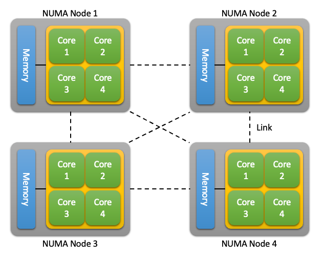

# 2장. **메모리 관리**

  * [2-1 메모리 단편화와 성능에 미치는 영향](#2-1-메모리-단편화와-성능에-미치는-영향) 
  * [2-2 NUMA 아키텍처와 메모리 관리에 미치는 영향](#2-2-numa-아키텍처와-메모리-관리에-미치는-영향) 
  * [2-3 Memory Leak 탐지 및 디버깅 기술](#2-3-memory-leak-탐지-및-디버깅-기법)

메모리 관리는 컴퓨터 시스템에서 메모리 리소스를 관리하는 프로세스이다.  
간단히 말해, 메모리를 여러 프로세스에 할당하고 각 프로세스가 필요한 메모리에 액세스할 수 있도록 해당 메모리를 관리하는 것이다.

최신 컴퓨터 시스템에서는 여러 프로세스가 동시에 실행되는 경우가 많으며, 모든 프로세스가 메모리에 액세스해야 하기 때문에 메모리 관리가 필수적이다.  
효과적인 메모리 관리가 이루어지지 않으면 이러한 프로세스가 서로 간섭하여 시스템 충돌이나 기타 오류가 발생할 수 있다.

* 메모리 관리는 작동 원리  
  메모리 관리는 사용 가능한 메모리를 `page`라고 하는 작은 블록으로 나누는 방식으로 작동한다.  
  그런 다음 이러한 페이지는 필요에 따라 다른 프로세스에 할당된다.  
  운영 체제는 각 프로세스에서 현재 사용 중인 페이지와 할당 가능한 페이지에 대한 기록을 유지한다.

  프로세스가 특정 메모리에 액세스해야 하는 경우 운영 체제에 요청을 보낸다.  
  운영 체제는 레코드를 확인하여 해당 메모리가 현재 다른 프로세스에 할당되어 있는지 확인한다.  
  메모리가 할당된 경우 운영 체제는 해당 메모리가 확보될 때까지 기다리거나 요청하는 프로세스에 다른 메모리를 할당한다.

  메모리 관리에는 프로세스가 시스템에서 물리적으로 사용할 수 있는 메모리보다 더 많은 메모리에 액세스할 수 있도록 하는 기술인 가상 메모리 관리도 포함된다.  
  이는 물리적 메모리와 하드 디스크 간에 메모리 페이지를 스왑하여 이루어진다.

* 메모리 관리가 필수적인 이유  
  1. 리소스 할당  
    메모리 관리는 각 프로세스가 필요한 메모리에 액세스할 수 있도록 한다.  
    효과적인 메모리 관리가 없으면 프로세스가 서로 간섭하여 시스템 충돌이나 기타 오류가 발생할 수 있다.
  2. 효율성  
    메모리 관리는 특정 요구 사항을 충족하는 방식으로 메모리 리소스가 할당되도록 하여 시스템 효율성을 향상시킬 수 있다.  
    이를 통해 지연을 줄이고 시스템 성능을 개선할 수 있다.
  3. 보안  
    메모리 관리는 프로세스가 액세스해서는 안 되는 메모리에 액세스하지 못하도록 하여 시스템 보안을 개선할 수 있다.  
    이를 통해 보안 침해를 방지하고 중요한 데이터를 보호할 수 있다.
  4. 안정성  
    효과적인 메모리 관리는 시스템 충돌을 일으킬 수 있는 Memory Leak나 기타 오류를 방지하여 시스템 안정성을 보장할 수 있다.

## 2-1 메모리 단편화와 성능에 미치는 영향
  메모리 단편화는 시스템 성능에 중대한 영향을 미칠 수 있는 Linux 커널의 일반적인 문제이다.  
  메모리 단편화의 정의, 메모리 단편화가 발생하는 이유, 시스템 성능에 미치는 영향에 대해 알아보자.

  1. 메모리 단편화란?  
      메모리 단편화는 시스템에 메모리 공간 전체에 흩어져 있는 작은 메모리 블록이 많을 때 발생한다.  
      더 큰 메모리 블록이 요청되면 사용 가능한 연속된 메모리 블록이 없기 때문에 시스템에서 이를 제공할 수 없다.  
      이로 인해 작은 블록 사이에 사용되지 않는 메모리 공간이 발생하는데, 이를 메모리 단편화라고 한다.

      메모리 단편화는 다음과 같은 다양한 원인으로 인해 발생할 수 있다.
      
      1. 동적 메모리 할당  
        프로세스가 동적으로 메모리를 요청하면 메모리 공간 전체에 작은 메모리 블록이 흩어질 수 있다.
      2. 메모리 할당 및 할당 해제  
        메모리를 자주 할당하고 할당 해제하는 경우에도 메모리 단편화가 발생할 수 있으며, 그 결과 작은 메모리 블록이 메모리 공간 전체에 흩어져 남게 된다.
      3. Memory Leak  
        Memory Leak는 사용하지 않는 작은 메모리 블록을 메모리 공간 전체에 흩어지게 하여 메모리 단편화를 유발할 수도 있다.

  2. 시스템 성능에 미치는 영향  
      메모리 단편화는 시스템 성능에 다음과 같은 중대한 영향을 미칠 수 있다.

      1. 메모리 효율성 감소  
        메모리 단편화는 작은 메모리 블록 사이에 사용되지 않는 공간을 남겨두어 메모리 사용의 효율성을 떨어뜨린다.
      2. 메모리 가용성 감소  
        메모리 단편화로 인해 더 큰 메모리 블록을 사용하지 못할 수 있으므로 메모리 단편화는 사용 가능한 메모리 양을 줄일 수 있다.
      3. 메모리 할당 시간 증가  
        메모리 단편화는 시스템이 인접한 메모리 블록을 검색해야 하므로 메모리 할당에 필요한 시간을 증가시킬 수 있다.
      4. 메모리 액세스 시간 증가  
        메모리 단편화는 시스템이 필요한 데이터에 액세스하기 위해 흩어져 있는 메모리 블록을 검색해야 할 수 있으므로 메모리 액세스에 필요한 시간도 증가시킬 수 있다.
      5. swap 사용량 증가  
        메모리 단편화는 인접한 메모리 블록을 확보하기 위해 시스템에서 메모리를 교체해야 할 수 있으므로 swap 사용량을 증가시킬 수 있다.
  
  3. 메모리 단편화 방지  
      메모리 단편화를 방지하는 방법에는 다음과 같은 여러 가지가 있다.

      1. 메모리 풀 사용  
        메모리 풀을 사용하면 메모리를 고정 크기 블록으로 할당하여 메모리 블록이 작고 흩어질 가능성을 줄일 수 있다.
      2. 메모리 사전 할당  
        메모리를 사전 할당하면 메모리를 동적으로 할당하는 대신 큰 메모리 블록을 한 번에 할당하여 메모리 단편화를 줄일 수 있다.
      3. 가비지 컬렉션 사용  
        가비지 컬렉션을 사용하면 사용하지 않는 메모리 블록을 확보하여 메모리 공간의 단편화 양을 줄일 수 있다.

## 2-2 NUMA 아키텍처와 메모리 관리에 미치는 영향
  NUMA(Non-Uniform Memory Access)는 최신 컴퓨터 시스템에서 일반적으로 사용되는 메모리 아키텍처이다.  
  각 프로세서가 물리적으로 더 가까운 시스템 메모리의 일부에 액세스할 수 있도록 하여 메모리 액세스 성능을 개선하도록 설계되었다. 

  

  1. NUMA 아키텍처란?  
    기존의 대칭형 멀티프로세싱(SMP) 시스템에서는 모든 프로세서가 전체 시스템 메모리에 동등하게 액세스할 수 있다.  
    즉, 프로세서가 특정 메모리 위치에 액세스해야 할 때 직접 빠르게 액세스할 수 있다.  
    반면에 NUMA 아키텍처는 시스템 메모리를 여러 노드로 나누고 각 노드는 특정 프로세서와 연결된다.  
    각 프로세서는 연결된 노드 내의 메모리에 직접 액세스할 수 있지만 다른 노드의 메모리에 간접 액세스할 수 있다.  
    즉, 프로세서가 연결된 노드에 없는 메모리에 액세스해야 하는 경우 다른 프로세서와 통신하여 데이터를 검색해야 한다.

  2. NUMA 아키텍처 작동 방식  
    NUMA 시스템에서 시스템 메모리는 물리적으로 여러 노드로 나뉘며, 각 노드는 특정 프로세서에 연결된다.  
    각 프로세서에는 다른 노드의 메모리보다 물리적으로 더 가까운 자체 로컬 메모리가 있다.  
    프로세서는 특정 메모리 위치에 액세스해야 할 때 먼저 데이터가 로컬 메모리에 있는지 확인한다.  
    그렇지 않은 경우 프로세서는 필요한 메모리가 포함된 노드와 연결된 프로세서로 요청을 보낸다.
    요청이 수신되면 메모리가 포함된 노드와 연결된 프로세서가 데이터를 검색하여 요청하는 프로세서로 다시 보낸다.  
    이 프로세스를 원격 메모리 액세스라고 하며 로컬 메모리 액세스에 비해 지연 시간이 늘어날 수 있다.

  3. 메모리 관리에 대한 시사점  
    NUMA 아키텍처는 Linux 커널의 메모리 관리에 다음과 같은 몇 가지 영향을 미친다.

      1. Memory Allocation  
        NUMA 시스템에서 메모리 할당은 요청하는 프로세서의 위치와 할당된 메모리의 위치를 고려해야 한다.  
        원격 노드에 메모리를 할당하면 지연 시간이 증가하고 성능이 저하될 수 있다.
      2. Memory Affinity  
        메모리 선호도는 요청하는 프로세서와 연결된 노드에 메모리가 할당되도록 하기 위해 NUMA 시스템에서 사용되는 기술이다.  
        이는 원격 메모리 액세스를 줄여 성능을 향상시킬 수 있다.
      3. Load Balancing  
        NUMA 시스템의 로드 밸런싱은 프로세서 및 관련 메모리 노드의 위치를 고려해야 한다.  
        노드 간 부하를 분산하면 원격 메모리 액세스를 줄여 성능을 향상시킬 수 있다.
      4. Page Migration  
        페이지 마이그레이션은 성능을 개선하기 위해 노드 간에 메모리 페이지를 이동하기 위해 NUMA 시스템에서 사용되는 기술이다.  
        이를 통해 노드 간 메모리 사용량의 균형을 맞추고 원격 메모리 액세스를 줄일 수 있다.

## 2-3 Memory Leak 탐지 및 디버깅 기법  
  Memory Leak는 메모리가 할당되었지만 제대로 해제되지 않아 시간이 지남에 따라 사용 가능한 메모리가 점진적으로 고갈될 때 발생한다.  
  이로 인해 시스템 성능이 저하되고 심지어 충돌이 발생할 수도 있다.

  1. Memory Leak란?
      Memory Leak는 메모리가 할당되었지만 제대로 해제되지 않았을 때 발생하는 리소스 누수의 한 유형이다.  
      이는 프로그램이 시스템에서 메모리를 요청하고 더 이상 필요하지 않을 때 시스템에 다시 해제하지 않을 때 발생할 수 있다.  
      시간이 지남에 따라 프로그램은 점점 더 많은 메모리를 사용하여 사용 가능한 메모리가 점진적으로 고갈된다.  
      이로 인해 시스템 성능이 저하되고 심지어 충돌이 발생할 수도 있다.

      Memory Leak는 프로그래밍 오류, 메모리 할당 기능의 잘못된 사용, 부적절한 메모리 관리 등 여러 가지 요인으로 인해 발생할 수 있다.  
      Linux 커널에서는 커널 모듈, 장치 드라이버 및 기타 시스템 구성 요소에서 Memory Leak가 발생할 수 있다.

  2. Memory Leak 탐지 기법  
      1. 정적 분석  
        정적 분석 도구는 컴파일 시 Memory Leak를 감지하는 데 사용할 수 있다.  
        정적 분석 도구는 소스 코드를 분석하여 잠재적인 Memory Leak 및 기타 프로그래밍 오류를 식별한다.  
        Linux 커널에서 사용되는 일반적인 정적 분석 도구로는 "Sparse"와 "Coverity"가 있다.
      2. 동적 분석  
        동적 분석 도구는 런타임에 Memory Leak를 감지하는 데 사용할 수 있다.  
        동적 분석 도구는 런타임에 메모리의 할당 및 할당 해제를 추적하고 제대로 해제되지 않은 메모리를 식별한다.  
        Linux 커널에서 사용되는 일반적인 동적 분석 도구로는 "Valgrind"와 "Kmemleak"이 있다.
      3. 프로파일링  
        프로파일링 도구는 시간 경과에 따른 프로그램의 메모리 사용량을 분석하여 Memory Leak를 식별하는 데 사용할 수 있다.  
        프로파일링 도구는 프로그램의 메모리 사용량을 추적하고 제대로 해제되지 않은 메모리를 식별한다.  
        Linux 커널에서 사용되는 일반적인 프로파일링 도구로는 "OProfile"과 "SystemTap"이 있다.

  3. Memory Leak 디버깅 기법  
      1. Code inspection(코드 검사)  
        Code inspection이란 소스 코드를 분석하여 Memory Leak를 유발할 수 있는 잠재적인 프로그래밍 오류를 식별하는 기법이다.  
        여기에는 잘못된 메모리 할당 및 할당 해제, 포인터의 부적절한 사용 및 기타 메모리 관련 문제 확인이 포함될 수 있다.
      2. 메모리 추적  
        메모리 추적 도구를 사용하여 런타임에 메모리의 할당 및 할당 해제를 추적할 수 있다.  
        메모리 추적 도구를 사용하면 Memory Leak의 원인을 파악하고 실시간으로 메모리의 할당 및 할당 해제를 추적할 수 있다.
      3. 디버깅 도구  
        gdb와 같은 디버깅 도구를 사용하여 Memory Leak의 원인을 파악하고 프로그램 실행을 추적할 수 있다.  
        디버깅 도구는 Memory Leak의 원인을 파악하고 프로그램 실행 중 메모리 할당 및 할당 취소를 추적하는 데 도움이 될 수 있다.
