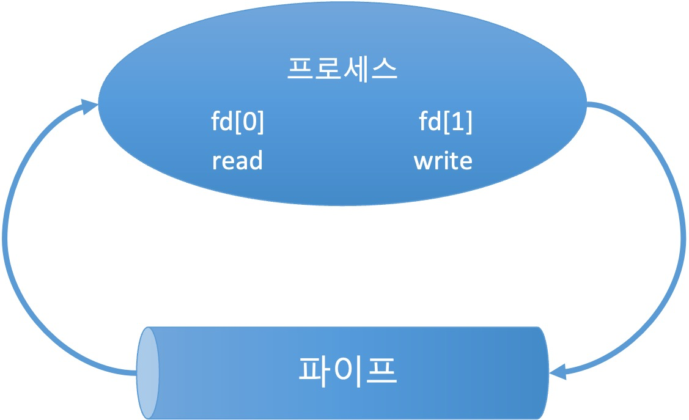
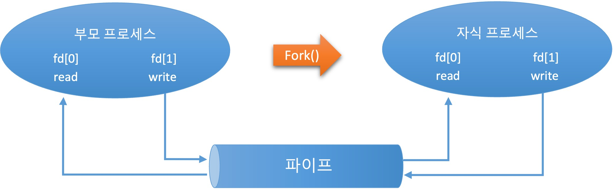
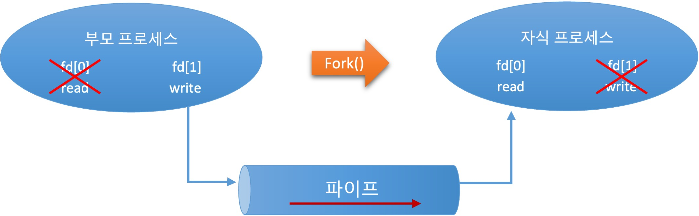

 ## 10장. **파이프**

  * [10-1 이름 없는 파이프](#10-1-이름-없는-파이프)
  * [10-2 이름 있는 파이프](#10-2-이름-있는-파이프)

파이프는 두 프로세스 사이에서 한 방향으로 통신할 수 있도록 지원하는 것이다.  
셸에서 | 기호가 파이프를 의미한다.

### 10-1 이름 없는 파이프  
파이프는 두 프로세스 간에 통신을 할 수 있도록 인터페이스를 제공한다.  
수식어가 없는(이름 없는) 파이프는 부모-자식 프로세스 간에 통신을 할 수 있게 한다.  

1. 간단한 파이프 생성  
파이프를 만드는 가장 간단한 방법은 popen() 함수를 사용하는 것이다.  
사용을 마친 파이프는 pclose() 함수를 사용해 닫는다.  
    * 파이프 만들기  
    popen() 함수는 내부적으로 fork() 함수를 실행해 자식 프로세스를 만들고 command에서 지정한 면령을 exec() 함수로 실행해 자식 프로세스가 수행하도록 한다.  
      ``` c
      #include <stdio.h>

      FILE *popen(const char *command, const char *type);
      ```
      command : 셸 명령  
      type : "r" 또는 "w"  
      return value : 성공하면 파일 포인터, 실패하면 NULL

    * 파이프 닫기  
    pclone() 함수는 파일 입출력 함수처럼 지정한 파이프를 닫는다.  
    관련된 waitpid() 함수를 수행하며 자식 프로세스들이 종료하기를 기다렸다가 리턴한다.  
      ``` c
      #include <stdio.h>

      int pclose(FILE *stream);
      ```
      stream : 파일 스트림 포인터  
      return value : 성공하면 종료 상태, 실패하면 -1

2. 복잡한 파이프 생성  
  popen() 함수를 사용해 파이프를 생성하는 일은 간단하지만, 셸을 실행해야 하므로 비효율적이고 주고 받을수 있는 데이터도 제한적이다.  
  pipe() 함수를 사용하면 과정은 복잡하지만 파이프를 효율적으로 생성할 수 있다.  

    * 파이프 만들기  
      ``` c
      #include <unistd.h>

      int pipe(int pipdfd[2]);
      ```
      pipdfd[2] : 파이프로 사용할 파일 기술자(2개)  
      (pipdfd[0]은 읽기 전용, pipdfd[1]은 쓰기 전용)  
      return value : 성공하면 0, 실패하면 -1

    * 파이프 함수가 통신하는 과정  
      1. 파일 기술자 얻기  
        * pipe() 함를 호출해 파이프에 사용할 파일 기술자를 얻는다.  
        * 파이프도 일종의 파일이므로 파일 기술자 fd가 필요하다.  
          

      2. 자식 프로세스 생성  
        * fork() 함수를 수행해 자식 프로세스를 생성한다.  
        * 이때 pipe() 함수에서 생성한 파일 기술자도 자식 프로세스로 복사된다.  
          

      3. 통신 방향 결정  
        *  파이프는 단방향 통신이므로 통신 방향을 결정한다.  
        * 부모, 자식 프로세스에서 각각 사용하지 않을 fd를 닫음으로써 통신 방향이 결정된다.  
          

### 10-2 이름 있는 파이프  
이름 없는 파이프는 부모-자식 프로세스 간에만 통신 할 수 있다는 단점이 있다.  
부모-자식 프로세스는 이름을 붙이지 않아도 서로의 존재를 알고 있기 때문에 파이프에 별도의 이름을 붙여 구분 할 필요가 없다.  
하지만 각각의 독립적인 프로세스는 서로의 존재를 알수 없기 때문에 파이프명이 있어야 파이프를 사용할 수 있다.  
이런 기능을 제공하는 파이프를 이름 있는 파이프라고 하며, 이름있는 파이프는 특수 파일의 한 종류로 FIFO라고도 한다.  

  1. 명령으로 FIFO 파일 생성하기  
    명령으로 FIFO 파일을 생성 하려면 `mknod` 나 `mkfifo` 명령을 사용한다.  
      
      * FIFO 특수 파일 생성(mknod)  
        `mknod` 명령은 FIFO 파일 뿐만 아니라 특수 파일도 생성하는 명령이다.  
        `mknod` 명령으로 FIFO 파일을 생성할 때는 아래와 같은 형식을 사용한다.  
        p 옵션은 FIFO 파일을 생성하라는 의미이다.  
        ```
        mknod 파일명 p
        ```
    
      * FIFO 파일 생성(mkinfo)  
        `mkinfo` 명령은 FIFO 파일만 생성하는 명령이다. 
        `mkinfo` 명령으로 FIFO 파일을 생성할 때는 아래와 같은 형식을 사용한다.  
        -m 옵션은 새로 생성 되는 FIFO 파일의 접근 권한을 지정한다. 이 옵션을 생략하면 unmask값에 따라 기본 권한을 설정한다.  
        ```
        mkfifo [-m mode] ... NAME ...
        ```

  2. 함수로 FIFO 파일 생성하기  
    함수로 FIFO 파일을 생성 하려면 mknod() 나 mkfifo() 함수를 사용한다.  

      * FIFO 특수 파일 생성(mknod())  
      pathname에 지정한 파일이 있거나 심벌릭 링크일 경우 함수는 실패하고 오류를 리턴한다.  
        ```
        #include <sys/types.h>
        #include <sys/stat.h>
        #include <fcntl.h>
        #include <ubistd.h>

        int mknod(const char *pathname, mode_t mode, dev_t dev);
        ```
        pathname : 특수 파일을 생성할 경로  
        mode : 특수 파일의 종류와 접근 권한 설정  
        dev : 블록/문자 장치 설정값  
        return value : 성공하면 0, 실패하면 -1

        * [특수 파일 종류 flag](#참고-특수-파일-종류-flag)

      * FIFO 파일 생성(mkinfo())  
      pathname에 지정한 경로에 접근 권한을 지정해 FIFO 파일을 생성한다.  
        ```
        #include <sys/types.h>
        #include <sys/stat.h>

        int mkinfo(const char *pathname, mode_t mode);
        ```
        pathname : FIFO 파일을 생성할 경로  
        mode : 접근 권한 설정  
        return value : 성공하면 0, 실패하면 -1

  3. FIFO로 데이터 주고 받기  
  명령이나 함수로 FIFO 파일을 생성하면 저수준 파일 입출력 함수로 이 파일을 읽거나 쓸 수 있다.  
  open() 함수로 FIFO 파일을 열때는 O_NONBLOCK 옵션의 영향을 받는다.  
  O_NONBLOCK 옵션을 설정하지 않으면 다른 프로세스가 읽기 위해 열 때까지 쓰기 위한 open() 함수는 블로킹된다.  
  반대로 O_NONBLOCK 옵션이 설정되어 있으면 open함수는 즉시 리턴된다.  
  FIFO에서 데이터를 읽으려는 프로세스가 없는데 쓰기 위해 open함수를 호출하면 오류가 발생한다.  
  </br>
  FIFO도 파이프와 마찬가지로 단방향 통신이다.  
  따라서 FIFO파일을 읽거나 쓰기 위해 열 경우 반드시 읽기 전용(O_RDONLY)이나 쓰기 전용(O_WRONLY)으로만 열어야 한다.  
  FIFO 파일은 양쪽이 같이 열려야 읽거나 쓸 수 있다.  
  한 프로세스가 FIFO 파일을 읽기위해 열면 다른 프로세스는 같은 FIFO 파일을 쓰기위해 열 때까지 기다린다.

#### (참고) 특수 파일 종류 flag  

|flag|설명|
|:--:|--|
|S_FIFO|FIFO 특수 파일|
|S_IFCHR|문자 장치 특수 파일|
|S_IFBLK|블록 장치 특수 파일|
|S_IFREG|일반 파일|
|S_IFSOCK|유닉스 도메인 소켓 파일|