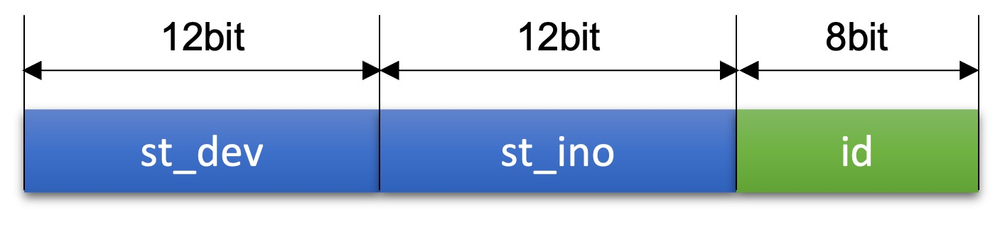

 ## 11장. **시스템 V의 프로세스 간 통신**

  * [11-1 시스템 V IPC의 공통 요소](#11-1-시스템-v-ipc의-공통-요소)
  * [11-2 메시지 큐](#11-2-메시지-큐)
  * [11-3 공유 메모리](#11-3-공유-메모리)
  * [11-4 세마포어](#11-4-세마포어)  

  유닉스는 크게 BSD 계열과 System V 계열로 구분할 수 있다.  
  System V 계열 유닉스에서 개발해 제공하는 프로세스간 통신 방법은 메시지 큐, 공유 메모리, 세마포어가 있다.  
  흔히 이 세가지를 묶어 System V IPC라고 한다.  
  System V IPC를 사용하려면 IPC 객체를 생성해야한다.

### 11-1 시스템 V IPC의 공통 요소  
  System V IPC에서 공통적으로 사용하는 기본 요소는 키와 식별자이다.  
  또한 System V IPC에서는 현재 사용 중인 각 통신 방법의 상태를 확인하고 불필요한 것은 정리할 수 있는 관리 명령을 제공한다.

  1. 키와 식별자(ID)  
    System V IPC에서 사용하는 키는 key_t형으로 sys/types.h 파일에 선언되어 있다.  
    IPC를 사용하기 위해 새로운 IPC 자원을 생성할 때 키를 지정하는데, 키가 다르면 서로 다른 자원이 생성된다.  
    각 IPC 방법의 자원 생성 함수에서 키를 받아 새로운 IPC 자원을 생성하고 이를 식별하는 식별자를 return한다.  
    return 받은 식별자를 이용해 통신할 수 있다.  

      * 키의 생성  
        같은 키로 생성된 식별자는 통신에 사용항수 있다. 
        따라서 미이 정해진 키를 서버와 클라이언트 프로세스가 공유할 수 있게 헤더 파일이나 환경설정 파일에 저장해 공유해야 한다.
        단, 이 키는 제3의 프로세스가 먼저 사용하고 있으면 안된다.  
        System V IPC에서는 사용하는 키는 아래와 같이 생성할 수 있다.  
        
        * 키로 IPC_PRIVATE 지정  
          식별자를 알아야 통신할 수 있으므로 IPC_PRIVATE를 키로 지정해 생성된 식별자를 서버와 클라이언트 모두 알 수 있게 해야한다.  
          fork() 함수로 생성된 부모-자식 프로세스 간 통신에서 사용할 수 있다.  
        
        * ftok() 함수로 키 생성  
          ftok() 함수는 경로명과 숫자값을 받아서 키를 생성한다.  
          따라서 서버와 클라이언트가 같은 경로명과 숫자값을 지정하면 공통된 식별자를 생성할 수 있다.

          * fork() 함수  
            fork() 함수는 pathname에 지정한 경로명과 proj_id에 지정한 정숫값을 조합해 새로운 키를 생성한다.  
            ``` c
            #include <sys/types.h>
            #include <sys/ipc.h>

            key_t ftok(const char *pathname, int proj_id);
            ```
            pathname : 파일 시스템에 이미 존재하는 임의의 파일명(권한 필요)  
            proj_id : 키값을 생성할 때 저장하는 임의의 번호(1~255)  
            return value : 성공하면 키값, 실패하면 -1  

            키를 구성하는 32bit 중 처음 12bit에는 stat 구조체의 st_dev값, 다음 12bit에는 st_ino값이 저장되고, 마지막 8bit에는 ftok() 함수의 두번째 인자인 proj_id의 값이 저장된다.  
              

  2. IPC 공통 구조체  
    System V IPC를 사용하기 위해 해당 IPc의 자원을 생성하면 IPC 공통 구조체가 정의된다.  
    System V IPC에서 공통으로 사용하는 IPC 공통 구조체는 sys/ipc.h 파일에 정의되어 있으며, 리눅스에서는 이전 시스템과의 호환성을 위해 이 구조체를 유지하고 있다.  
    *주의!  
    IPC 구조체는 사용이 끝나면 반드시 프로그램 안에서 삭제해야 한다.  
    IPC 구조체를 삭제하지 않으면 계속 남아 있게 된다.  
    그런데 시스템에서 제공 가능한 IPC 구조체의 총 개수가 한정되어 있으므로, 사용하지 않는 IPC 구조체가 계속 남아 있으면 시스템 자원을 낭비하게 되고, IPC를 사용해야하는 프로세스가 사용하지 못하게 될수도 있다.*
      ``` c
      struct ipc_perm {
        key_t _key;
        uid_t uid;
        gid_t gid;
        uid_t cuid;
        gid_t cgid;
        unsigned short mode;
        unsigned short _seq;
      };
      ```
      _key : 키 값  
      uid : 구조체의 소유자 ID  
      gid : 구조체의 소유 그룹 ID  
      cuid : 구조체를 생성한 소유자 ID  
      cgid : 구조체를 생성한 그룹 ID  
      mode : 구조체에 대한 접근 권한  
      _seq : 일련번호

  3. System V IPC 정보 검색  
    System V IPC의 정보를 검색하고 현재 상태를 확인하는 명령은 `ipcs`다.  
    `ipcs` 명령을 사용하는 동안에도 IPC의 상태가 변경될 수 있다.  
    `ipcs` 명령은 검색하는 순간의 정확성만 보장한다.  

      * ipcs 명령의 기본 형식  
        ```
        ipcs [-ihVmqsaclptu]
        ```
      1. 기본 옵션
        
        |옵션|설명|
        |:--:|--|
        |-i id|특정 id에 대한 정보 출력</br> -m, -q, -s 중 하나와 결합해 사용한다.|
        |-h|도움말 출력|
        |-v|버전 정보 출력|
        
      2. 지원 옵션

        |옵션|설명|
        |:--:|--|
        |-m|공유 메모리 정보 검색|
        |-q|메시지 큐 정보 검색|
        |-s|세마포어 정보 검색|
        |-a|공유 메모리, 메시지 큐, 세마포어 정보를 전부 검색(default)|
        
      3. 출력 옵션
        출력 옵션은 하나만 지정
        
        |옵션|설명|
        |:--:|--|
        |-c|IPC 자원을 생성한 사용자와 소유자 정보 출력|
        |-l|사용할수 있는 공유 메모리, 메시지 큐, 세마포어읜 제한값 출력|
        |-p|자원의 생성자와 마지막 운영자의 PID 출력|
        |-t|시간 정보 출력|
        |-u|요약 정보 출력|

      4. 표현 형식  
        -l 옵션에서만 적용

        |옵션|설명|
        |:--:|--|
        |-b|크기 정보를 byte 단위로 출력|
        |--human|크기 정보를 사용자가 읽기 편한 형식으로 출력|

  4. System V IPC 자원의 생성과 삭제  
    System V IPC 자원을 명령으로 `ipcmk` 명령을 사용하고, 불필요한 IPC 자원을 삭제할 때는 `ipcrm` 명령을 사용한다.  

      * ipcmk 명령    
        ```
        ipcmk [options]
        ```
        |옵션|설명|
        |:--:|--|
        |-M size|size에 지정한 byte 크기로 공유 메모리 생성</br>KB, MB, GB 단위 사용|
        |-Q|메시지 큐를 생성|
        |-s number|number에 지정한 개수의 요소를 갖는 세마포어 생성|
        |-p mode|자원의 접근 권한 지정(default: 0644)|
        
      * ipcrm 명령  
        ```
        ipcrm [options]
        ```
        |옵션|설명|
        |:--:|--|
        |-a|모든 자원 제거|
        |-M shmkey|shmkey로 생성한 공유 메모리의 마지막 연결이 헤제된 뒤 공유 메모리 제거|
        |-m shmid|shmid로 지정한 공유 메모리 삭제</br>공유 메모리에 대한 마지막 헤제 동작 이후 관련된 메모리 세그먼트가 제거됨|
        |-Q msgkey|msgkey로 생성한 메시지 큐 제거|
        |-q msgid|msgid로 지정한 메시지 큐 삭제|
        |-S semkey|semkey로 생성한 세마포어 삭제|
        |-s semid|semid로 지정한 세마포어 삭제|

### 11-2 메시지 큐  
  메시지 큐는 파이프와 유사하다.  
  하지만 **파이프는 스트림 기반** 으로 동작하고, **메시지 큐는 메시지(or 패킷)** 단위로 동작한다.  
  각 메시지의 최대 크기는 제한되어 있으며, 수신 프로세스는 메시지 유형을 선택해 메시지를 받는다.

### 11-3 공유 메모리  

### 11-4 세마포어  

##### (참고)