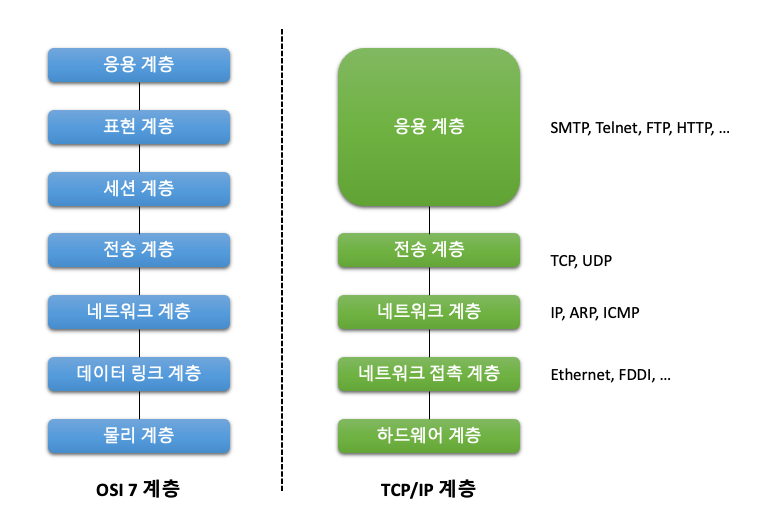

 ## 12장. **소켓 프로그래밍 기초**

  * [12-1 IP 주소와 포트 번호](#12-1-ip-주소와-포트-번호)
  * [12-2 소켓 프로그래밍](#12-2-소켓-프로그래밍)
  * [12-3 소켓 인터페이스 함수](#12-3-소켓-인터페이스-함수)

  TCP/IP 프로토콜은 계층 구조로 구성되어 있다.  
  네트워크 계층 구조의 기준이라고 할 수 있는 ISO <sup>(International Organization for Standardization)</sup>의 OSI<sup>(Open System Interconnection)</sup> 7 계층과 달리 TCP/IP는 5개 계층으로 이루어져있다.  
  이 중 하드웨어 계층과 네트워크 접속 계층을 묶어서 4개 계층으로 구분하기도 한다.  

   

  * 1계층 - 하드웨어 계층 <sup>(Hardware Layer)</sup>  
    물리적인 네트워크와의 연결을 담당(10 Base T, 802.11)
  * 2계층 - 네트워크 접속 계층 <sup>(Network Access Layer)</sup>  
    하드웨어 계층에서 수신되는 신호들을 해석하는 방법을 정의(Ethernet, Wi-Fi, FDDI 등)
  * 3계층 - 네트워크 계층<sup>(Network Layer)</sup>  
    인터넷 계층이라고도 하며 패킷이 전달되는 경로를 담당 (IP, ARP, RARP)  
  * 4계층 전송 계층<sup>(Transport Layer)</sup>  
    패킷의 전송을 담당(TCP, UDP)
  * 5계층 응용 계층<sup>(Application Layer)</sup>  
    사용자에게 서비스를 제공하기 위한 계층(FTP, HTTP, SSH 등)  

  * TCP, UDP 차이점  
    |TCP|UDP|
    |:--:|:--:|
    |연결지향형|비연결형|
    |신뢰성 보장|신뢰성을 보장하지 않음|
    |흐름 제어 기능 제공|흐름 제어 기능 없음|
    |순서 보장|순서를 보장하지 않음|

### 12-1 IP 주소와 포트 번호  

  1. IP 주소와 호스트명  
    IP 주소는 인터넷을 이용할 때 사용하는 주소로 "." 으로 구분된 32비트 숫자로 표시한다.  
    시스템은 주소를 숫자로 구분하는 것이 효율적이지만, 사람은 이름으로 구분하는 것이 편하다.  
    그래서 시스템에는 IP 주소 외에 호스트명을 지정하여 이름으로 구분한다.  
    호스트명은 '호스트명 + 도메인명' 으로 구성된다.  
    우리가 흔히 쓰는 인터넷 주소에서 'www'는 호스트명 그 외의 부분이 도메인명이다.  
    도메인명은 도메인을 관리하는 기관에 등록하고 사용해야한다.  
    호스트명은 같은 도메인 안에서 중복되기 쉽지않게 시스템 관리자가 정해서 사용한다.  
    호스트명과 도메인명을 관리하는 시스템을 **DNS** 라고 한다.

  2. 호스트명과 IP 주소 변환  
    호스트명과 IP 주소를 등록해놓은 파일이나 데이터베이스를 검색하면 호스트명이나 IP 주소를 찾을 수 있다.  
    관련된 파일은 `/etc/hosts` 이며, 데이터베이스로는 제공하는 서비스에 따라 DNS일수도 있고, NIS일 수도 있다.  
    `/etc/nsswitch.conf` 파일에 어떤 데이터베이스를 어떤 순서로 활용하는지 지정하고 있다.  

      * 호스트명과 IP 주소 읽어오기  
        ```
        #include <netdb.h>

        struct hostent *gethostent(void);
        void sethostent(int stayopen);
        void endhostent(void);
        ```
        stayopen : IP 주소 데이터베이스를 열어둘 것인지 여부를 나타내는 값  
        return value : IP 주소에 대한 hostent 구조체 주소  

        * [hostent 구조체](#참고-hostent-구조체)  

      * 호스트명으로 정보 검색  
        ```
        #include <netdb.h>

        struct hostent *gethostbyname(const char *name);
        ```
        name : 검색하려는 호스트명  
        return value : IP 주소에 대한 hostent 구조체 주소  

      * IP 주소로 정보 검색  
        type에는 AF_UNIX, AF_INET을 주로 사용한다.  
        ```
        #include <netdb.h>
        #include <sys/socket.h>

        struct hostent *gethostbyaddr(const char *addr, socklen_t len, int type);
        ```
        addr : 검색하여는 IP 주소  
        len : addr 길이  
        type : IP 주소 형식  

        * [type 속성](#참고-type-속성)  

  3. 포트 번호  
    IP 주소는 데이터가 전송될 목적지 호스트를 알려주는 역할을 한다.  
    그런데 호스트에서 여러 가지 기능을 수행하는 서비스 프로세스들이 동시에 동작하고 있을 수 있다.  
    이때 사용하는 것이 포트 번호이다.  
    포트 번호는 2바이트 정수로 되어 있으므로  0 ~ 65535 까지 사용할 수 있다.  
    0 ~ 1023 까지는 인터넷에서 자주 사용하는 서비스가 사용하고 있고(알려진 포트 <sup>well-known port</sup>), 일반 프로그램에서는 1024 ~ 65535를 사용한다.  
    또한, 이미 정해지 포트 번호는 `/etc/services` 파일에 등록되어 있다.  
    알려진 포트 번호는 다음과 같다.  

      

### 12-2 소켓 프로그래밍  


### 12-3 소켓 인터페이스 함수  


#### (참고) hostent 구조체
``` c
struct hostent {
	char *h_name;
	char **h_aliases;
	int h_addrtype;
	int h_length;
	char **h_addr_list;
};
```
h_name : 호스트명  
h_aliases : 호스트를 가리키는 다른 이름  
h_addrtype : 호스트 주소의 형식  
h_length : 주소의 길이  
h_addr_list : 해당 호스트의 주소 목록  

#### (참고) type 속성
|속성|설명|
|:--:|--|
|AF_UNIX|호스트 내부 통신|
|AF_LOCAL|AF_UNIX와 동일|
|AF_INET|IPv4 인터넷 프로토콜|
|AF_AX25|아마추어 라디오 AX.25 프로토콜|
|AF_IPX|노벨 프로토콜(IPX)|
|AF_APPLETALK|애플토크 프로토콜|
|AF_X25|IUT-T X.25 / ISO-8208 프로토콜|
|AF_INET6|IPv6 인터넷 프로토콜|
|AF_KEY|보안 키 관리 프로토콜(IPsec)|
|AF_NETLINK|커널 사용자 인터페이스 장치|
|AF_PACKET|저수준 패킷 인터페이스|
|AF_RDS|신뢰할 수 있는 데이터그램 소켓(RDS) 프로토콜|
|AF_PPPOX|일반적인 PPP 전송 계층(L2TP, PPPoE)|
|AF_LLC|논리적 링크 제어 프로토콜(IEEE 802.2, LLC)|
|AF_IB|인피니밴드 주소|
|AF_MPLS|멀티프로토콜 레이블 스위칭|
|AF_CAN|컨트롤러 영역 네트워크 자동 버스 프로토콜|
|AF_TIPC|클러스터 도메인 소켓 프로토콜|
|AF_BLUETOOTH|블루투스 저수준 소켓 프로토콜|
|AF_ALG|커널 암호 API 인터페이스|
|AF_VSOCK|VMeare VSockets 프로토콜|
|AF_KCM|커널 연결 멀티플렉서 인터페이스|
|AF_XDP|XDP(express data path) 인터페이스|
