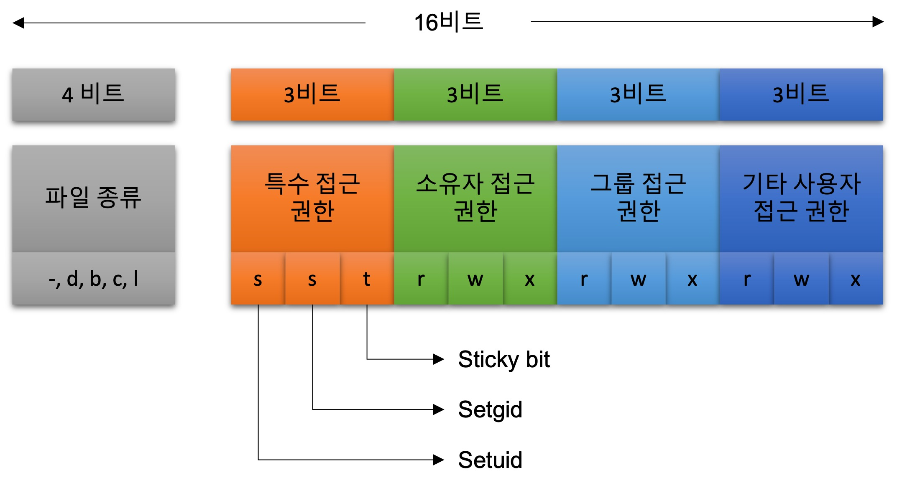

# 3장. **파일**
  * [3-1 파일 정보 검색](#3-1-파일-정보-검색)
  * [3-2 파일 접근 권한 제어](#3-2-파일-접근-권한-제어)
  * [3-3 파일 접근 권한 변경](#3-3-파일-접근-권한-변경)
  * [3-4 링크 파일](#3-4-링크-파일)

## 3-1 파일 정보 검색
*- 파일에 대한 읽기 권한 필요*  

1. 파일명을 파일 정보 검색  
``` c
#include <sys/types.h>
#include <sys/stat.h>
#include <unistd.h>

int stat(const char *pathname, struct stat *statbuf);
```
pathname : 정보를 알고자하는 파일명  
statbuf : 검색한 파일 정보를 저장할 구조체의 주소  
return value : 성공하면 0, 실패하면 -1  
  * [stat 구조체](#참고-stat-구조체)

2. 파일 기술자로 파일 정보 검색  
``` c
#include <sys/types.h>
#include <sys/stat.h>
#include <unistd.h>

int fstat(int fd, struct stat *statbuf);
```
fd : 열려있는 파일의 파일 기술자  
statbuf : 검색한 파일 정보를 저장할 구조체의 주소  
return value : 성공하면 0, 실패하면 -1  

## 3-2 파일 접근 권한 제어
stat 구조체의 st_mode에는 파일의 종류와 권한 정보가 있다.
stat 구조체는 16비트이며 아래와 같은 구조로 되어있다.

<p align="center"></p>

1. 파일의 종류 검색  
파일의 종류를 검색할때는 상수와 매크로를 사용할 수 있다.  
- 상수를 이용한 파일의 종류 검색
S_IFMT와 st_mode의 값과 AMD연산을 통해 파일의 종류를 알 수 있다.

|상수명|상숫값(8진수)|기능|
|:--:|:--:|--|
|S_IFMT|0170000|파일의 종류 비트를 가져오기 위한 비트 마스크|
|S_IFSOCK|0140000|소켓 파일|
|S_IFLNK|0120000|심벌릭 링크 파일|
|S_IFREG|0100000|일반 파일|
|S_IFBLK|0060000|블록 장치 특수 파일|
|S_IFDIR|0040000|디렉터리|
|S_IFCHR|0020000|문자 장치 특수 파일|
|S_IFIFO|0010000|FIFO 파일|

- 매크로를 이용한 파일의 종류 검색  
각 매크로는 인자로 받은 mode의 값을 0xF000과 AND 연산하여 참인지의 여부를 확인한다.

|매크로명|매크로 정의|기능|
|:--:|:--:|--|
|S_ISLNK(m)|(((m) & S_IFMT) == S_IFLNK)|참이면 심벌릭 링크 파일|
|S_ISREG(m)|(((m) & S_IFREG) == S_IFLNK)|참이면 일반 파일|
|S_ISDIR(m)|(((m) & S_IFDIR) == S_IFLNK)|참이면 디렉터리|
|S_ISCHR(m)|(((m) & S_IFCHR) == S_IFLNK)|참이면 문자 장치 특수 파일|
|S_ISBLK(m)|(((m) & S_IFBLK) == S_IFLNK)|참이면 블록 장치 특수 파일|
|S_ISFIFO(m)|(((m) & S_IFIFO) == S_IFLNK)|참이면 FIFO 파일|
|S_ISSOCK(m)|(((m) & S_IFSOCK) == S_IFLNK)|참이면 소켓 파일|


2. 파일의 접근 권한 검색  
파일의 접근 권한 검색도 st_mode의 값으로 알 수 있으며, 상수와 access() 함수를 사용할 수 있다.  
- 상수를 이용한 파일의 잡근 권한 검색

|상수명|상숫값(8진수)|기능|
|:--:|:--:|--|
|S_ISUID|0x800|st_mode 값과 AND 연산으로 setuid 설정 확인|
|S_ISGID|0x400|st_mode 값과 AND 연산으로 setuid 설정 확인|
|S_ISVTX|0x200|st_mode 값과 AND 연산으로 sticy 비트 설정 확인|
|S_IREAD|00400|st_mode 값과 AND 연산으로 소유자의 읽기 권한 확인|
|S_IWRITE|00200|st_mode 값과 AND 연산으로 소유자의 쓰기 권한 확인|
|S_IEXEC|00100|st_mode 값과 AND 연산으로 소유자의 실행 권한 확인|

*소유자 이외의 권한을 확인 하려면 st_mode값을 왼쪽으로 3비트 이동시키거나, 상숫값을 오른쪽으로 3비트 이동시키면 된다.  
(기타 사용자는 6비트)  
ex) st_mode & (S_IREAD >> 3)*

* 함수를 이용한 접근 권한 검색  
``` c
#include <unistd.h>

int access(cost char *pathname, int mode);
```
pathname : 접근 권한을 알고자하는 파일명  
mode : 접근 권한  
return value : 접근 권한이 있으면 0, 오류가 있으면 -1  

두번쩨 인자인 mode 는 OR 연산자(|)로 연결해 사용 가능  

mode 상수 
R_OK : 읽기 권한 확인  
W_OK : 쓰기 권한 확인  
X_OK : 실행 권한 확인  
F_OK : 파일이 존재하는지 권한 확인  

*오류메세지  
ENOENT : 파일이 없거나 심볼릭 링크의 경우 원본 파일이 없어서 발생
EACCESS : 접근 권한이 없어서 발생*

## 3-3 파일 접근 권한 변경
파일의 접근 권한을 변경하는 명령어는 `chmod`이다.  
또한, chmod()와 fchmod()함수를 통해 접근 권한을 변경할 수 있다.
*파일의 접근 권한 상수를 사용한다.*
``` c
#include <sys/stat.h>

int chmod(cost char *pathname, mode_t mode);
```
pathname : 접근 권한을 변경하려는 파일명  
mode : 접근 권한  
return value : 접근 권한이 있으면 0, 오류가 있으면 -1  

``` c
#include <sys/stat.h>

int fchmod(int fd, mode_t mode);
```
fd : 열려있는 파일의 기술자  
mode : 접근 권한  
return value : 접근 권한이 있으면 0, 오류가 있으면 -1  
*파일의 접근 권한 상수를 사용한다.*

## 3-4 링크 파일
링크는 이미 있는 파일이나 디렉터리에 접근할수 있는 새로운 이름을 말한다.
링크의 종류는 하드 링크와 심벌릭 링크가 있다.

1. 하드 링크  
파일의 접근할수 있는 새로운 파일명을 생성하는 것으로, 기존 파일과 동일한 inode를 사용한다.
하드 링크를 사용하면 inode에 저장된 링크의 개수가 증가한다.

2. 심벌릭 링크  
기존 파일에 접근할 수 있는 또다른 파일을 생성한다.
기존 파일과 다른 inode를 생성하며, 기존 파일의 경로를 저장한다.

``` c
#include <unistd.h>

int link(const char *oldpath, const char *newpath);
```
하드 링크 생성  
oldpath : 기존 파일의 경로  
newpath : 새로 생성할 하드 링크의 경로  
return value : 성공하면 0, 실패하면 -1

``` c
#include <unistd.h>

int symlink(const char *target, const char *linkpath);
```
심벌릭 링크 생성  
target : 기존 파일의 경로  
linkpath : 새로 생성할 심벌릭 링크의 경로  
return value : 성공하면 0, 실패하면 -1  

``` c
#include <sys/types.h>
#include <sys/stat.h>
#include <unistd.h>

int lstat(const char *pathname, const stat *statbuf);
```
심벌릭 링크 정보 검색  
pathname : 심벌릭 링크의 경로  
statbuf : 파일 정보를 저장할 포인터  
return value : 성공하면 0, 실패하면 -1  

``` c
#include <unistd.h>

ssize_t readlink(const char *pathname, char *buf, size_t bufsiz);
```
심벌릭 링크 내용 읽기  
pathname : 심벌릭 링크의 경로  
buf : 읽어올 내용을 저장할 버퍼  
buf size : 버퍼의 크기  
return value : 성공하면 읽어온 데이터의 크기(바이트), 실패하면 -1  

``` c
#include <limits.h>
#include <stdlib.h>

char *realpath(const char *path, char *resolved_path);
```
심벌릭 링크 원본 파일 경로 읽기  
path : 심벌릭 링크의 경로명  
resolved_path : 경로를 저장할 버퍼 주소  
return value : 성공하면 실제 경로명이 저장된 주소, 실패하면 NULL

``` c
#include <unistd.h>

int unlink(const char *pathname);
```
링크 끊기  
pathname : 삭제할 링크의 경로  
return value : 성공하면 0, 실패하면 -1


#### (참고) stat 구조체  
``` c
struct stat {
  dev_t				st_dev;
  ino_t				st_ino;
  mode_t			st_mode;
  nlink_t			st_nlink;
  uid_t				st_uid;
  gid_t				st_gid;
  dev_t				st_rdev;
  off_t				st_size;
  blksize_t			st_blksize;
  blkcnt_t			st_blocks;
  struct timespec	st_atim;
  struct timespec	st_mtim;
  struct timespec	st_ctim;

  #define st_atime st_atim.tv_sec
  #define st_mtime st_mtim.tv_sec
  #define st_ctime st_ctim.tv_sec
};
```

st_dev : 파일이 저장되어 있는 장치의 번호  
st_ino : 파일의 inode 번호  
st_mode : 파일의 종류와 접근 권한  
st_nlink : 하드 링크의 개수  
st_uid : 파일 소유자의 UID  
st_gid : 파일 소유 그룹의 GID
st_rdev : 장치 파일일 경우 주장치의 번호와 부장치의 번호(장치 파일이 아니면 의미 없음)  
st_size :  
st_blksize : 파일 내용 입출력시 사용되는 버퍼의 크기  
st_blocks : 파일에 할당된 파일 시스템의 블록 수(블록의 크기느 512byte)  
st_atim : 마지막으로 파일을 읽거나 실행한 시간  
st_mtim : 마지막으로 파일의 내용을 변경한 시간  
st_ctim : 마지막으로 inode 내용을 변경한 시간  
*(inode 내용은 소유자/그룹, 파일 크기 링크개수 등이 변경될 때 바뀜)*  

*리눅스 커널 2.6 이전 버전과의 호환성을 위해 #define으로 타임스탬프 값을 매핑해서 정의함*  