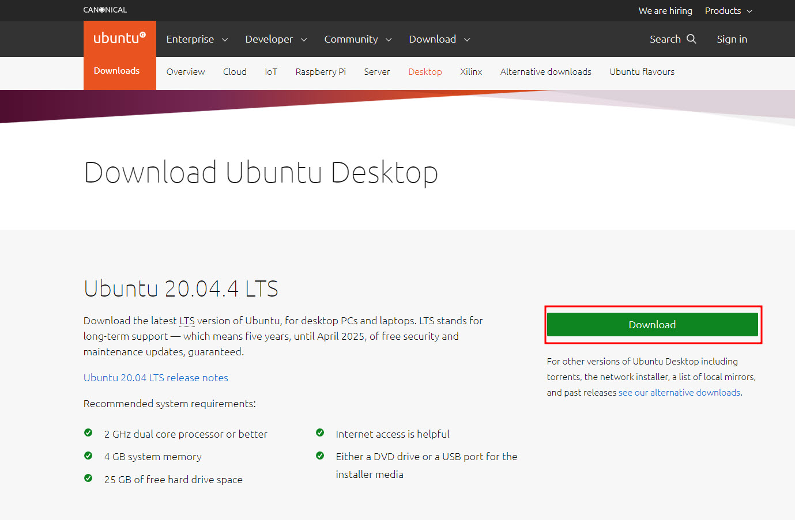
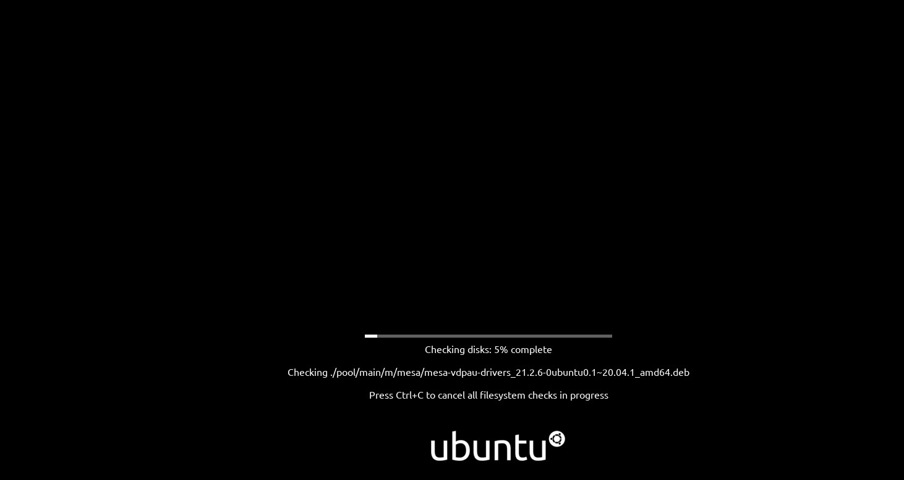
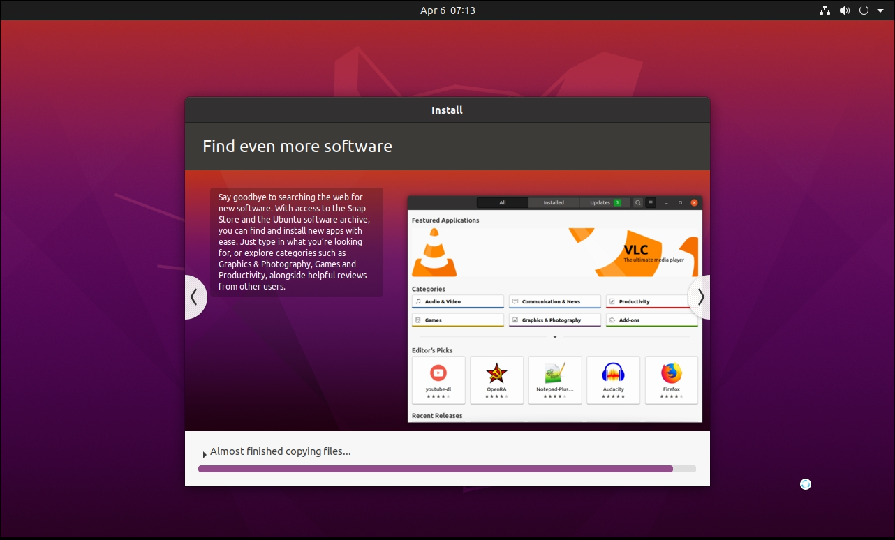
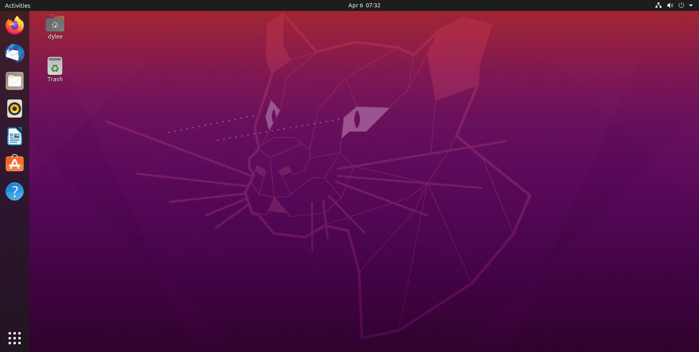
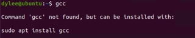
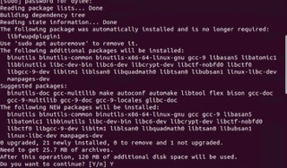
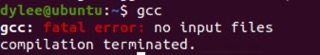

 ## 0장. **리눅스 설치**

  * [0-1 우분투 다운로드](#0-1-우분투-다운로드)
  * [0-2 우분투 설치](#0-2-우분투-설치)
  * [0-3 gcc 설치](#0-3-gcc-설치)

## 0-1 우분투 다운로드
[우분투 사이트](https://ubuntu.com/download/desktop)

우분투 사이트에 접속해서 아래 버튼을 클릭해 이미지를 다운로드 받는다.

## 0-2 우분투 설치
Virtual Machine이나 본인의 PC에 우분투 이미지를 사용하여 Install한다.  
아래와 같은 화면이 뜨며 Install이 진행된다.

이후 간단한 설정을 마치면 아래와 같이 우분투가 시작된다.

## 0-3 gcc 설치
우분투를 설치하면 보통 gcc가 설치되어있다.  
teminal을 실행해서 *gcc* 명령어를 실행시켜 gcc가 설치되어 있는지 확인한다.  
설치되지 않았다면 다음과 같은 오류 메세지를 발생한다.  
  
오류 메세지에서 안내하는 명령어를 실행해보자.  
*sudo apt install gcc*  
중간에 계속 할거냐는 메세지가 나오는데 Y를 입력하고 넘어간다.  
  
설치가 완료 되면 *gcc* 명령어를 실행해 확인한다.  
  
설치가 완료 되었다.