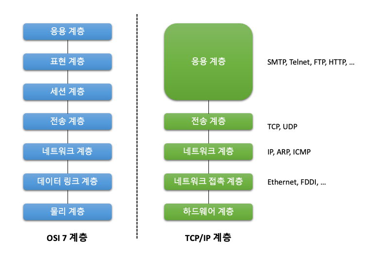
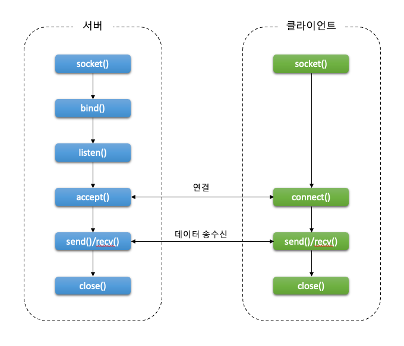

 ## 12장. **소켓 프로그래밍 기초**

  * [12-1 IP 주소와 포트 번호](#12-1-ip-주소와-포트-번호)
  * [12-2 소켓 프로그래밍](#12-2-소켓-프로그래밍)
  * [12-3 소켓 인터페이스 함수](#12-3-소켓-인터페이스-함수)

  TCP/IP 프로토콜은 계층 구조로 구성되어 있다.  
  네트워크 계층 구조의 기준이라고 할 수 있는 ISO <sup>(International Organization for Standardization)</sup>의 OSI<sup>(Open System Interconnection)</sup> 7 계층과 달리 TCP/IP는 5개 계층으로 이루어져있다.  
  이 중 하드웨어 계층과 네트워크 접속 계층을 묶어서 4개 계층으로 구분하기도 한다.  

   

  * 1계층 - 하드웨어 계층 <sup>(Hardware Layer)</sup>  
    물리적인 네트워크와의 연결을 담당(10 Base T, 802.11)
  * 2계층 - 네트워크 접속 계층 <sup>(Network Access Layer)</sup>  
    하드웨어 계층에서 수신되는 신호들을 해석하는 방법을 정의(Ethernet, Wi-Fi, FDDI 등)
  * 3계층 - 네트워크 계층<sup>(Network Layer)</sup>  
    인터넷 계층이라고도 하며 패킷이 전달되는 경로를 담당 (IP, ARP, RARP)  
  * 4계층 전송 계층<sup>(Transport Layer)</sup>  
    패킷의 전송을 담당(TCP, UDP)
  * 5계층 응용 계층<sup>(Application Layer)</sup>  
    사용자에게 서비스를 제공하기 위한 계층(FTP, HTTP, SSH 등)  

  * TCP, UDP 차이점  
    |TCP|UDP|
    |:--:|:--:|
    |연결지향형|비연결형|
    |신뢰성 보장|신뢰성을 보장하지 않음|
    |흐름 제어 기능 제공|흐름 제어 기능 없음|
    |순서 보장|순서를 보장하지 않음|

### 12-1 IP 주소와 포트 번호  

  1. IP 주소와 호스트명  
    IP 주소는 인터넷을 이용할 때 사용하는 주소로 "." 으로 구분된 32비트 숫자로 표시한다.  
    시스템은 주소를 숫자로 구분하는 것이 효율적이지만, 사람은 이름으로 구분하는 것이 편하다.  
    그래서 시스템에는 IP 주소 외에 호스트명을 지정하여 이름으로 구분한다.  
    호스트명은 '호스트명 + 도메인명' 으로 구성된다.  
    우리가 흔히 쓰는 인터넷 주소에서 'www'는 호스트명 그 외의 부분이 도메인명이다.  
    도메인명은 도메인을 관리하는 기관에 등록하고 사용해야한다.  
    호스트명은 같은 도메인 안에서 중복되기 쉽지않게 시스템 관리자가 정해서 사용한다.  
    호스트명과 도메인명을 관리하는 시스템을 **DNS** 라고 한다.

  2. 호스트명과 IP 주소 변환  
    호스트명과 IP 주소를 등록해놓은 파일이나 데이터베이스를 검색하면 호스트명이나 IP 주소를 찾을 수 있다.  
    관련된 파일은 `/etc/hosts` 이며, 데이터베이스로는 제공하는 서비스에 따라 DNS일수도 있고, NIS일 수도 있다.  
    `/etc/nsswitch.conf` 파일에 어떤 데이터베이스를 어떤 순서로 활용하는지 지정하고 있다.  

      * 호스트명과 IP 주소 읽어오기  
        ```
        #include <netdb.h>

        struct hostent *gethostent(void);
        void sethostent(int stayopen);
        void endhostent(void);
        ```
        stayopen : IP 주소 데이터베이스를 열어둘 것인지 여부를 나타내는 값  
        return value : IP 주소에 대한 hostent 구조체 주소  

        * [hostent 구조체](#참고-hostent-구조체)  

      * 호스트명으로 정보 검색  
        ```
        #include <netdb.h>

        struct hostent *gethostbyname(const char *name);
        ```
        name : 검색하려는 호스트명  
        return value : IP 주소에 대한 hostent 구조체 주소  

      * IP 주소로 정보 검색  
        type에는 AF_UNIX, AF_INET을 주로 사용한다.  
        ```
        #include <netdb.h>
        #include <sys/socket.h>

        struct hostent *gethostbyaddr(const char *addr, socklen_t len, int type);
        ```
        addr : 검색하여는 IP 주소  
        len : addr 길이  
        type : IP 주소 형식  

        * [type 속성](#참고-type-속성)  

  3. 포트 번호  
    IP 주소는 데이터가 전송될 목적지 호스트를 알려주는 역할을 한다.  
    그런데 호스트에서 여러 가지 기능을 수행하는 서비스 프로세스들이 동시에 동작하고 있을 수 있다.  
    이때 사용하는 것이 포트 번호이다.  
    포트 번호는 2바이트 정수로 되어 있으므로  0 ~ 65535 까지 사용할 수 있다.  
    0 ~ 1023 까지는 인터넷에서 자주 사용하는 서비스가 사용하고 있고(알려진 포트 <sup>well-known port</sup>), 일반 프로그램에서는 1024 ~ 65535를 사용한다.  
    또한, 이미 정해지 포트 번호는 `/etc/services` 파일에 등록되어 있다.  
    알려진 포트 번호는 다음과 같다.  
      * [Well-known Port](#참고-well-known-port)  

      * 포트 정보 읽어오기  
        getservent() 함수는 포트 정보를 읽어서 servent 구조체에 저장하고 그 주소를 return 한다.  
        setservent() 힘수는 getservent() 함수를 처음 사용하기 전에 호출해야 하며, 데이터베이스의 현재 읽기 위치를 시작부분으로 재설정하는 함수이다.  
        endservent() 함수는 데이터베이스를 닫는 함수이다.  
        ``` c
        #include <netdb.h>

        struct servent *getservent(void);
        void setservent(int stayopen);
        void endservent(void);
        ```
        stayopen : 포트 정보 데이터베이스를 열어둘 것인지 여부를 나타내는 값(0이면 데이터베이스를 닫음)  
        return value : 포트 정보 구조체의 주소  
          * [servent 구조체](#참고-servent-구조체)  

      * 서비스명으로 정보 검색  
        getservbyname() 함수는 포트명을 인자로 받아 데이터베이스에서 해당 항목을 검색하는 함수이다.

        ``` c
        #include <netdb.h>

        struct servent *getservbyname(const char *name, const char *proto);
        ```
        name : 검색할 포트명  
        proto : "tcp" or "udp" or NULL  
        return value : 포트명에 해당하는 항목의 정보의 구조체 주소  


      * 포트 번호로 정보 검색  
        getservbyport() 함수는 포트 번호를 인자로 받아 데이터베이스에서 해당 항목을 검색하는 함수이다.

        ``` c
        #include <netdb.h>

        struct servent *getservbyport(int port, const char *proto);
        ```
        port : 검색할 포트 번호  
        proto : "tcp" or "udp" or NULL  
        return value : 포트 번호에 해당하는 항목의 정보의 구조체 주소  

### 12-2 소켓 프로그래밍  
  소켓은 응용 계층과 전송 계층을 연결하는 기능을 제공하는 프로그래밍 인터페이스이다.  
  소켓을 이용해 TCP/IP 환경에서 프로그래밍을 할 경우 TCP나 UDP의 세부 내용에 대한 지식이 없어도 통신 프로그램을 작성할 수 있다.  

  1. 소켓의 종류  
    소켓은 크게 두 가지로 구분된다.  
    같은 호스트에서 프로세스 사이에 통신할 때 사용하는 유닉스 도메인 소켓과 네트워크를 통해 다른 호스트와 통신할 때 사용하는 인터넷 소켓이 있다,  
    이 소켓들을 표시하는 이름으로는 다음과 같은 주소 패밀리명을 사용한다.
      * AF_UNIX : 유닉스 도메인 소켓  
      * AF_INET : 인터넷 소켓  
  
  2. 소켓의 통신 방식  
    TCP/IP 프로토콜의 전송 계층에서 사용하는 프로토콜에는 TCP와 UDP가 있다.  
    소켓을 이용할떄도 하부 프로토콜로 TCP와 UDP중 어떤 것을 사용할 것인지 지정해야 한다.
      * SOCK_STREAM : TCP 사용  
      * SOCK_DGRAM : UDP 사용  
  3. 소켓 주소 구조체  
    소켓을 이용한 프로그래밍에서는 소켓의 종류, IP 주소, 포트 번호 등을 지정하기 위한 구조체를 사용한다.  
    소켓 구조체는 UNIX 도메인 소켓과 인터넷 소켓을 다르게 사용한다.  

      * 유닉스 도메인 소켓의 주소 구조체  
        ``` c
        #include <sys/un.h>

        struct sockaddr_un {
          __kernel_sa_family_t  sun_family;
          char                  sun_path[UNIX_PATH_MAX];
        };
        ```
        sun_family : AF_UNIX 지정  
        sun_path : 경로명

      * 인터넷 소켓의 주소 구조체  
        ``` c
        #include <sys/un.h>

        struct sockaddr_in {
          __kernel_sa_family_t  sin_family;
          __be16	              sin_port;
          struct in_addr	      sin_addr;
        };

        struct in_addr {
	        __be32	s_addr;
        }
        ```
        sin_family : 주소 패밀리명  
        sin_port : 포트 번호  
        sin_addr : 인터넷 주소  
        s_addr : 32비트 IPv4 주소

  4. 바이트 순서 함수  
    컴퓨터에서 정수를 저장하는 방식은 빅 엔디언 <sup>Big endian</sup> 과 리틀 엔디언 <sup>Little endian</sup> 이 있다.  
    빅 엔디언은 바이트를 순서대로 저장하는 방식이고, 리틀 엔디언은 거꾸로 저장하는 방식이다.  
    인텔 계열 CPU는 리틀 엔디언 방식을, 썬 SPARC은 빅 엔디언 방식을 사용하고, ARM은 둘 중 하나를 선택할 수 있도록 한다.  
    이렇게 컴퓨터마다 바이트를 저장하는 순서가 다르기 떄문에 네트워크 통신에서는 바이트 순서가 중요한 문제가 된다.  
    따라서 TCP/IP에서는 데이터를 전송할 깨 무조건 빅엔디언을 사용하기로 되어있다.  
    이를 네트워크 바이트 순서(NBO<sup>Network Byte Order</sup>) 라고 한다.  
    반면, 호스트에서 사용하는 바이트 순서는 호스트 바이트 순서(HBO<sup>Host Byte Order</sup>) 라고 한다.  
    시스템에서 통신을 통해 데이터를 보낼 때는 HBO에서 NBO로 데이터 순서를 바꿔서 전송하고, 데이터를 받으면 NBO에서 HBO로 변환한 후에 처리해야한다.

      * 바이트 순서 변환 함수  
        ``` c
        #include <arpa/inet.h>

        uint32_t htonl(uint32_t hostlong);
        uint16_t htohs(uint16_t hostshort);
        uint32_t ntonl(uint32_t netlong);
        uint16_t ntohs(uint16_t netshort);
        ```
        hostlong, hostshort : 호스트 바이트 순서로 저장한 값  
        netlong, netshort : 네트워크 바이트 순서로 저장한 값  
        return value : 변환한 데이터  

        |함수|설명|
        |:--:|--|
        |htonl|HBO to NBO(32bit)|
        |htohs|HBO to NBO(16bit)|
        |ntonl|NBO to HBO(32bit)|
        |ntohs|NBO to HBO(16bit)|

  5. IP 주소 변환 함수  
    IP 주소는 192.168.0.1 과 같이 . 으로 구분되는 형태이다.  
    이 주소를 저장하는 방법은 두 가지이다.  
    시스템 내부적으로는 IP주소를 이진값으로 저장하고, 외부적으로 사용할 때는 문자열로 사용한다.  

      * 문자열 IP 주소를 숫자로 변환
      ``` c
      #include <sys/socket.h>
      #include <netinet/in.h>
      #include <arpa/inet.h>

      in_addr_t inet_addr(const char *cp);
      ```
      cp : 문자열 형태의 IP 주소  
      return value : IP 주소를 이진값으로 바꾼 값  

      * 구조체 IP 주소를 문자열로 변환    
      ``` c
      #include <sys/socket.h>
      #include <netinet/in.h>
      #include <arpa/inet.h>

      char *inet_ntoa(cosnt struct in_addr in);
      ```
      in : in_addr 구조체 형태의 IP 주소  
      return value : IP 주소 문자열  

### 12-3 소켓 인터페이스 함수  
  소켓도 특수 파일중 하나다.  
  따라서 소켓을 이용해 네트워크 프로그래밍을 할 때는 소켓을 생성해 IP 주소와 연결한 후 서버와 클라이언트가 연결 되면 소켓을 통해 읽고 쓰면 된다.  

  1. 소켓 인터페이스 함수의 종류  
    bind(), listen(), accept() 함수는 서버에서, connect() 함수는 클라이언트에서 사용한다.  
    나머지 socket(), recv(), send(), recvfrom(), sendto(), close() 함수는 서버와 클라이언트에서 모두 사용한다.  
      * [데이터 송수신 flag](#참고-데이터-송수신-flag)  


      * 소켓 파일 기술자 생성  
        ``` c
        #include <sys/socket.h>
        #include <sys/type.h>

        int socket(int domain, int type, int protocol);
        ```
        domain :  : 소켓 종류(유닉스 도메인 or 인터넷 소켓)  
        type : 통신 방식(TCP or UDP)  
        protocol : 소켓에 이용할 프로토콜  
        return value : 성공하면 소켓 기술자, 실패하면 -1  

      * 소켓 파일 기술자를 지정한 IP 주소/포트 번호와 결합  
        ``` c
        #include <sys/socket.h>
        #include <sys/type.h>

        int bind(int sockfd, const struct sockaddr *addr, socklen_t addrlen);
        ```
        sockfd : socket() 함수가 생성한 소켓 기술자  
        addr : 소켓의 이름을 표현하는 구조체  
        addrlen : addr의 크기  
        return value : 성공하면 0, 실패하면 -1  

      * 클라이언트의 연결 요청 대기  
        ``` c
        #include <sys/socket.h>
        #include <sys/type.h>

        int listen(int sockfd, int backlog);
        ```
        sockfd : socket() 함수가 생성한 소켓 기술자  
        backlog : 최대 허용 클라이언트 수  
        return value : 성공하면 0, 실패하면 -1  

      * 클라이언트가 서버에 접속 요청  
        ``` c
        #include <sys/socket.h>
        #include <sys/type.h>

        int connect(int sockfd, const struct sockaddr *addr, socklen_t addrlen);
        ```
        sockfd : socket() 함수가 생성한 소켓 기술자  
        addr : 접속하려는 서버의 IP 정보  
        addrlen : addr의 크기  
        return value : 성공하면 0, 실패하면 -1  

      * 클라이언트의 연결 요청 수락  
        ``` c
        #include <sys/socket.h>
        #include <sys/type.h>

        int accept(int sockfd, const struct sockaddr *addr, socklen_t *addrlen);
        ```
        sockfd : socket() 함수가 생성한 소켓 기술자  
        addr : 접속을 수락한 클라이언트의 IP 정보  
        addrlen : addr의 크기  
        return value : 성공하면 소켓 기술자, 실패하면 -1  

      * 데이터 송신(send)  
        ``` c
        #include <sys/socket.h>
        #include <sys/type.h>

        int send(int sockfd, const void *buf, size_t len, int flags);
        ```
        sockfd : socket() 함수가 생성한 소켓 기술자  
        buf : 전송할 메시지를 저장한 메모리 주소  
        len : 메시지의 크기  
        flags : 데이터를 주고받는 방법을 지정한 플래그  
        return value : 성공하면 전송한 바이트 수, 실패하면 -1  

      * 데이터 수신(recv)  
        ``` c
        #include <sys/socket.h>
        #include <sys/type.h>

        int recv(int sockfd, void *buf, size_t len, int flags);
        ```
        sockfd : socket() 함수가 생성한 소켓 기술자  
        buf : 전송받은 메시지를 저장한 메모리 주소  
        len : buf의 크기  
        flags : 데이터를 주고받는 방법을 지정한 플래그  
        return value : 성공하면 수신한 바이트 수, 실패하면 -1  

      * 데이터 송신(sendto)  
        UDP 에서 사용된다.
        ``` c
        #include <sys/socket.h>
        #include <sys/type.h>

        int sendto(int sockfd, const void *buf, size_t len, int flags, const struct sockaddr *dest_addr, socklen_t addrlen);
        ```
        sockfd : socket() 함수가 생성한 소켓 기술자  
        buf : 전송할 메시지를 저장한 메모리 주소  
        len : 메시지의 크기  
        flags : 데이터를 주고받는 방법을 지정한 플래그  
        dest_addr : 매시지를 받을 호스트의 주소  
        addrlen : dest_addr 의 크기  
        return value : 성공하면 전송한 바이트 수, 실패하면 -1  

      * 데이터 수신(recvfrom)  
        UDP 에서 사용된다.
        ``` c
        #include <sys/socket.h>
        #include <sys/type.h>

        int recvfrom(int sockfd, void *buf, size_t len, int flags, struct sockaddr *src_addr, socklen_t addrlen);
        ```
        sockfd : socket() 함수가 생성한 소켓 기술자  
        buf : 전송받은 메시지를 저장한 메모리 주소  
        len : 메시지의 크기  
        flags : 데이터를 주고받는 방법을 지정한 플래그  
        src_addr : 메시지를 보내는 호스트의 주소  
        addrlen : src_addr의 크기  
        return value : 성공하면 수신한 바이트 수, 실패하면 -1  

  2. 소켓 인터페이스 함수의 호출 순서  

       

### (참고) hostent 구조체
``` c
struct hostent {
	char *h_name;
	char **h_aliases;
	int h_addrtype;
	int h_length;
	char **h_addr_list;
};
```
h_name : 호스트명  
h_aliases : 호스트를 가리키는 다른 이름  
h_addrtype : 호스트 주소의 형식  
h_length : 주소의 길이  
h_addr_list : 해당 호스트의 주소 목록  

### (참고) type 속성
|속성|설명|
|:--:|--|
|AF_UNIX|호스트 내부 통신|
|AF_LOCAL|AF_UNIX와 동일|
|AF_INET|IPv4 인터넷 프로토콜|
|AF_AX25|아마추어 라디오 AX.25 프로토콜|
|AF_IPX|노벨 프로토콜(IPX)|
|AF_APPLETALK|애플토크 프로토콜|
|AF_X25|IUT-T X.25 / ISO-8208 프로토콜|
|AF_INET6|IPv6 인터넷 프로토콜|
|AF_KEY|보안 키 관리 프로토콜(IPsec)|
|AF_NETLINK|커널 사용자 인터페이스 장치|
|AF_PACKET|저수준 패킷 인터페이스|
|AF_RDS|신뢰할 수 있는 데이터그램 소켓(RDS) 프로토콜|
|AF_PPPOX|일반적인 PPP 전송 계층(L2TP, PPPoE)|
|AF_LLC|논리적 링크 제어 프로토콜(IEEE 802.2, LLC)|
|AF_IB|인피니밴드 주소|
|AF_MPLS|멀티프로토콜 레이블 스위칭|
|AF_CAN|컨트롤러 영역 네트워크 자동 버스 프로토콜|
|AF_TIPC|클러스터 도메인 소켓 프로토콜|
|AF_BLUETOOTH|블루투스 저수준 소켓 프로토콜|
|AF_ALG|커널 암호 API 인터페이스|
|AF_VSOCK|VMeare VSockets 프로토콜|
|AF_KCM|커널 연결 멀티플렉서 인터페이스|
|AF_XDP|XDP(express data path) 인터페이스|

### (참고) Well-known Port  
|포트|서비스|
|:--:|:--:|
|1|TCPMUX|
|7|ECHO|
|13|DAYTIME|
|20|FTP|
|21|FTP|
|22|SSH|
|23|TELNET|
|25|SMTP|
|53|DNS|
|69|TFTP|
|80|HTTP|
|110|POP3|
|123|NTP|
|179|BGP|
|443|https|

### (참고) servent 구조체
``` c
#include <netdb.h>

struct servent {
  char *s_name;
  char **s_aliases;
  int s_port;
  char *s_proto;
}
```
s_name : 포트명  
s_aliases : 해당 서비스를 가리키는 다른 이름들  
s_port : 포트 번호  
s_proto : 서비스에 사용하는 프로토콜의 종류  

### (참고) 데이터 송수신 flag  
|flag|설명|
|:--:|--|
|MSG_OOB|영역 밖의 데이터<sup>Out-of-band data</sup>로 처리<br>SOCK_STREAM에서만 사용<br>중요한 데이터가 아니라는 의미<br>메시지를 보내고 수신 확인을 받지 않아도 다른 메시지를 계속 전송|
|MSG_DONTROUTE|데이터의 라우팅 설정을 해제함<br>진단 프로그램이나 라우팅 프로그램에서 사용|
|MSG_DONTWAIT|NONE BLOCKING 통신이 가능|
|MSG_NOSIGNAL|상대방과 연결이 끊겼을 때, SIGPIPE 시그널을 받지 않음|