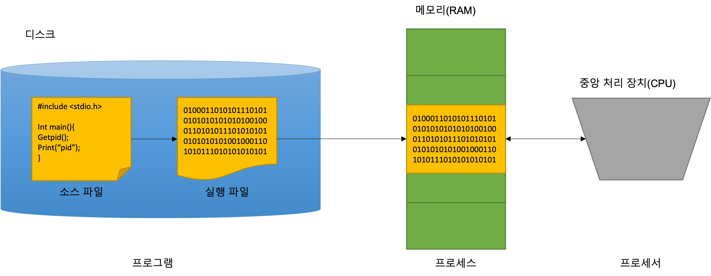
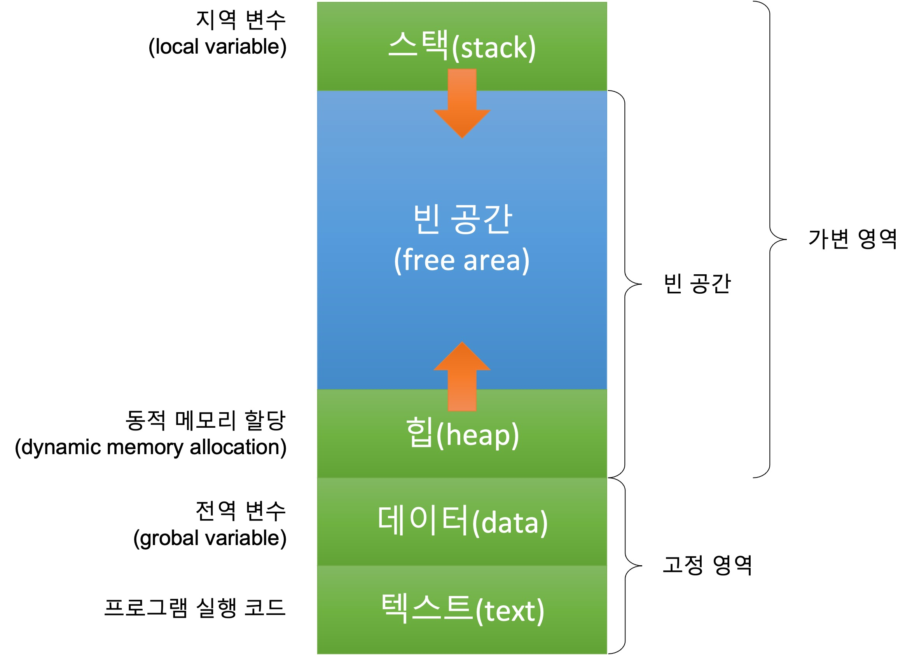
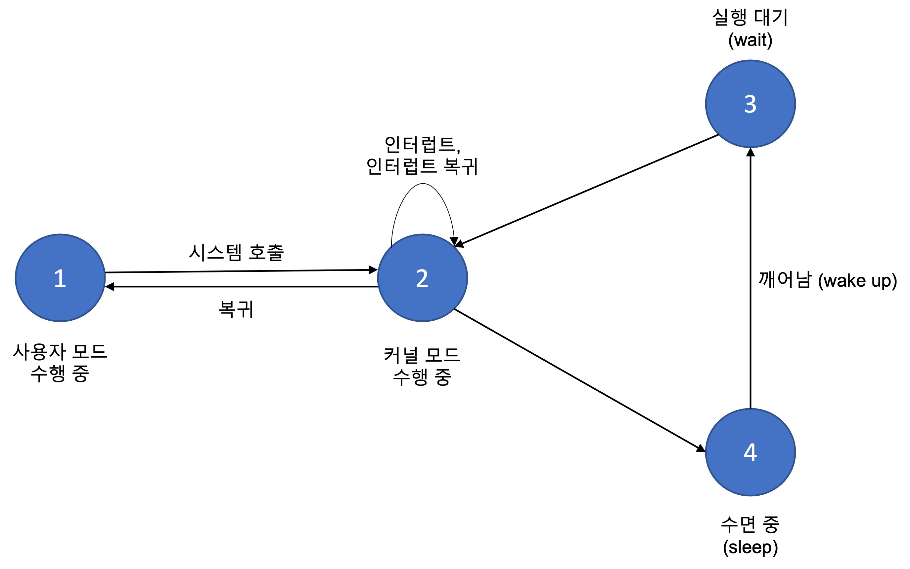

 ## 6장. **프로세스 정보**

  * [6-1 프로세스의 개념](#6-1-프로세스의-개념)
  * [6-2 프로세스 식별](#6-2-프로세스-식별)
  * [6-3 프로세스 실행 시간 측정](#6-3-프로세스-실행-시간-측정)
  * [6-4 환경 변수의 활용](#6-4-환경-변수의-활용)

### 6-1 프로세스의 개념
1. 프로세스의 정의  
프로세스는 실행 중인 프로그램을 의미한다. 즉, 프로세스는 프로세서가 처리 중인 프로그램  
*(프로세서 : CPU, 프로그램 : 유저가 컴퓨처에 작업을 시키기 위한 명령러의 집합)*  

  

2. 프로세스의 구조  
프로그램을 실행하면 프로세스가 생성된다.  
생성된 프로세스는 아래와 같이 메모리에 할당 된다.
  

|영역|설명|
|:--:|--|
|텍스트 영역|실행 코드를 저장하는 공간<br>프로세스 실행중에 크기가 변하지 않는 고정 영역에 속한다,|
|데이터 영역|프로그램에서 정의한 전역변수를 저장하는 공간<br>전역 변수는 프로그램을 실행할때 크기가 고정되므로 고정 영역에 할당 된다.|
|힙 영역|프로그램 실행중 동적으로 메모리를 요청하는 경우 할당되는 공간<br>빈영역&#8594;할당&#8594;할당 해제처럼 산태가 변하는 가변 영역.|
|스택 영역|프로그램에서 정의한 지역변수를 저장하는 메모리 영역<br>지역 변수를 정의한 부분에서 할당.|
|빈 공간|스택이나 힙과 같이 가변적인 메모리 할당을 위해 유지하고 있는 빈 메모리 영역이다.<br>프로세스에 할당된 빈 메모리 영역이 모두 소진되면 메모리 부족으로 프로그램 실행이 중단될수도 있다.|

3. 프로세스 상태 변화  
    1. 프로세스는 사용자 모드에서 먼저 실행된다.  
    2. 사용자 모드에서 시스템 호출을 하면 커널 모드로 전황되어 실행한다.  
    3. 수면 중이던 프로세스가 깨어나 실행 대기 상태가 되면 바로 실행할수 있도록 준비한다.  
    4. 커널 모드에서 실행중 입출력 완료를 기다릴때와 같이 더 이상 실행을 계속할 수 없을 때 수면 상태로 전환한다.
  

4. 프로세스 목록 보기  
현재 실행중인 프로세스 목록을 보기 위한 명령어는 **ps** 이다.  
아무 옵션 없이 ps 명령을 사용하면 현재 터미널에서 실행한 프로세스만 출력된다.  
시스템에서 동작하고 있는 전체 프로세스를 보려면 -ef 옵션을 사용한다.

5. 시스템 메모리 정보 보기  
ps 명령 외에도 프로세스를 검색하는 top 명령이 있다. 이 멸령을 현재 실행 중인 프로세스를 주기적으로 확인해 출력한다.  
top 명령은 메모리, 스왑, 현재 실행중인 프로세스 수 등의 정보를 보여준다.  
메모리와 스왑 등에 관한 정보를 직접 검색하려면 sysinfo() 함수를 사용한다.  

* 메모리와 스왑 상태 검색  
``` c
#include <sys/sysinfo.h>

int sysinfo(struct sysinfo *info);
```
info : 검색 결과를 리턴하는 sysinfo 구조체의 주소  
return value : 사람이 보기 편한 형태의 시간 형태  

* [sysinfo 구조체](#참고-sysinfo-구조체)  

### 6-2 프로세스 식별  

1. PID와 PPID  
* PID 란?  
PID는 0번부터 시작한다.  
0번 프로세스는 스케줄러로 프로세스에 CPU 시간을 할당하는 역할을 한다.  
0번 프로세스는 커널의 일부분으로 별도의 실행파일은 없다.  
1번 프로세스는 init이다.
프로세스는 중복되지 않는 번호로 할당한다.

* PPID 란?  
0번 프로세서(스케줄러)를 제외한 모든 프로세스는 자신을 생성한 프로세스가 있다.  
이를 부모 프로세스라고 하고, 부모 프로세스의 PID를 PPID라고 한다.  

* PID 검색  
``` c
#include <sys/types.h>
#include <unistd.h>

pid_t getpid(void);
```
return value : 호출한 프로세스의 PID  

* PPID 검색  
``` c
#include <sys/types.h>
#include <unistd.h>

pid_t getppid(void);
```
return value : 부모 프로세스의 PID  

2. 프로세스 그룹  
프로세스 그룹은 관련이 있는 프로세스들을 묶은 것으로, 프로세스 그룹 ID(PGID)를 부여 받는다.  
BSD 계열 유닉스에서 작업 제어를 구현하며 도입되었다.  
작업 제어 기능을 제공하는 C 셸이나 bash 셸은 명령을 파이프로 연결함으로써 프로세스 그룹으로 묶어 한 작업으로 처리할 수 있다.  

* 프로세스 그룹 리더  
프로세스 그룹을 구성하는 프로세스들 중 하나가 그룹 리더가 되고 프로세스 그룹 리더의 PID가 PGID가 된다.  
프로세스의 그룹 리더는 변경될 수 있으며, 리더 프로세스가 변경되면 PGID도 변경된다.  

* PGID 검색  
getpgrp() 는 함수를 호출하는 프로세스가 속한 그룹의 PGID를 return하고,  
getpgid() 는 pid로 지정한 프로세스가 속한 그룹의 PGID를 return한다.  
``` c
#include <sys/types.h>
#include <unistd.h>

pid_t getpgrp(void)
pid_t getpgid(pid_t pid)
```
pid : PGID를 구하려는 프로세스의 ID  
return value : PGID 값  

* PGID 변경  

setpgid() 함수는 가 가르키는 프로세스의 PGID응 pgid로 지정한 값을 지정한다.  
pid와 pgid가 같으면 pid에해당하는 프로세스가 그룹의 리더가 된다.  
pid가 0이라면 함수를 호출하는 현재 프로세스의 pid를 사용하고, pgid가 0이면 pid로 지정한 프로세스가 pgid가 된다.  
``` c
#include <sys/types.h>
#include <unistd.h>

int setpgid(pid_t pid, pid_t pgid)
```
pid : 프로세스 그룹의 속한 프로세스의 ID  
pgid : 새로 지정할 PGID  
return value : 성공하면 0, 실패하면 -1

3. 세션  

세션은 POSIX 표준에서 제안한 개념으이다.  
사용자가 로그인해 작업하고 있는 터미널 단위로 프로세스 그룹을 묶은 것이다.  
프로세스 그룹이 관련있는 프로세스를 그룹으로 묶은 개념이라면, 세션은 관련 있는 프로세스 그룹을 모은 개념이다.  

프로세스가 새로운 세션을 생성하면 해당 프로세스는 세션 리더가 되고 세션리더의 PID는 세션 ID가 된다.  

* 세션 검색  
``` c
#include <sys/types.h>
#include <unistd.h>

pid_t getsid(pid_t pid)
```
pid : 자신이 속한 세션의 ID를 구하려는 프로세스의 ID  
return value : 현재 세션의 ID  

* 세션 생성  
setsid() 함수를 사용하면 새로운 세션을 만들수 있다.  
setsid() 함수를 호출하는 프로세스가 프로세스 그룹 리더가 아니면 새로운 세션을 만들어 세션 리더가 된다.  
setsid() 함수를 호출한 프로세스가 새로운 세션과 프로세스 그룹의 유일한 프로세스가 된다.
``` c
#include <sys/types.h>
#include <unistd.h>

pid_t setsid(pid_t pid)
```
return value : 성공하면 새로운 세션의 ID, 실패하면 -1  

### 6-3 프로세스 실행 시간 측정
프로세스를 실행하면 CPU나 메모리같은 시스템 자원을 사용한다.  
시간 정보를 이용해 프로세스 실행 시간을 측정할수 있으며, 이를 이용해 많은 시간을 소비하는 부분을 찾아 개선하는데도 활용할 수 있다.  

프로세스 실행 시간 = 시스템 실행 시간 + 사용자 실행 시간  
*시스템 실행 시간 : 커널 코드를 수행한 시간(시스템 호출로 소비한 시간)*  
*사용자 실행 시간 : 사용자 모드에서 프로세스를 실행한 시간*

### 6-4 환경 변수의 활용


##### (참고) sysinfo 구조체  
``` c
struct sysinfo {
    long uptime;
    unsigned long loads[3];
    unsigned long totalram;
    unsigned long freeram;
    unsigned long sharedram;
    unsigned long bufferram;
    unsigned long totalswap;
    unsigned long freeswap;
    unsigned short procs;
    unsigned long totalhigh;
    unsigned long freehigh;
    unsigned int mem_unit;
    char _f[20-2*sizeof(long)-sizeof(int)];
};

```
uptime : 시스템 부팅 후 경과된 시간(초)  
loads : 시스템 부하 평균을 저장하는 배열(1분, 5분, 15분을 기준으로 저장)  
totalram : 사용가능한 총 메모리 크기  
freeram : 사용가능한 메모리 크기  
sharedram : 공유 메모리의 크기  
bufferram : 버퍼가 사용하는 메모리의 크기  
totalswap : 스왑 영역의 총 크기  
freeswap : 사용 가능한 스왑 영역의 크기  
procs : 현재 실행중인 프로세스 수  
totalhigh : 사용자에 할당된 메모리의 총 크기  
freehigh : 사용 가능한 사용자 메모리의 크기  
mem_unit : 메모리 크기를 바이트 단위로 저장  
_f : 64 바이트 크기를 맞추기 위한 패딩  