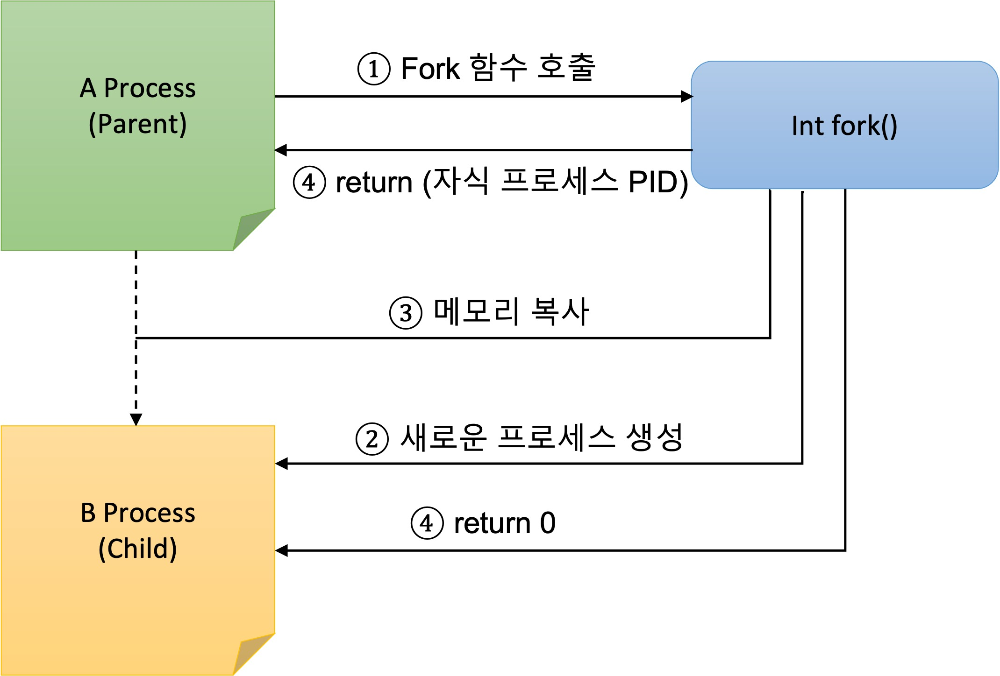

 ## 7장. **프로세스 생성과 실행**

  * [7-1 프로세스 생성](#7-1-프로세스-생성)
  * [7-2 프로세스 종료](#7-2-프로세스-종료)
  * [7-3 exec 함수군 활용](#7-3-exec-함수군-활용)
  * [7-4 프로세스 동기화](#7-4-프로세스-동기화)

### 7-1 프로세스 생성
프로세스는 프로그램 안에서 다른 프로그램을 실행해 생성하기도 한다.  

1. system() 함수로 프로그램 실행하기  
system() 함수를 이용해 간단하게 프로그램을 실행시킬수 있다.  
하지만, 명령을 실행하기위해 셸까지 동작시켜야 하기떄문에 비효울적이다.  
system() 함수는 기존 명령이나 실행 파일명을 인자로 받아 셸에 전달한다.  
셸은 내부적으로 새 프로세스를 생성해 인자로 받은 명령을 실행하고 종료될 떄 까지 기다렸다가 종료 상태를 return 한다.

```c
#include <stdlib.h>

int system(const char *command);
```
command : 실행할 명령이나 실행 파일명  
retue value : 실패하면 0, 성공하면 0이 아닌 값

2. 프로세스 생성  

* fork() 함수  
fork() 함수는 부모 프로세스를 거의 그대로 복제해 새로운 프로세스를 만든다.  
fork() 함수를 호출한 프로세스는 부모 프로세스가 되고, fork() 함수가 생성한  프로세스는 자식 프로세스가 된다.  
fork() 함수가 리턴하면 부모 프로세스와 자식 프로세스가 동시에 동작하며, 어느 프로세스가 먼저 동작할지는 알 수 없다.  
처리 순서는 시스템의 스케줄링에 따라 달라진다.  

```c
#include <sys/types.h>
#include <unistd.h>

pid_t fork(void));
```
retue value : 부모 프로세스에는 자식프로세스의 PID, 자식 프로세스에는 0. 실패하면 -1

* fork() 함수 실행 순서  
    1. 부모 프로세스에서 fork() 함수 호출  
    2. 새로운 프로세스 생성  
    3. 부모 프로세스의 메모리를 자식 프로세스의 메모리로 그대로 복사  
    4. 부모 프로세스에는 자식 프로세스의 PID를, 자식 프로세스에는 0을 return  



* fork() 함수의 특징  
자식 프로세스는 부모 프로세스의 메모리를 그대로 복사할 뿐만 아니라 다양한 속성을 상속 받는다.  
    * 실제 사용자 ID, 유효 사용자 ID, 실제 그룹 ID, 유효 그룹 ID
    * 환경 변수
    * 일반 파일 기술자
    * 시그널 처리 설정
    * setuid, setgid 설정
    * 현재 작업 디렉터리
    * unask 설정값
    * 사용 가능한 자원 제한  
    
    부모 프로세스와 다른 점은 아래와 같다.  
    * 자식 프로세스는 새로운 PID를 할당 받는다. 
    * 자식 프로세스는 부모 프로세스와 다른 자신만의 PPID를 갖는다.  
    즉, 부모 프로세스가 자식 프로세스의 PPID로 설정된다.
    * 부모가 연 파일 기술자에 대한 복사본을 가지고 있다.  
    부모 프로세스와 자식 프로세스가 같은 파일의 오프셋을 공유하고 있는 상태가 된다.
    * 부모 프로세스가 설정한 프로세스 잠금, 파일 잠금, 기타 메모리 잠금 등은 상속 받지 않는다.
    * 처리되지 않은 시그널은 자식 프로세스로 상속되지 않는다. 
    * 자식 프로세스는 tms 구조체 값은 0으로 초기화된다.  
    즉, 프로세스 실행 시간을 측정하는 기준 값이 새로 설정된다.


* vfork() 함수  
vfork() 함수는 새로운 프로세스를 생성하지만 부모 프로세스의 메모리 공간을 모두 복사하지 않는다.  
*vfork() 함수는 버그 발생 우려가 있어 사용을 권장하지 않음*

```c
#include <unistd.h>

pid_t vfork(void));
```

### 7-2 프로세스 종료

### 7-3 exec 함수군 활용

### 7-4 프로세스 동기화